---
meta:
    author: Emma Krebs
    topic: Diffusion Limited Aggregation
    course: TN Tech PHYS4130
    term: Spring 2026
---

# Diffusion

## Introduction to Diffusion

Diffusion-limited aggregation (DLA) is the process where particles undergo a random walk, clustering together to form aggregations in the form of fractal branches. We define a random walk as a path that consists of the succession of random steps in some arbitrary mathematical space. For example, the main program this report describes is in a 2D space, so a particle could make a single random step along the positive and negative x- and y-axes. Doing this repeatedly gives us our random walk. An example of how a 3D and 2D aggregate looks like is shown below:

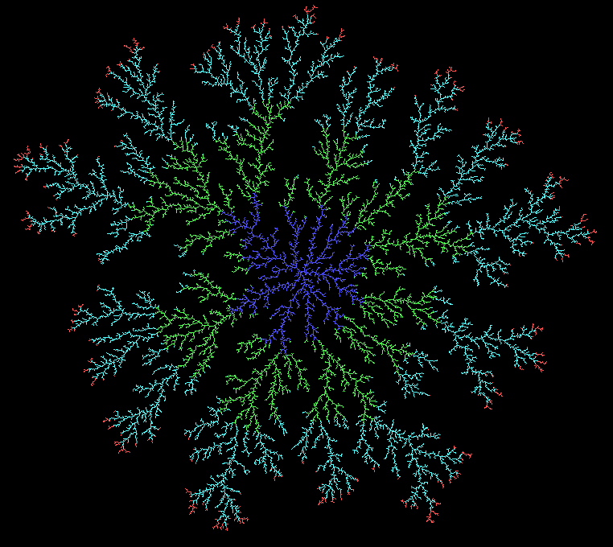 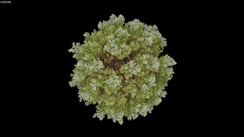

*Fig. 1) The left image is of a basic 2D DLA and the right is a 3D DLA.*

It is important to note that DLA programs are not limited to the circular and spherical shapes above. They can adhere to straight lines, create Brownian Trees, and have many other shapes:

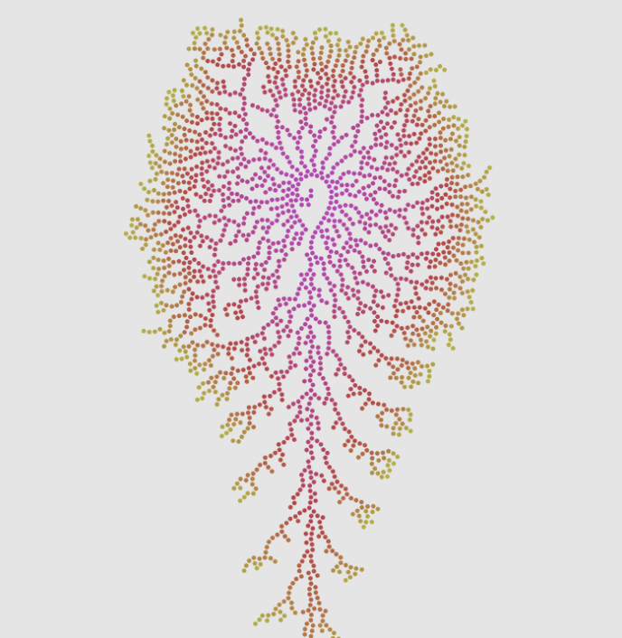 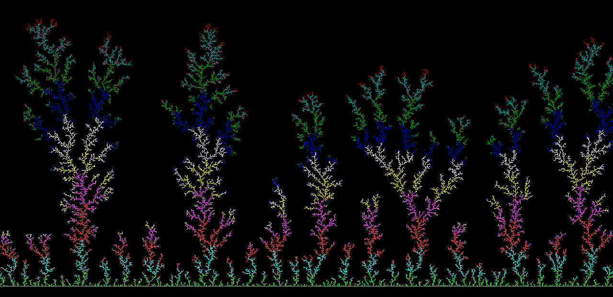

*Fig. 2) Miscellaneous DLA aggregations of different shapes. The first is just a creative project from a user on X and the second is a Brownian Tree from the WIki*

DLAs are not solely a computational novelty either. They often appear in nature! For example, mineral deposits, fungi, lightning bolts, snowflakes, and even ants biting off wall paint all follow a form of diffusion-limited aggregation.

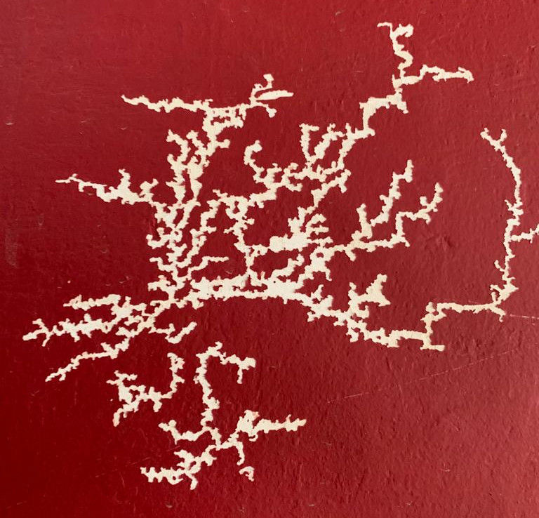 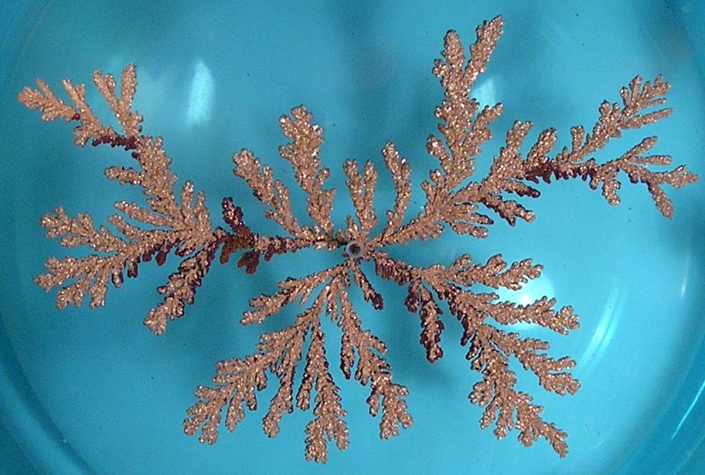

*Fig. 3) The left image is a DLA pattern from ants eating paint and the right image is a DLA pattern grown from a copper sulfate solution in an electrodeposition cell.*

There are three main factors that affect how an aggregate forms: seed particle location, stickiness probability, and what we consider ‘neighbors’. Stickiness probability determines how likely a particle will become a part of the aggregate when encountering a ‘stuck’ particle. High probabilities mean it will most likely stick to the first particle it encounters, meaning we have thinner, elongated branches. Lower probabilities allow more time for the particle to travel deeper into the structure on its random walk, so for the same number of particles these structures tend to be condensed with little to no branches (See GIFs and Images section for more!). This also means that low stickiness eats up computation time because of the increased iterations of the particles’ random walks. Neighbor definitions can also change our aggregate branch shapes. For a 2D space, if we only consider the vertical and horizontal neighbors around our particle, we can get more rigid, cardinal growth along our axes compared to an eight neighbor approach. This program utilizes all eight neighbors for the 2D space. Finally, a seed particle is what determines the start of our accumulation for the aggregation. It is placed at a location to become our source point for the following particles to stick to, and it doesn’t necessarily have to be directly in the center of the particles’ generation range. 

Now that we know what a DLA is and how different factors can affect them, let us create our own!

## Summary of Code

### Overview

This DLA program is made up of three files: Capacity_Dimension.py, Diffusion_Main.py, and Diffusion_Functions.py. Capacity_Dimension.py is what dictates how many particles will run and with what probability of stickiness they will adhere to the aggregate. Its main purpose is to streamline the generation of aggregations for different parameters without looping through the entire Diffusion_Main.py in order to calculate the capacity dimension (a measure of the number of particles compared to the aggregate’s cluster size, or how many particles are packed into the size of the cluster). This is so we can easily compare stickiness probability to the capacity dimension. Diffusion_Main.py, as seen by its namesake, is the main contributor to creating these aggregations. It loops through the number of particles and calls all the necessary functions from Diffusion_Functions.py to determine which particles should be added to our cluster. It also animates and saves a .gif and .png for the aggregations. Finally, Diffusion_Functions.py is where the inner-workings of the diffusion program are stored. It contains all the objects and functions for this program to work. 

The main idea of this code is that it takes a given number of particles and creates a square grid array the size of half the number of particles. All stuck particles will be given a designation equal to one such that we can track the positions of the aggregate through the 0’s and 1’s in the array. A seed particle is spawned directly in the center of the grid. Then, the program enters a while loop that will continue until the cluster has the user defined number of particles attached to the aggregate. New objects labeled particles are generated on the circumference of a circle through a function called the generation sphere, defined by a user set distance from the maximum size of the aggregate, and these particles keep track of their own location and whether it is stuck through its object attributes. It can also call an object defined function to randomly walk itself and directly update its location. It continues this until either 1) It wanders too far from the aggregation and gets deleted by a defined kill distance, or 2) Has a neighboring ‘stuck’ particle. If it does find a neighbor, it calls another object defined function to determine if it sticks depending on the stickiness probability. If it succeeds, the stuck attribute is updated and we can add one to the total number of stuck particles for our aggregate. A new kill and generation distance is created based on the furthest particle, and the cycle continues. Once the cluster is complete, the growth is animated and saved with the last frame being turned into a .png. The aggregation is now complete, and the capacity dimension can now be found. 

Next, let us take a closer look at some of the more important functions!

### Important Functions

There are a few important functions to note for this program. The main three that are integral for getting a working program are: class Particle and its functions, get_neighbors, and capacity_dimension. Let us start with the star of the show, class Particle. Particle objects contain a function that defines its initial values which include location, probability, and whether it has stuck to the aggregate yet. These are defined below.

```python

class Particle:
    '''
        Class: Particle
        Description: Particle object that stores location, age, and probability. Can call a random walk on itself
        and store the data.
    '''
    def __init__(self, location, probability):
        self.location = location
        self.probability = probability
        self.stuck = False
```
We can initialize location with the randomly generated location from our generation_sphere and the probability with the value from Capacity_Dimension.py. The attribute self.stuck always starts as false and is only updated once the particle sticks to the aggregate. The next important function inside of class Particle is the random_walk. 

```python

def random_walk(self):
    dx, dy = random.choice([[-1, 0], [0, 1], [0, -1], [1, 0]])
    self.location[0] += dx
    self.location[1] += dy
```

Here we make a random choice between four possible directions of movement and let that array equal our change in x and y directions. The object then accesses its own attribute to directly update this movement for its location. The final definition function that is important to note is the sticky function.

```python

def sticky(self):
    # This particle has the potential to get stuck. Check all particles nearby. 

    prob = self.probability
    if random.uniform(0, 1) <= prob:
        return True
        
    return False # It was not stuck
```

This function accesses its probability and randomly generates a value between 0 and 1. If this value is smaller than or equal to the sticky probability the function returns true, updating the stuck parameter to be true. This is what ends our loop of random walks for a particle, and thus, is very important to moving onto the next particle. Otherwise, the function returns false and the random walks continue. 

The next important function is the get_neighbors definition. This function grabs the surrounding neighbors to a particle's location and is always called after every random walk iteration. It includes diagonals for a total of eight neighbors.

```python

def get_neighbors(location):
    '''
        Grabs the surrounding neighbors. Includes diagonals as well for a total of eight neighbors.

        Args:
            location: Center location of where a particl is. 

        Return:
            neighborhood: A list of points around our given location for a 2D grid. 
    '''

    offsets = [[-1, 0], [1, 0], [0, 1], [0, -1], [-1, -1], [1, 1], [-1, 1], [1, -1]]
    neighborhood = []

    for offset in offsets: # For x coordinate
        grid_x = location[0] + offset[0]
        grid_y = location[1] + offset[1]

        neighbor = [grid_x, grid_y]
        neighborhood.append(neighbor)

    return neighborhood
```

Locations of the eight values are found using offsets to the particle's location in all cardinal and diagonal directions. It is important to note that this function only grabs the locations of neighbors to create a neighborhood of values to check for 0's and 1's. It is Diffusion_Main.py that actually does the checking. Taking a quick side note to see what Diffusion_Main.py does with this, we see:


```python

neighbors = Diffusion_Functions.get_neighbors(particle.location)
neighbor_count = 0
touching = False

for point in neighbors:
    # Check if anything is touching 
    if grid_array[point[0]][point[1]] == 1:
        touching = True
        neighbor_count += 1

if touching and neighbor_count == 1: # Avoid overfilling and focus on tip growth by saying neighbor count = 1
    result = particle.sticky()
```

Here we find that Diffusion_Main.py cycles through the neighbors, checking each grid position if any of the values equal 1. If it does, that means there's a possible particle to stick to, so it tells the program that the moving particle is touching the aggregate and should call the particle.sticky() function to see if it sticks. 

The final noteworthy function is the capacity_dimension (and by subsequent relation, capacity_dimension_vs_radii). We see from a snippet of the function below that we are finding sizes of boxes that extend to the largest distance of our aggregate. Then, we sort through the points of our 'stuck' particles and see how many boxes contain particles for sequentially bigger boxes. Taking the log of both the number of particles and sizes, since they grow exponentially, we can polyfit the middle data points to find our slope, and thus our capacity dimension. We do only the middle because the ends vary and negatively impact our calculation of the dimension. The outside ends are too sparse since it's the part that of the aggregate that is growing, and the center is too dense because of the limited space. Thus, we only want that stable middle range. 

```python

while biggest > s:
        sizes_of_boxes.append(s)
        s *= 2

    Ns = []

    for size in sizes_of_boxes:
        boxes = (points // size).astype(int)
        unique_boxes = np.unique(boxes, axis=0)
        Ns.append(len(unique_boxes))

    sizes = np.array(sizes_of_boxes)
    Ns = np.array(Ns)

    log_sizes = np.log(1 / sizes)
    log_N = np.log(Ns)

    coeffs = np.polyfit(log_sizes[1:-1], log_N[1:-1], 1) # Fit the paramters
    D = coeffs # Grab slope

    return D, log_sizes, log_N
```

To a lesser degree of importance, we also have the generation_sphere and particle_from_center. These are both simpler in design. The generation_sphere generates a random location for a particle to spawn in and particle_from_center calculates the distance between a particle's location and the center. The latter is important for recalculating the aggregate's furthest particle from the center and whether it is outside of the kill radius. 

Now we know a little more about the program, let us look at our results!

### Gifs/Images

Capacity_Dimension.py tested five different stickiness probabilities for 5000 particles each. Their animation and final growth is shown below:

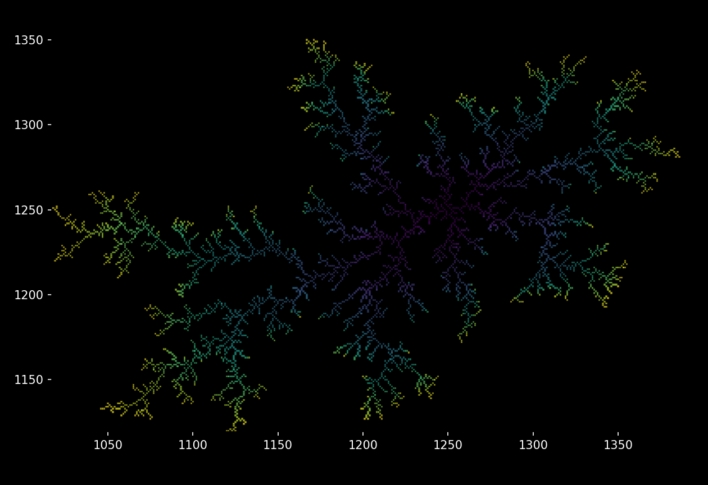 

*Fig. 4) Aggregation of p = 1*

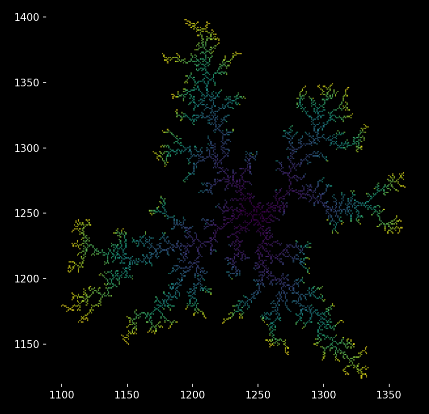 

*Fig. 5) Aggregation of p = 0.5*

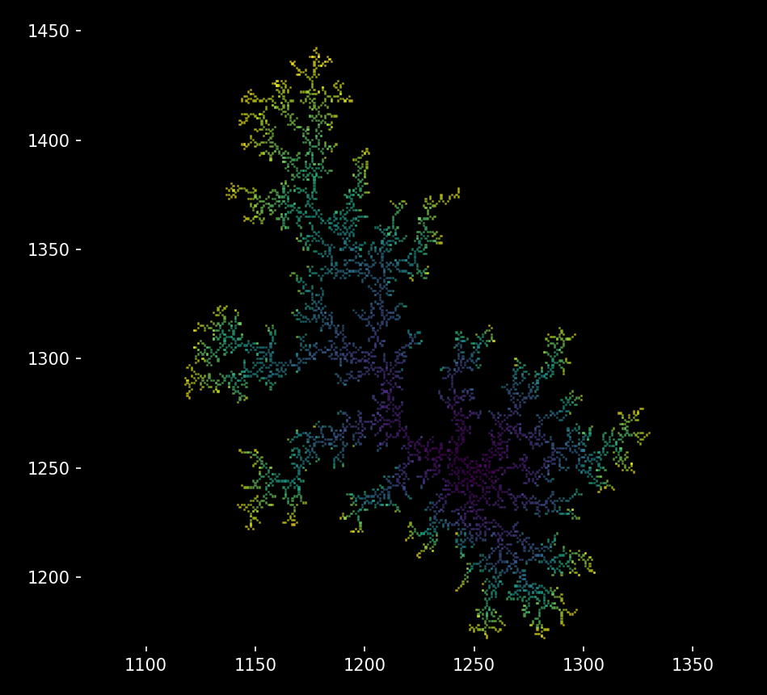 

*Fig. 5) Aggregation of p = 0.25*

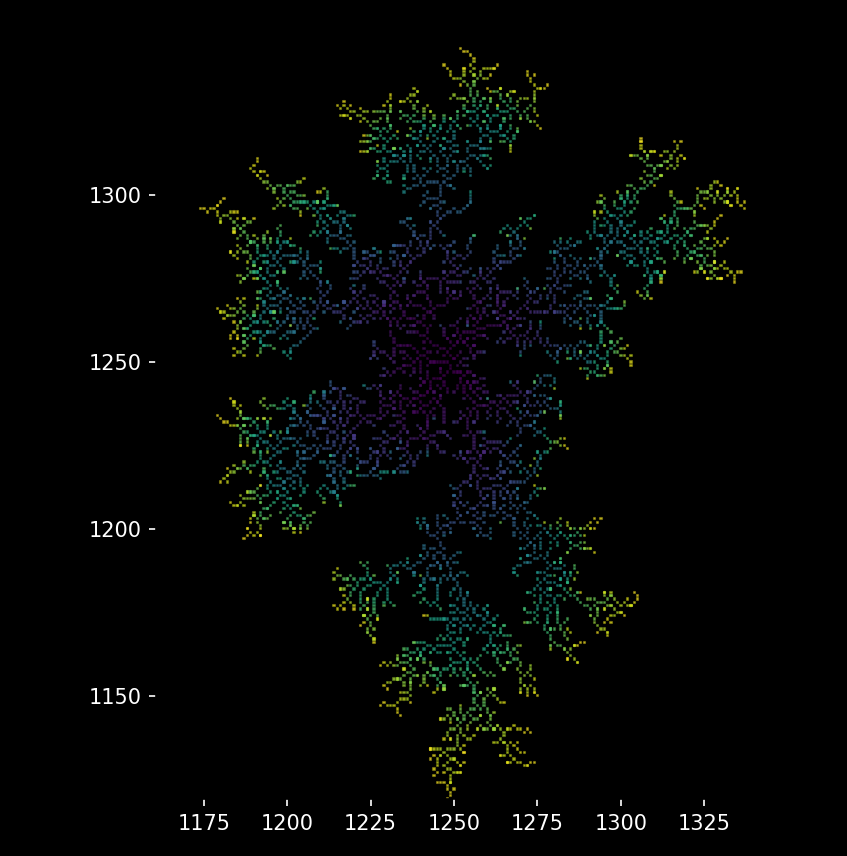 

*Fig. 6) Aggregation of p = 0.1*

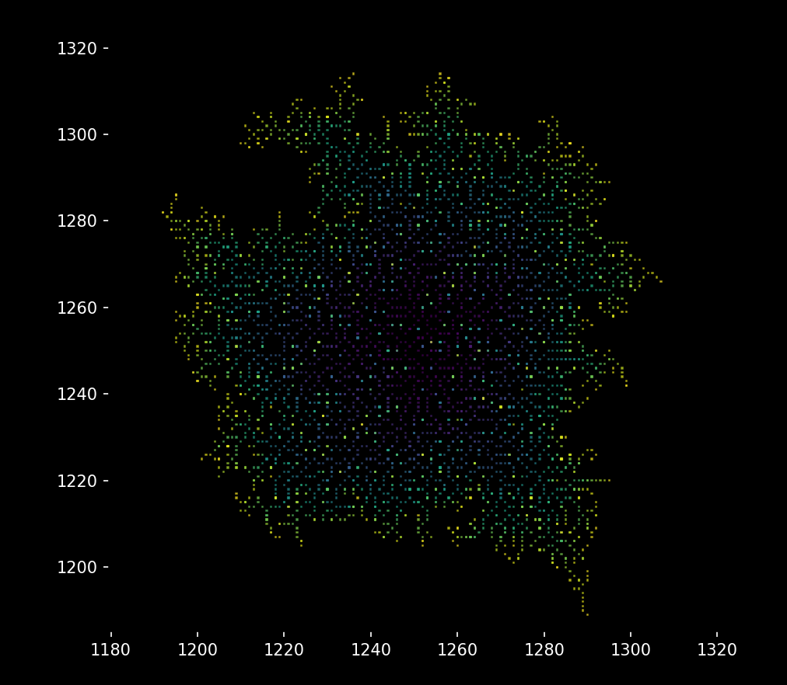 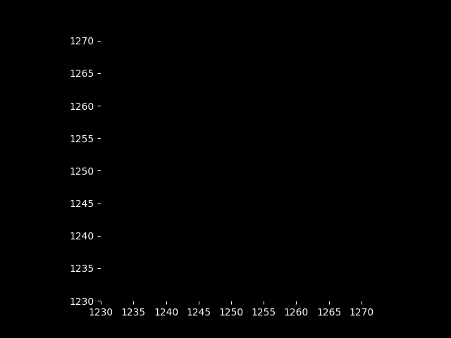

*Fig. 7) Aggregation of p = 0.01*

We can see that as our probability decreases, our branches get thicker and the particles tend to be condensed.

### Capacity Dimension and Topological Dimension

As we mentioned before, the capacity dimension represents the number of particles inside of our aggregate's maximum size. In other words, it describes the density of fractal patterns for our problem. The topological dimension is what we traditionally think of as dimension, so for a 2D space it would be equal to 2. What does the capacity dimension look like in our 2D DLA then? We must consider our stickiness probabilities again. We saw previously for high probability there were sparse, branching aggregations while small probabilities had compact, more circular structures. We can measure the capacity dimension over radius such that we can see this relationship:

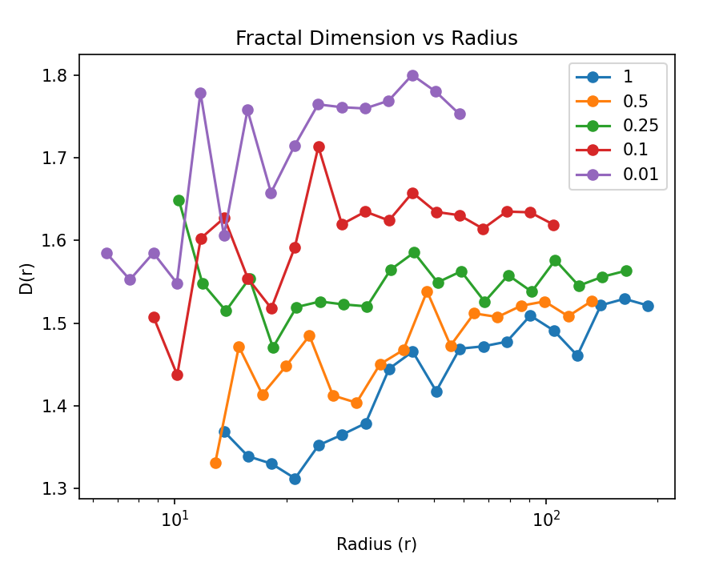

*Fig. 7) Fractal Dimension vs Radii*

While this is a little jittery, which I suspect is due to my 5000 particle count, we do see a stabilization on the right side of the graph with clear distinction between our probabilities. For decreasing stickiness probability we see an increasing capacity dimension vs radii. We can also study this on a global scale where instead of radii we look at the entire aggregation:


*Fig. 8) Fractal Dimension vs Increasing Box Sizes*

Where the slopes of these linear lines are our capacity dimension. Again, we see for decreasing probability an increase in our dimension value. Both of these graphs end up approximating to roughly 1.75 at p = 0.01 (which is consistent with sources online saying it should be roughly 1.70). Therefore, capacity dimensions are less than topological dimensions for 2D. We can see this relationship in one final graph of fractal dimension vs stickiness probability. 

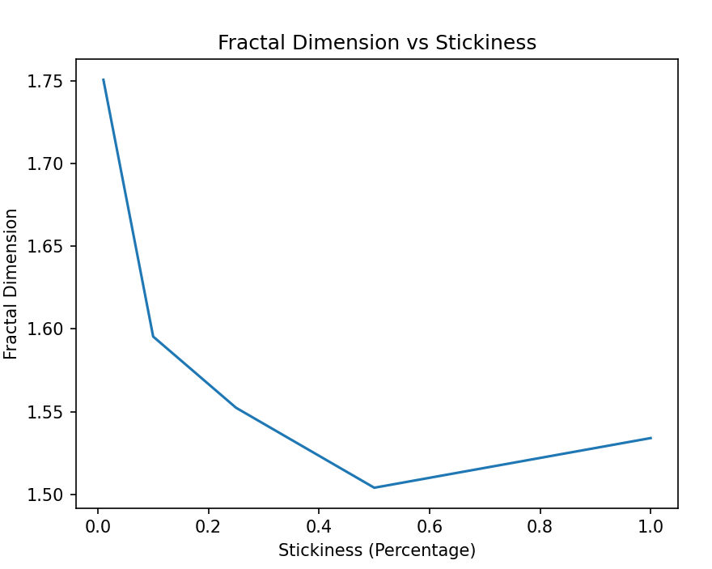

*Fig. 9) Fractal Dimension vs Stickiness*

## Extensions

### How does behavior change in 3D

The 3D program, while not too logically different, has a few changes to its behavior and generation time. Since particles are not limited to only a 2D space to move, computation time significantly  increases because they can randomly walk in three different directions. Additionally, there were some minor changes to the arrays and generation sphere. The generation sphere is now an actual sphere instead of just a circle, and considers an additional randomly chosen angle. Then, of course, the arrays were increased to three dimensions. Another major change is that the random function favors the poles of a sphere if you are not careful, which we can see in the following image and animation. A stickiness probability of 1 with 3000 particles was generated and is shown below:

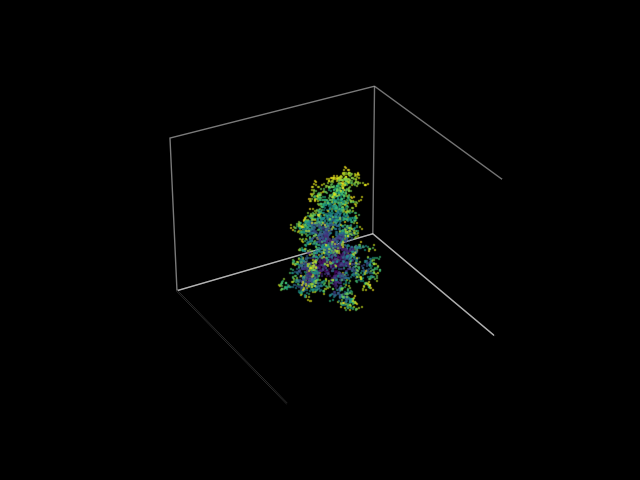 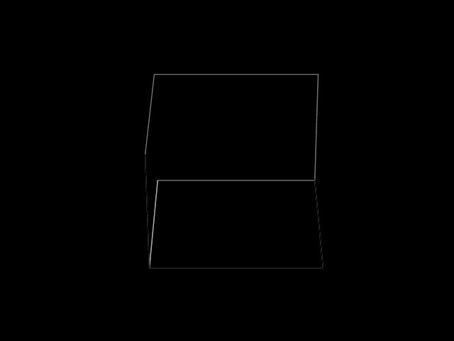

*Fig. 10) 3D Aggregation that favors the poles.*

### 

## Languages, Libraries, Lessons Learned

The main language was python and I used the libraries numpy, matplotlib, and os. I developed my skills with using objects and classes in python and creating images and animations for aggregations. In particular, I learned how to use the os to more effectively store the .gifs and .pngs. I also learned how to do octrees, but they unfortunately did not end up working for this particular program (but they might be useful for my project over the summer!). On that note, ignore the Code_Graveyard. It is filled with ghosts of past aggregate lives. 

## Timekeeping

As of 4/23/26: 36 hours

## Sources

People Used:

Michael helped me with the capacity dimension. 

Websites (Images and Information):

https://tonybaloney.github.io/posts/why-is-python-so-slow.html

https://cemrehancavdar.com/2026/03/10/optimization-ladder/ 

https://eli.thegreenplace.net/2018/slow-and-fast-methods-for-generating-random-integers-in-python/ 

https://en.wikipedia.org/wiki/Octree

https://vpython.org/

https://www.gut-wirtz.de/dla/improvements.html#:~:text=Outside%20the%20release%20radius%20we,the%20cluster%20during%20one%20step. 

https://docs.scipy.org/doc/scipy/reference/generated/scipy.spatial.cKDTree.html 

https://pypi.org/project/pyoctree/ 

https://github.com/jcranch/octrees/blob/master/octrees/octrees.py

https://medium.com/data-science/neighborhood-analysis-kd-trees-and-octrees-for-meshes-and-point-clouds-in-python-19fa96527b77 

https://en.wikipedia.org/wiki/Color_quantization 

https://eisenwave.github.io/voxel-compression-docs/svo/svo.html#:~:text=Best%20Case%20for%20Regular%20Octrees,best%20case%20is%20rarely%20encountered. 

https://delimitry.blogspot.com/2016/02/octree-color-quantizer-in-python.html#:~:text=As%20each%20leaf%20has%20the,Delimitry%20at%204:14%20PM 

https://www.geeksforgeeks.org/dsa/octree-insertion-and-searching/ 

https://www.eskimo.com/~scs/cclass/int/sx4ab.html#:~:text=The%20&%20operator%20performs%20a%20bitwise,exclusive%2DOR%20on%20two%20integers. 

https://vispy.org/api/vispy.scene.visuals.html

https://towardsdatascience.com/neighborhood-analysis-kd-trees-and-octrees-for-meshes-and-point-clouds-in-python-19fa96527b77/ 

https://markjstock.org/dla3d/ 

https://discussions.unity.com/t/octree-subdivision-problem-solved/405500 
https://alea.impa.br/articles/v14/14-15.pdf

https://docs.actian.com/ingres/11.0/index.html#page/QUELRef/Numeric_Data_Types.htm 

https://softologyblog.wordpress.com/category/diffusion-limited-aggregation/#:~:text=Another%20thing%20you%20want%20to,hits%20per%20update%20each%20frame.

https://arxiv.org/html/2504.13400#:~:text=Initially%20proposed%20by%20Witten%20and,;%20jungblut%20;%20halsey%20;%20halsey2%20. 

https://www.deconbatch.com/2019/10/the-poor-mans-dla-diffusion-limited.html 

https://medium.com/nerd-for-tech/neighborhood-connections-and-connected-components-cedf922dd383 

https://mathworld.wolfram.com/CapacityDimension.html 

https://archive.lib.msu.edu/crcmath/math/math/c/c040.htm 

https://www.w3schools.com/python/trypython.asp?filename=demo_matplotlib_pyplot 

https://matplotlib.org/stable/api/_as_gen/matplotlib.animation.FuncAnimation.html 
