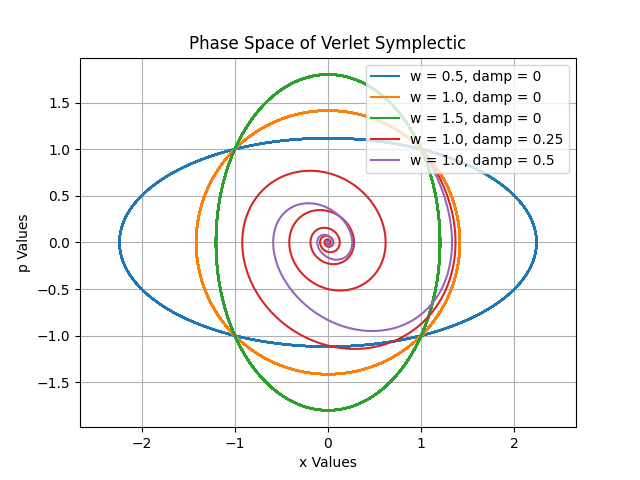
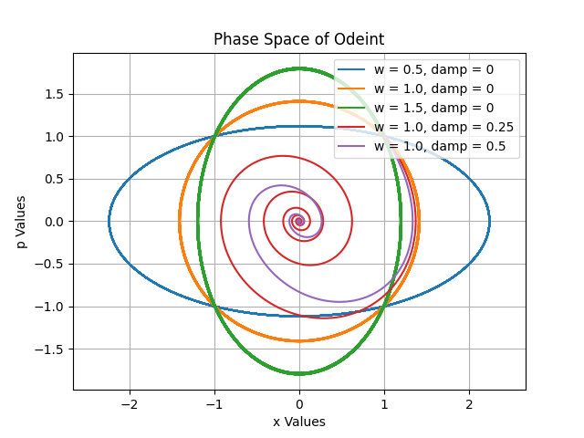
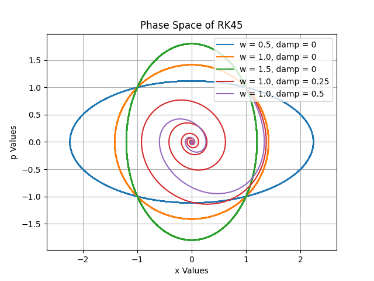
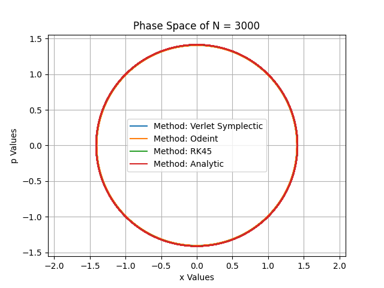
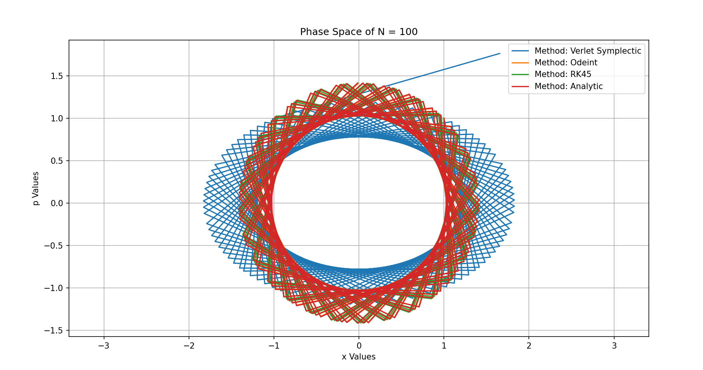
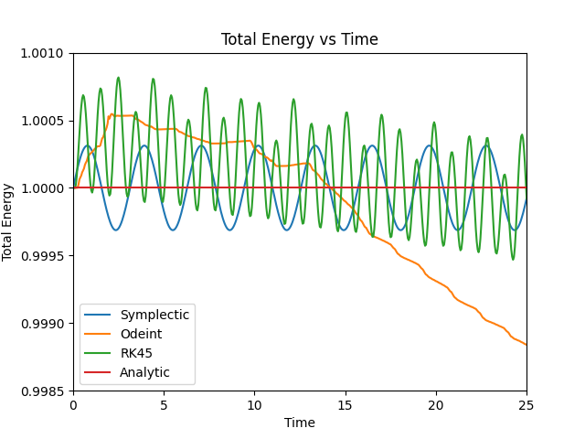
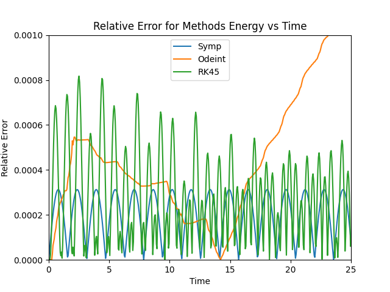
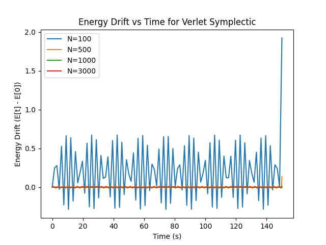
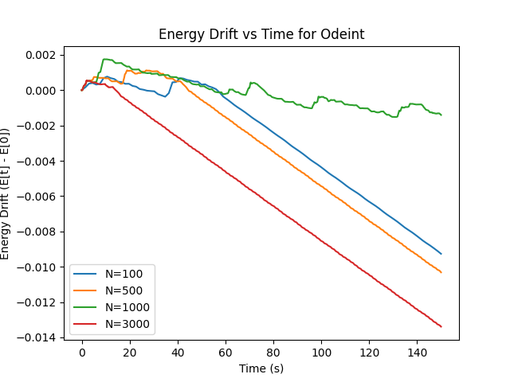
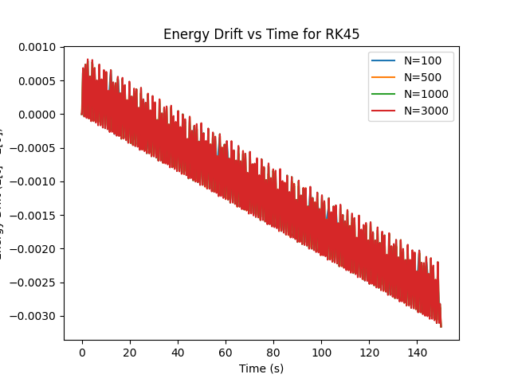

---
meta:
    author: Emma Krebs
    topic: Symplectic Integrations
    course: TN Tech PHYS4130
    term: Spring 2026
---

# Symplectic Integrations

## Types of Integrations

Ordinary Differential Equations (ODEs) are differential equations that depend on one independent variable. ODEs relate how systems can change over time or space, making them an extremely pervasive tool of mathematics for understanding how something develops. These functions can be solved numerically through integrators given an initial state. Thus, it is important to understand what these integrators are doing to our system and how they might accumulate error. For conservative physical systems, a good long-term ODE solver will be one that preserves the total energy of the system, but what does that mean in context of our report? We will start by considering harmonic oscillation, which also happens to be the main system we will investigate throughout this report. The function is given as:

$$m\text{ }\dfrac{d^2y}{dt^2} = -ky$$

where its associated equation of energy is

$$E = \dfrac{1}{2}\text{ } m \text{ }(\text{ } \dfrac{dy}{dt} \text{ })^2 + \dfrac{1}{2}ky^2$$

The important part of this energy definition is that any solution to our ODE will automatically conserve this energy function. Let us see this by taking the derivative:

$$\dfrac{dE}{dt} = m\text{ } (\text{ }\dfrac{dy}{dt}\text{ }) \text{ } (\text{ }\dfrac{d^2y}{dt^2}\text{ }) + ky(\text{ }\dfrac{dy}{dt}\text{ })$$

and if we plug in our previous equality we find that

$$\dfrac{dE}{dt} = -ky\text{ } (\text{ }\dfrac{dy}{dt}\text{ }) + ky(\text{ }\dfrac{dy}{dt}\text{ }) = 0$$

Therefore, our energy is conserved. A good ODE solver produces similar conservations of energy; however, this is a trait that very few integration methods can do. Throughout this report we will investigate three ODE solvers, only one of which will preserve energy. We will then analyze the error for these solvers to show why energy conservation is important for accuracy over long spans of time/space.

### What is Harmonic Oscillation and What Does it Look Like?

The main system we studied with these methods of integration was our previously mentioned harmonic oscillatior, which is defined to be a system that experiences a restoring force towards an equilibrium point proportional to its displacement. Some classical examples of this are mass springs and pendulums, where the restoring forces are from the spring and gravity, respectively. However, the harmonic oscillator is even more important to physics than just describing these simple examples. This is because any mass subject to a force in stable equilibrium acts as a harmonic oscillator in small vibrations. Therefore, there are many physical phenomena we can apply this system to, such as: quantum potential wells, orbital perturbations, stellar oscillations, and more. 

Harmonic oscillators are characterized by two main categories, damped and undamped oscillators. These change what their phase plot diagrams look like, which are their space vs momentum graphs. For undamped systems, they are circular or elliptical shaped paths depending on the angular frequency of the system. An angular frequency of one results in a circular shape. An angular frequency less than one stretches the circle in the position axis' direction, and above one stretches it into the momentum axis' direction. If an oscillator is damped, this means that there is a term that decreases the amplitude over time. In response, the phase space diagram breaks the circular/elliptical shape and spirals inward. An example of what these graphs look like are demonstrated below for the three integrators we will be investigating:

  

*Fig 1. This figure demonstrates three phase space graphs. From left to right, we have the Symplectic, Odeint, and RK45 integration methods.*

Although these all maintain similar shapes, if you look closely some appear to have thicker lines. These are from an accumulation of errors due to the method of integration. Let us see what makes these integrations unique and what these errors look like!

### Symplectic Integration

Symplectic integrators are used to solve second-degree ODEs which we do by applying it to a system of two 1st-degree ODEs. For a general variable u and v, we start with:

$$\dfrac{du}{dt} = f(t, v)$$
$$\dfrac{dv}{dt} = g(t, u)$$

where our Symplectic Euler can be written as the repetition of

$$v_{n + 1} = v_n + hg(t_n, u_n)$$
$$u_{n + 1} = u_n + hf(t_n, v_{n + 1})$$

Notice that v is updated, and then u is updated with the already updated v. Also note h, which is the step size of the function.

For a harmonic oscillator, we can let:

$$f(t, v) = -\omega^2v$$ and
$$g(t, u) = u$$

such that when we insert it into our previous equations we find

$$v_{n + 1} = v_n + hu_n$$
$$u_{n + 1} = u_n - h\omega^2v_{n + 1}$$

The Symplectic integrator is the ODE solver we mentioned previously that conserves energy. But what does that mean in the context of integration? Consider Liouville’s theorem that says phase space volume remains the same size when the system evolves over an action like time. In other words, phase space is conserved for the Hamiltonian, and thus so is the geometrical structure of the system. This can be proved by considering the Hamiltonian of a harmonic oscillator such that for

$$H = \dfrac{1}{2}p^2 + \dfrac{1}{2}x^2$$

we must find that

```math
\begin{pmatrix}
0 & 1  \\
-1 & 0
\end{pmatrix} = \begin{pmatrix}
-H_{xp} & H_{pp}  \\
-H_{xx} & -H_{px}
\end{pmatrix} \begin{pmatrix}
0 & 1  \\
-1 & 0
\end{pmatrix} \begin{pmatrix}
-H_{xp} & -H_{xx}  \\
H_{pp} & -H_{px}
\end{pmatrix}
```
where by doing so proves that the harmonic oscillator is Symplectic. Thus, Symplectic solvers conserve energy. 

An example of the function definition used for harmonic oscillation is shown below:

```python
    def Verlet_symplectic(x_0, p_0, tmax, w, damp, N):

        t_array = np.linspace(0, tmax, N)
        x_array = np.zeros(len(t_array))
        p_array = np.zeros(len(t_array))
        h = t_array[1] - t_array[0]
        x_array[0] = x_0
        p_array[0] = p_0
    
        # Get the next value
        a_0 = -w**2*x_0 - damp*p_0
        x_array[1] = x_0 + p_0*h + 0.5*a_0*h**2
    
        # Iterations, update momentum first then position
        for i in range(1, len(t_array) - 1):
    
            a = -w**2*x_array[i] - damp*((x_array[i] - x_array[i - 1])) / h # Acceleration
            x_array[i+1] = 2*x_array[i] - x_array[i - 1] + a*h**2
    
            p_array[i] = (x_array[i+1] - x_array[i - 1]) / (2*h)
        
        p_array[-1] = (x_array[-1] - x_array[-2]) / h
    
        return x_array, p_array, t_array
```

where we see a similar pattern of updates from our theory.

### RK45

RK45, also known as Runge–Kutta–Fehlberg method, is an adaptive numerical technique for solving ODEs. It uses intermediate calculations to produce two estimates of different accuracy. By doing this, it can adjust the time step sizes for high accuracy and efficiency. These techniques have a range of different orders you can use for a problem. In this case, RK45 computes a 4th and 5th order error estimate while RK2 would be a lower order with only a 2nd order estimate. Although RK45 excels at accuracy, it does not maintain the geometrical properties of the phase space, so it loses total energy from small numerical errors over time.

The function definition in the code is shown as:

```python
    def RK45_solver(x_0, p_0, tmax, w, damp, N):

        y_0 = [x_0, p_0]
        t_array = np.linspace(0, tmax, N)
        
        # Force it to match other integration methods
        
        sol = solve_ivp(Harmonic_deriv, (0, tmax), y_0, method='RK45', t_eval=t_array, args=(w, damp)) 
        t_array = sol.t
        x_array = sol.y[0]
        p_array = sol.y[1]
    
        return x_array, p_array, t_array
```
Here, we use solve_ivp and feed it our Harmonic_deriv function definition and method name in order to calculate our three arrays.

### Odeint

This function definition calls the Odeint function from scipy.integrate, and Odeint solves a system of ordinary differential equations using LSODA from the FORTRAN library odepack. The method automatically switches between stiff and non-stiff solvers, minimizing our error. Once again, this does not conserve phase space. 

```python

    def Odeint_solver(x_0, p_0, tmax, w, damp, N):

        y_0 = [x_0, p_0]
    
        t = np.linspace(0, tmax, N)
        L = odeint(Harmonic_deriv, y_0, t, args=(w, damp), tfirst=True, rtol=1e-4)
        
        return L[:,0], L[:,1], t
```

### Final Comparison

Now that we understand our three functions a little more, let us turn our attention to the main.py function. We saw before that these integration methods had a pretty consistent phase space diagram. However, this was for a small time step. This means that error isn't as easily accumulated between steps since not as much changes. This doesn't mean that there is no error, and if we compare it between two N spacing values N = 100 and N = 3000, we see how much this error can impact our energy conservation:

  

*Fig 2. Here we have two phase space plots for our three integration methods and analytic solution. The time step is changed such that the spacing given by N is 3000 (on the left), resulting in small steps, and 100 (on the right), resulting in larger steps.*

Thus, the error is now apparent. However, we need a more direct way to compare error between our methods. To do this, we will be looking at the errors through Total Energy vs Time, Relative Error vs Time, and Energy Drift vs Time for a variety of N spacings. Let us start with the former. We need to start by finding the total energy using a function definition from ODE_Methods.py:

```python

    def Total_energy(x_array, p_array, w):

        kinetic_energy = []
        potential_energy = []
        total_energy = []
        
        # Assuming m = 1, we can find the kinetic, potential, and total energy through the following methods
        for x, p in zip(x_array, p_array):
            KE_value = (1/2) * p**2
            PE_value = (1/2) * w**2 * x**2 # Since w is angular frequency and m = 1, so k = w**2
            TE_value = KE_value + PE_value
    
            kinetic_energy.append(KE_value)
            potential_energy.append(PE_value)
            total_energy.append(TE_value)
        
        return kinetic_energy, potential_energy, total_energy
```

This function returns the kinetic, potential, and total energy for a given array of x and p (along with their angular frequency) for a harmonic oscillator. It assumes the mass equals one to simplify the energy calculation. It uses the general equations for kinetic and potential energy such that for each x and p in these arrays:

$$KE_{Value} = \dfrac{1}{2} * p^2$$
$$PE_{Value} = \dfrac{1}{2} * w^2 * x^2$$
$$TE_{Value} = KE_{Value} + PE_{Value} = \dfrac{1}{2} * p^2 + \dfrac{1}{2} * w^2 * x^2$$

where these values are then appended to their respective arrays and returned. Thus, we find that:

 

*Fig 3. Total energy vs Time for three integration methods. This graph spans over the time of 150 seconds, but was zoomed in between 0 to 25 seconds to easily see the trends between the energies.*

As we see above, our baseline of the analytic solution is a flat line, which makes sense since there should be no error in the harmonic oscillator function. Then, we see that the Symplectic and RK45 methods oscillate around the total energy value of the analytic solution. The Symplectic is expected because it conserves energy; however, the RK45 is decent at minimizing the accumulation of error due to its adjustments of its steps when integrating. We see near the end though that error starts accumulating enough to decrease the oscillation average, showing RK45 does not conserve energy. Finally, Odeint does not oscillate and is fairly sporadic with its total energy, eventually decreasing like RK45 but at a much quicker pace. 

To compare these differences further, let us look at Relative Error vs Time. Here we calculate the relative error for these energies using the analytic value and the equation:

$$\text{Relative Error} = \dfrac{|  \text{ analytic  -  estimated }  |}{(\text{analytic})}$$

and we find

 

*Fig 4. Relative error vs time graph for the three integration methods. This graph also spans over 150 seconds, but is limited to 25 seconds.*  

Again, we see the relative error oscillate between zero and a positive value, indicating that, even though there is an error, it is manageable and still allows conservation of energy. Odeint is obviously once again collecting relative error at an alarming rate and, although this graph doesn't extend past 25 seconds, RK45 is also steadily collecting error while oscillating around a decreasing error value. 

Finally, we will compare the energy drift over time for different step values. This will be the biggest indicator for stability and conservation for a method. 

  

*Fig 5. Energy Drift vs Time for the three methods. Starting from the left, we have Symplectic, Odeint, and RK45.*

We see once again that even at low N the Symplectic method oscillates around 0, and for higher N it significantly decreases its oscillation range. Interestingly enough, the Symplectic is actually much worse than Odeint and RK45 for N = 100 if we look at energy drift. Its range has an energy drift roughly equal to two while the others are on the order of $$10^{-3}$$ and $$10^{-4}$$. Although we know that Symplectic is overall the better choice for stability of harmonic oscillators, we see that the other two functions would initially appear as the better choice for minimizing error. Therefore, it is always important to decide what matters more to your program: stability over long time scales, energy conservation, and/or the number of steps it has to calculate to get a sufficiently small error.   

## Extensions

### Virial Theorem
TBA

## Languages, Libraries, Lessons Learned

The main library I used in this project was the Scipy library. I found out about the different integration methods you can call from this library. Additionally, in the future I will have to consider the error accumulated from the method I use for simulation projects and whether the conservation of energy in the system would be an issue.

## Timekeeping

4/28: 22 hours

## Sources

Main Source: https://math.libretexts.org/Bookshelves/Differential_Equations/Numerically_Solving_Ordinary_Differential_Equations_(Brorson)/07%3A_Symplectic_integrators 

https://www.gorillasun.de/blog/euler-and-verlet-integration-for-particle-physics/ (Verlet and Symplectic Integrator)

https://en.wikipedia.org/wiki/Semi-implicit_Euler_method (Semi-implicit Euler wiki)

https://docs.scipy.org/doc/scipy/reference/generated/scipy.integrate.solve_ivp.html (Modeled equation based off of def lotkavolterra from this section. I needed to pass it and return it as a  tuple for it to work.

ChatGPT (My Visual Studio stopped working at the beginning of the project and wouldn’t compile the python code or run it. I fed ChatGPT the error message and I eventually found a work around.) 

Prompt:

PS C:\Users\wolf1\OneDrive\Documents\GitHub\PHYS4130-S26> & C:/Users/wolf1/AppData/Local/Programs/Python/Python39/python.exe
Python 3.9.13 (tags/v3.9.13:6de2ca5, May 17 2022, 16:36:42) [MSC v.1929 64 bit (AMD64)] on win32
Type "help", "copyright", "credits" or "license" for more information.
Ctrl click to launch VS Code Native REPL
>>> plt.plot()
Traceback (most recent call last):
  File "<stdin>", line 1, in <module>
NameError: name 'plt' is not defined
>>> plt.plot()
Traceback (most recent call last):
  File "<stdin>", line 1, in <module>
NameError: name 'plt' is not defined
>>> v_array.append(start_v)
Traceback (most recent call last):
  File "<stdin>", line 1, in <module>
NameError: name 'v_array' is not defined
>>> import matplotlib.pyplot as plt
>>> 

https://docs.scipy.org/doc/scipy/reference/generated/scipy.integrate.RK45.html (For RK45 solver’s notation)

https://docs.scipy.org/doc/scipy/reference/generated/scipy.integrate.odeint.html (For Odient)

https://stackoverflow.com/questions/18648626/for-loop-with-two-variables (For loop zip)

https://en.wikipedia.org/wiki/Harmonic_oscillator (Harmonic Oscillator)

