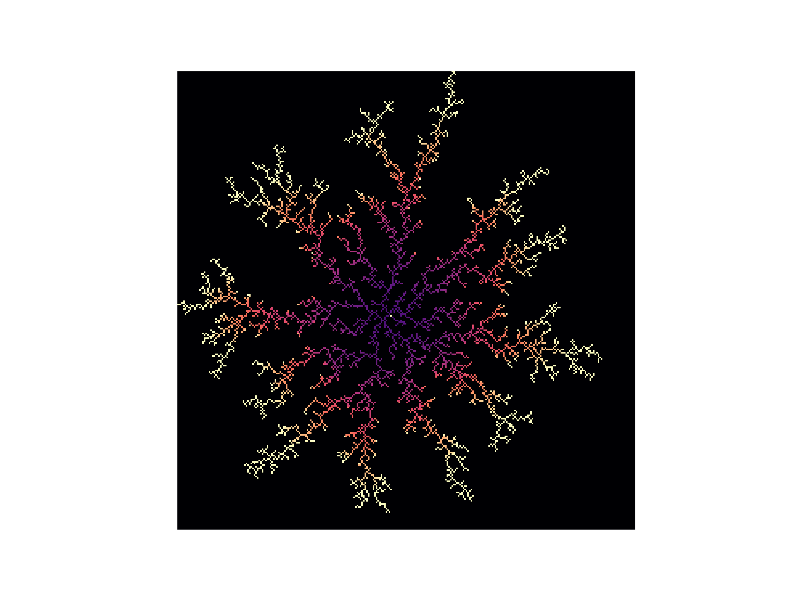
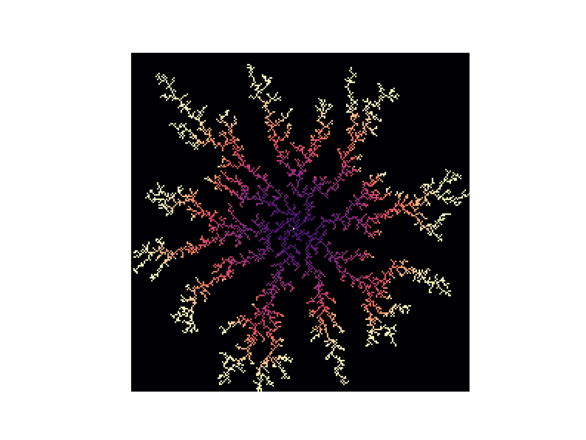
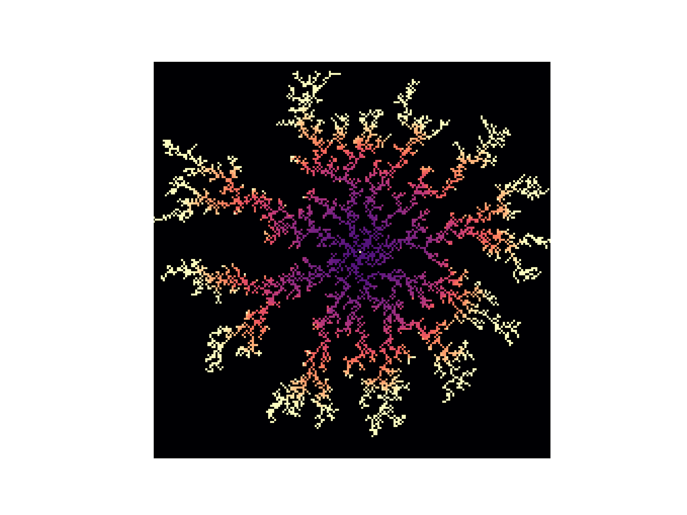
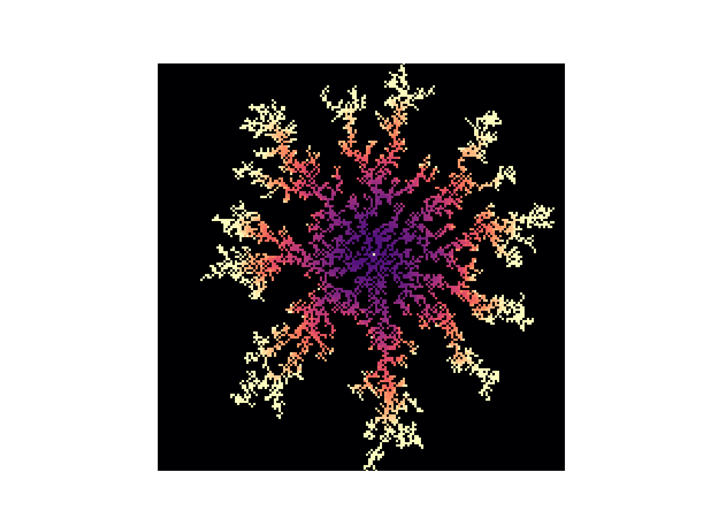
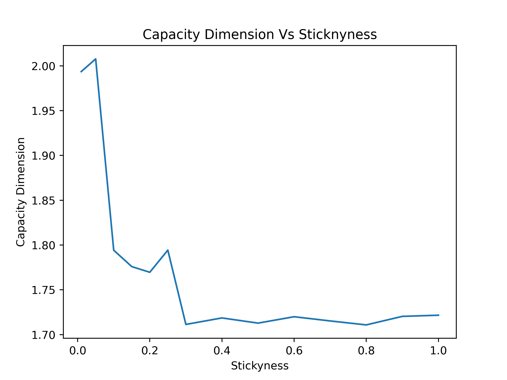
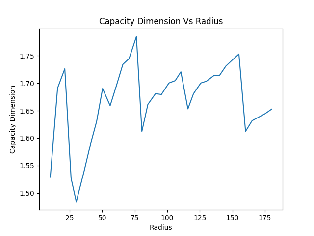

## Introduction
Montecarlo simulations are useful techniques for simulating certain physical phenomena where random effects contribute signifigantly. One example of this is diffusion limited aggregation (DLA) which shows up in the growth of crystals through electrochemical deposition, dielectric breakdown, and the growth of bacteria colonies with scarce nutrients. Therefore, these structures are worth studying for their novel applications. 

## Algorithms and Theory
Fractals are loosely charecterized by having non-vanishing complexity as you zoom into them. The fractals that we are intersted in are those generated by DLA. Roughly speaking, the algorithm is simple. You start with a seed point, and then you recursivley walk points until they stick to the aggregate. As points are added, the aggreagte grows and a fractal structure is formed. However, direct implimentation of this algorithm results in an innefficient program that struggles to quickly plot more than one thousand particles. 

The first step in generating a DLA fractal is deciding a useful data structure to store it. This program will use a 2D numpy array. This is because they are indexed, allowing a simple way to take discrete steps, and there is a numpy function called imshow that trivializes plotting an array. 

The first function we need is a way check if our point that we are walking has come up to the aggregate. This is done through the neighbors function. It takes in the aggregate (agg) and a list of coordinats (coords) and the length of the array along one side (L). 
```python
import numpy as np

#Takes in the array aggreate (Agg) a point (coords) and the length of the space we're in
def Neighbors(Agg, coords, Length): 
    X, Y = coords #coordinates passed in as the list [X, Y] 

    x_low = max([X - 1, 0])           # If X - 1 goes out of the array, then go to 0
    x_high = min([X + 1, Length - 1]) # If X + 1 goes out of the array, then go to L - 1

    y_low = max([Y - 1, 0])            # If Y - 1 goes out of the array, then go to 0
    y_high =  min([Y + 1, Length - 1]) # If Y + 1 goes out of the array, then go to L - 1

    #check for neighbors by counting the nonzero elements in the 8 neighbors of the point
    return np.count_nonzero(Agg[y_low:y_high+1, x_low:x_high+1])
```
The next thing needed is a way to walk the particle from one set of coordinates to the next. This is achieved through the walk function.
```python
def Walk(Agg, coords, Length): #This can be refined later.
    X, Y = coords

    direction = random.choice([[1,1], [1,-1], [-1,1], [-1,-1], [0, 1], [0,-1], [1,0], [-1,0]])
    while Agg[Y+direction[1], X + direction[0]] > 0:
        direction = random.choice([[1,1], [1,-1], [-1,1], [-1,-1], [0, 1], [0,-1], [1,0], [-1,0]])

    X = X + direction[0]
    Y = Y + direction[1]

    if X < 0: #at the left
        X = 0
    if X > Length-1: #at the right
        X =  Length-1

    if Y < 0: # at the top
        Y = 0
    if Y > Length-1: #at the bottom
        Y = Length -1
        
    return [int(X),int(Y)]
```
It takes in similar arguments to neighbors, and it returns the coordinates after moving its indices. It also has edge cases to account for a point at the edge of the array or if you walked into the array. 

This brings us to how we are going to sample our new points. Instead of sampling the points randomly in the array, we define an effective radius that is the largest distance from an aggregate point to the center. Then, we will sample our new points along a short distance past that radius so that we primarily grow the outer parts of the aggregate. The sampling is done by the StartPoint function. In the implementaion, there are some terms in regference to a histogram that have not yet been described. 
```python
def StartPoint(start_radius, Length, angle_histo, bin_edges):

    theta = ChooseAngle(angle_histo, bin_edges)

    x = (Length-1)//2 + (start_radius)*np.cos(theta)
    y = (Length-1)//2 + (start_radius)*np.sin(theta)

    #edge cases to keep poits in the array
    if x < 0:
        x = 0
    if x > Length-1:
        x = Length-1

    if y < 0:
        y = 0
    if y > Length-1:
        y = Length-1

    return [int(x), int(y)] 
```
Like the walk function, this has edge cases to keep points in the array. The next adjustment is introduction of a kill radius. Whenever the points walks too far away, we simply start a new sample point. One issue that has yet to be addressed is sampling our points so close to the aggregate on a uniform aangular distribution. Diffusion process are laplacian, so the potential generated by the aggregate when treating it as a source becomes approximatley unfiform at large radius. This means that, at large distances, sampling along a uniform angular dimension is perfectly valid. However, this would require increasing the distance a particle has to walk which thus drives up the run time. A solution to this is an adaptive sampling of angles that favors underprepresented angles. This is done by storing the angular distribuition as a histogram. 
```python
thetaMin = -np.pi
thetaMax = np.pi
numBins = 10

bin_edges = np.linspace(thetaMin, thetaMax, 1+numBins)
angle_histo = np.zeros(numBins, dtype=int)

def ChooseAngle(angle_histo, bin_edges):
    min_count = angle_histo.min()
    candidates = np.where(angle_histo == min_count)[0]

    i = np.random.choice(candidates)
    left = bin_edges[i]
    right = bin_edges[i+1]

    return np.random.uniform(left, right)

def CalcAngle(coords, Length):
    X, Y = coords
    X = X - (Length-1)//2
    Y = Y - (Length-1)//2
    return np.atan2(Y, X)

```
By updating this distribution as particles are added using the CalcAngle function, it helps maintain a unform angular spread and keeps exceessively large branches that quickly increase the effective radius from forming. We finally have all the basic pieces to put together a single function that takes in the aggregate, adds a new point, and updates the effective radius. 
```python
def AddPoint(Agg, r_eff, Sticky , Length, angle_histo, bin_edges, point_num, color_offset): #numpy arrays are mutable, so we can alter them in functions easily
    r = r_eff

    start_radius = r + 3
    kill_radius = start_radius + 1

    X, Y = StartPoint(start_radius, Length, angle_histo, bin_edges)

    NumNeighbors = Neighbors(Agg, [X,Y], Length)
    while NumNeighbors == 0:
        
        X, Y =  Walk(Agg, [X, Y], Length)

        #checks for new neighbors
        NumNeighbors = Neighbors(Agg, [X,Y], Length)
        if NumNeighbors > 0:
            p_stick = 1 - (1-Sticky)**NumNeighbors
            if p_stick < np.random.uniform(0, 1): #checks to see if the particle stuck
                NumNeighbors = 0

        d = np.sqrt((X - ((Length-1)//2))**2 + (Y - ((Length-1)//2))**2)
        if  d > kill_radius:
            X, Y =  StartPoint(start_radius, Length, angle_histo, bin_edges)

    if d > r:
        r = d
    # add point
    Agg[Y, X] = point_num + color_offset

    #update histogram
    theta = CalcAngle([X, Y], Length)
    bin = 0
    while theta > bin_edges[1+bin]:
        bin += 1
    angle_histo[bin] = angle_histo[bin] + 1

    #return new radius
    return r
```
This function is easy to put in a loop to calculate an aggregate for as many points as we want. The most basic implementation requires just a few lines of initialization and then the loop.
```python
# simulation parameters
L = 600   #number of slots on one edge of the array
N = 5000  #number of points to add to the aggregate
S = 1     #sticknynesss
r_eff = 2 #inital effective radius
color_offset = N/4 #purely visual parameter to help when coloring the plot

#Create the aggregate
Aggregate = np.zeros((L,L)) 
center = (L-1)//2
Aggregate[center, center] = 10000 #seed point

#angle histogram
thetaMin = -np.pi
thetaMax = np.pi
numBins = 20

bin_edges = np.linspace(thetaMin, thetaMax, 1+numBins)
angle_histo = np.zeros(numBins, dtype=int)

for k in range(N)
    r_eff =  AddPoint(Aggregate, r_eff, S, L, angle_histo, bin_edges, k+1, color_offset)
```
Before going into different plots of aggregates, it is important to look into how we quantify the way fractals fill space. Traditional notions of the dimension of a space may give a defintion that says the dimenion of an object is how many independent directions exist on it. This is referred to as topological dimension. It works fine for the objects of classical geometry like squares and circles, but it's hard to apply this to fractals. Some, like the famous Mandelbrot set, do have large continuous regions that seem two dimensional. However, not all fractals have such features, but many do have these complex and winding structures that don't exactly fit the criterion to be one or two dimensional. 

Therefore, we need a generalized concept of dimension that works for classical objects but still captures the meaningful distinctions of fractals. This is done with capacity dimension (aka, the box counting dimension). The capacity dimension is a way to measure the “size” or complexity of a set that may be too irregular to describe with standard integer dimensions. The idea is to cover the set with boxes of side length ε, and count the minimum number N(ε) needed to cover it. The capacity dimension is then defined by how this number scales as the boxes get smaller:

$$
D = \lim_{\epsilon \to 0} \frac{\log N(\epsilon)}{\log(1/\epsilon)}
$$

when the limit exists. Intuitively, it captures how quickly detail appears as you zoom in. This generalizes the traditional notion of dimension because for ordinary geometric objects the scaling recovers dimensions 1, 2, and 3 respectively, and it also assigns non-integer dimensions to more complicated sets, reflecting their intermediate scaling behavior between classical dimensions.

The logarithms in this defintion play two important rolls. First, they turn a power-law relationship into something linear. For many sets, the covering number scales like N(ε)≈Cε^−d. Taking logs gives logN(ε)≈logC+dlog(1/ε), so the dimension d becomes the slope of a straight line when you plot logN(ε) versus log(1/ε). The ratio in the definition is exactly extracting that slope.
Second, the logarithms remove multiplicative constants and make the definition scale-invariant. The constant C only contributes an additive term logC, which disappears when you take the limit, so the dimension depends only on the scaling behavior—not on arbitrary choices like units or normalization.

This motivates a somewhat simple algorithm to compute the capacity dimension. 

```python
def box_counting_dimension(agg, min_box_size=1):

    # Convert to binary mask
    mask = (agg != 0)
    coords = np.argwhere(mask)
    ymin, xmin = coords.min(axis=0)
    ymax, xmax = coords.max(axis=0)

    mask = mask[ymin:ymax+1, xmin:xmax+1]

    N = min(mask.shape)

    # Use powers of 2 for box sizes
    max_power = int(np.log2(N))
    sizes = [2**k for k in range(int(np.log2(min_box_size)), max_power + 1)]

    counts = []

    for size in sizes:
        # Trim array so it divides evenly into size X size boxes
        trimmed = mask[:N - (N % size), :N - (N % size)]

        # Reshape into blocks. It's a 4 element shape that that essentially
        # has the number of blocks along an edge in the 1st and 3rd spot
        # and the length of each box in the 2nd and fourth spot. 
        new_shape = (trimmed.shape[0] // size, size,
                     trimmed.shape[1] // size, size)

        blocks = trimmed.reshape(new_shape)

        # Check if any pixel in each block is occupied
        occupied = blocks.max(axis=(1, 3))

        # Count occupied boxes
        count = np.sum(occupied)
        counts.append(count)

    sizes = np.array(sizes)
    counts = np.array(counts)

    # Remove zeros (log undefined)
    valid = counts > 0
    sizes = sizes[valid]
    counts = counts[valid]

    # Linear fit in log-log space
    coeffs = np.polyfit(np.log(1/sizes), np.log(counts), 1)
    D = coeffs[0]

    return D, sizes, counts
```
With all the pieces in place we can start creating DLA fractals and computing their fractal dimension.

## Capacity Dimension Vs Stickyness
The stickyness affectst the chance of a particle sticking once it reaches the aggregate. We can see its affects by generating some plots as the stickyness decreases from 1.

<div align="center">
  
  <p><em>Figure 1:</em> Aggregate with S = 1 and N = 5000.</p>
</div>

<div align="center">
  
  <p><em>Figure 2:</em> Aggregate with S = 0.5 and N = 5000.</p>
</div>

<div align="center">
  
  <p><em>Figure 3:</em> Aggregate with S = 0.25 and N = 5000.</p>
</div>

<div align="center">
  
  <p><em>Figure 4:</em> Aggregate with S = 0.1 and N = 5000.</p>
</div>

When we generate this for many more values of the stickyness, we get a plot that looks something like this:

<div align="center">
  
  <p><em>Figure 5:</em> Effects of stickyness on the dimension for aggregates with N = 5000 points.</p>
</div>

We can clearly see that as S decreases, the dimension increases towards two. This is because the stickyness being smaller allows particles to meander around near the aggregate. When they finally stick, they form clumps instead of the thin branches procduced by immediatley sticking. Furthermore, the dimension we are measuring seems to be in line with what we expect from the published dimension. 

One last thing to look at is how dimension changes as the aggregate grows. 

<div align="center">
  
  <p><em>Figure 5:</em> Effects of radius on the dimension for the aggregates </p>
</div>

Presuming that this is not an artifact of a buggy implimentation, this change is less smooth than the effect stickyness. We see that the capacity dimension starts to oscillate somewhat around 1.66.

## Attribution
Alec gave me the idea for the adaptive sampling of angles. That greatly sped up the algorithm. Besides that, various papers and articles online were not directly incorporated, but we helpful in putting together the algorithm.

## Time Keeping
About 30 hours was spent on the code and about 6 on the report.

## Languages, Libraries, Lessons Learned
Everything was written in python using matplotlib and numpy for plotting, computing, and animating. I learned about using the animating features the most as well as creative ways to use list slicing and reshaping for algorithms. 
