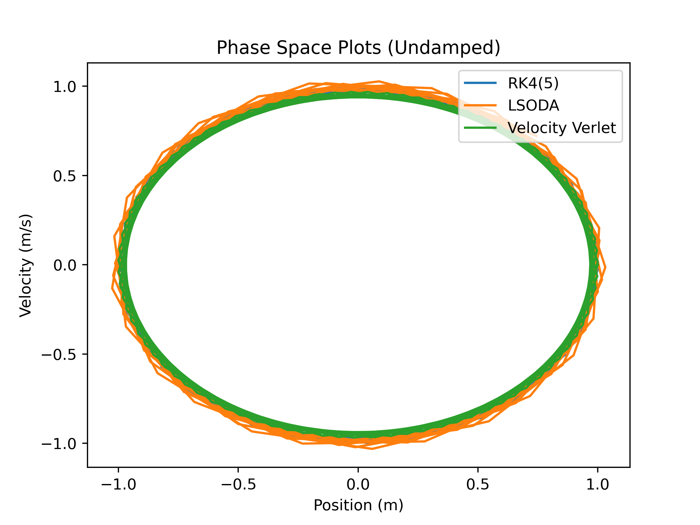
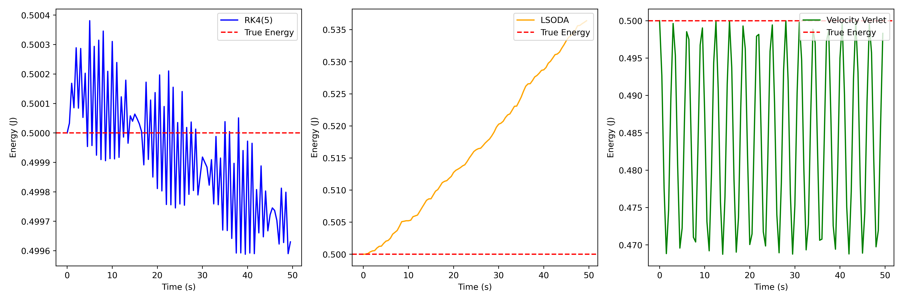
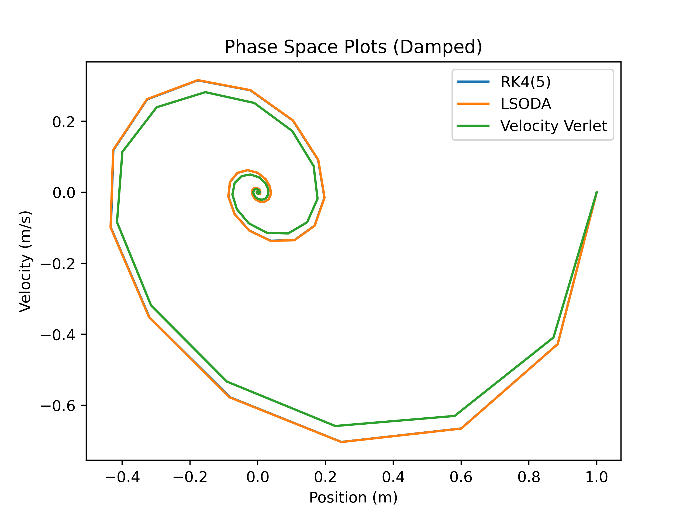
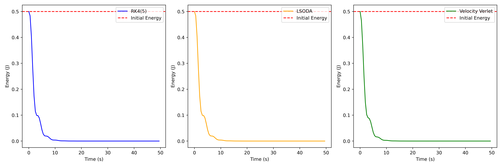
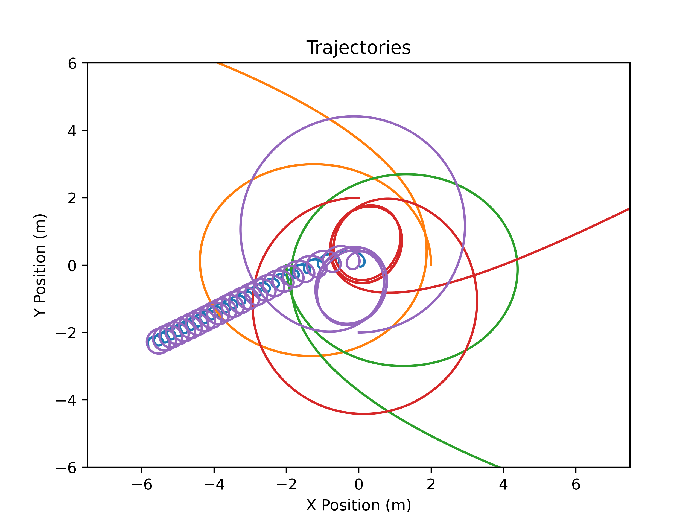
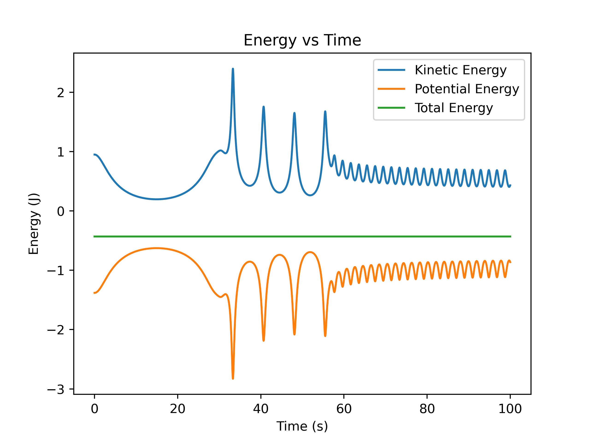
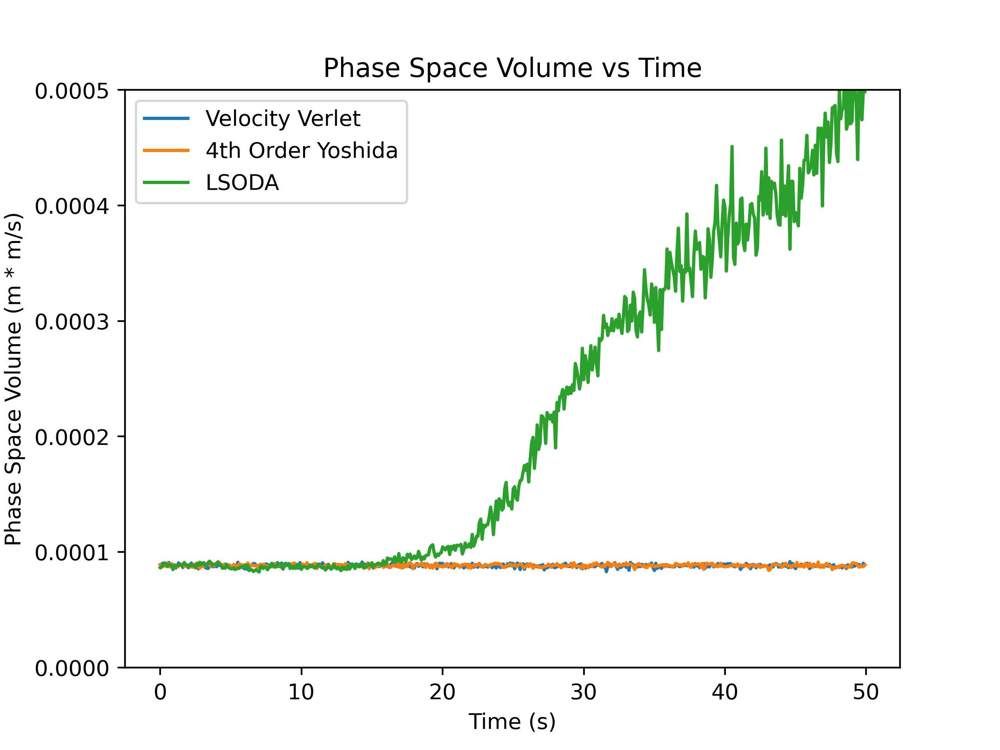
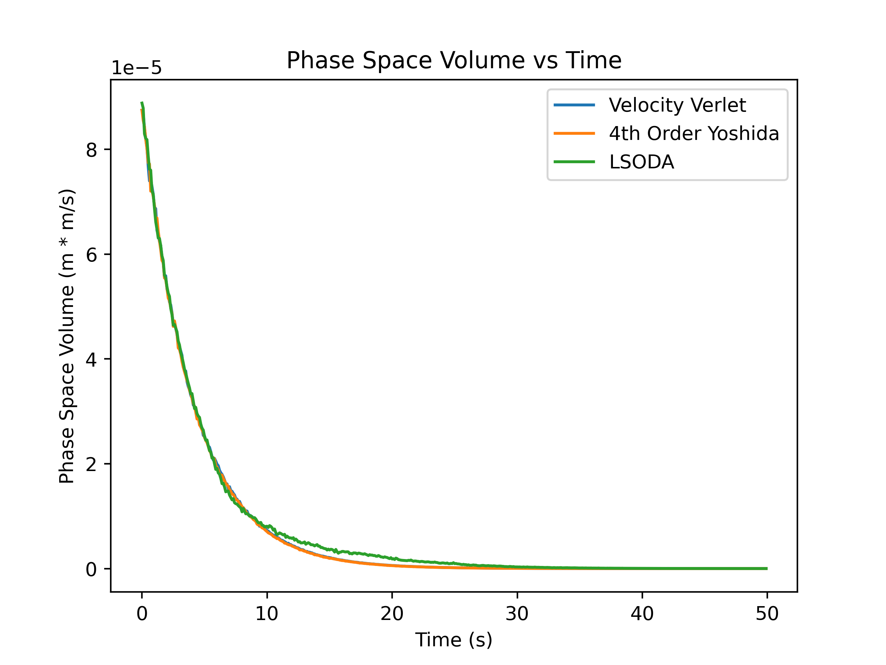
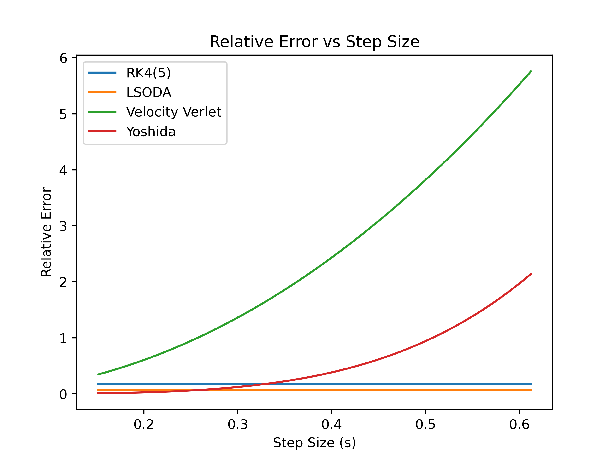

# Project 3
## Introduction
Few areas of math are as useful in physics as differential equations. However, for all of their utility in modeling physical systems, the average differential equations that we encounter outisde of an introductory course lack any kind of analytic solution. This necessitates the development of numerical methods that can efficiently and accuratley approximate solutions to initial value problems. In this project, we will show the pthon implementation for some different ODE algorithms and see how they differ in some use cases.

## Implementation and Theory
Equations of motion in physics are typically 2nd order ODEs. However, most ODE algorithms are dervied to solve systems of coupled first order equations. Therefore, the code has been written to solve problems of the form 

```math
\dot{x} = f(t,x,y)
```
```math
\dot{y} = g(t,x,y)
```
for some give initial conditon(s) on X and Y. A 2nd order equation for X can be decompoed into a system of 1st order equations by letting Y be the time derivative of X and then back substituting. 
```math
\dot{x} = y
```
```math
\dot{y} = g(t,x,y)
```
Before showing how the different algorithms have been implemented, there are some nice features that have been built into the that should be discsused. For one, they are not limited to taking in one set of initial conditons. All of the solvers can take two lists (of equal length) for intial condtions and solve the ODE system for each of those and output the solutions. The other notable feature is how the solutions are strctured. To make the code uniform, all solutions outputs have the same structure. The strucutre is expplained through sample code below that demonstrate how to use any of the methods. 
```python
#list of initial condtions
X_initial = [1, 2, 3]
Y_initial = [5, 6, 7]

#time range
tmin = 0
tmax = 1

#resolution (points between tmin and tmax)
nts = 100

#how the derivatives must be structured. U = [X, Y] is passed in as the system's current state.
def du_dt(t, U) #U = [X, Y] 
    X, Y = U
    dx_dt = f(t, X, Y)
    dy_dt = g(t, X, Y)
    return [dx_dt, dy_dt] #MUST be a list of this form

#solution from a generic method
sol = Method(X_initial, Y_initial, tmin, tmax, du_dt)

#How to extract information from sol
# The first element of sol is the array of times computed at
t = sol[0]

#The following elements of sol are lists containnig the computed X and Y over time.
X1 = sol[1][0]
Y1 = sol[1][1]

X2 = sol[2][0]
Y2 = sol[2][1]

X3 = sol[3][0]
Y3 = sol[3][1]
```
With a basic explanation done, we can now look at the different method that will be used. The first one is RK4(5). It belongs to a family of solvers known as Runge-Kutta (RK) methods. The explicit derivation is not of interest here, but a brief explanation of how this family of solvers works is useful. They are what's known as prediction corrector methods. Unlike bad solvers such as Euler's method, they improve the approximation accuracy by evaluating the system several times at locations around your computation point. Then, they use a weighted average of the results to update the state. RK4(5) is unique in that it is an adaptive method. This means that it changes the step size through comparing a 4th order step and a 5th order step. This allows is to adjust the time scale to capture the relevant dynamics. A python implementation is simple using the solve_ivp function from scipy.integrate. 

```python
from scipy.integrate import solve_ivp

def RK45(X0, Y0, tmin, tmax, nts, du_dt): 
    t_span = (tmin,tmax)
    t = np.linspace(tmin,tmax,nts,endpoint = False)

    #Convert the initial condtions from lists to arrays
    X0 = np.asarray(X0)
    Y0 = np.asarray(Y0)

    #Packaging the solutions for the way I described above. It loops over the initial conditions and
    #solves. This does mean that [X1, Y1], [X2, Y2], ... can't be coupled.

    solutions = [t]
    for i in range(len(X0)):
        sol = solve_ivp(du_dt, t_span, [X0[i], Y0[i]], t_eval = t, method = 'RK45')
        solutions.append([sol.y[0], sol.y[1]])

    return solutions
```

The next method is known as LSODA. It is another adaptive method for systems of ODEs. It was developed as part of the ODEPACK library and is designed to efficiently handle both stiff and non-stiff problems without requiring the user to decide which type of solver to use. It automatically switches between two classes of multistep methods depending on the behavior of the system. When the problem appears non-stiff, LSODA uses variable-order Adams predicton corrector methods, which are explicit multistep schemes that are efficient for smooth solutions. If the solver detects signs of stiffness—such as instability or rapidly shrinking step sizes, then it switches to Backward Differentiation Formula methods. These are implicit and more stable for stiff systems but computationally more expensive because they require solving nonlinear equations at each step. Throughout the integration, LSODA continuously adjusts the step size and method order. It is likewise simple to implement with solve_ivp.

```python
from scipy.integrate import solve_ivp

#This code is nearly identical to RK4(5), just one option is changed in solve_ivP
def LSODA(X0, Y0, tmin, tmax, nts, du_dt):
    t_span = (tmin,tmax)
    t = np.linspace(tmin,tmax,nts,endpoint = False)

    #Express ICs as arrays
    X0 = np.asarray(X0)
    Y0 = np.asarray(Y0)

    #Again, repackaging the solutions
    solutions = [t]
    for i in range(len(X0)):
        sol = solve_ivp(du_dt, t_span, [X0[i], Y0[i]], t_eval = t, method = 'LSODA')
        solutions.append([sol.y[0], sol.y[1]])

    return solutions
```
The last two algorithms are known as symplectic integrators. When possible, they conserve the volume for a continuous patch of initial condtions in phase space as it evolves in time. For physics problems, this translates to conseravation of energy. This makes them useful for long-term simulations of systems that conserve energy. 

The first syplectic method is the Velocity Verlet method. It is a second order method that works by updating position and velocity in a way that incorporates how acceleration changes over time instead of treating it as constant over a full step. Intuitively, you first use the current velocity and acceleration to “predict” where the particle will move over a small time step, giving a very accurate new position. Then, because forces may depend on position, you recompute the acceleration at this new location. Finally, you update the velocity using the average of the old and new accelerations, which captures how the force changed during the step. The solve_ivp function does not have this method as an option, so it had to be written explicitly.

```python
def VelVerlet(X0, Y0, tmin, tmax, nts, du_dt):
    t = np.linspace(tmin,tmax,nts,endpoint = False)

    #Doing this allows me to vectorize the solver, so X0 and Y0 can be arrays of initial conditions, and allows coupling.
    X0 = np.asarray(X0)
    Y0 = np.asarray(Y0)

    #Make X and Y the same  structure as the ICs
    X = np.zeros((len(t), ) + X0.shape)
    Y = np.zeros((len(t), ) + Y0.shape)

    dt = t[1]-t[0]

    X[0] = X0
    Y[0] = Y0

    for it in range(0,nts-1):
        X[it+1] = X[it] + dt*Y[it] + 0.5*(dt**2)*(du_dt(t[it],[X[it], Y[it]])[1])

        Y_predict = Y[it] + dt*(du_dt(t[it],[X[it], Y[it]])[1])

        Y[it+1] = Y[it] + 0.5*dt*(du_dt(t[it],[X[it], Y[it]])[1] +  du_dt(t[it+1], [X[it+1],Y_predict])[1])

    # Now, we need to repackage these results so that they are implemented the same as the scipy methods
    if len(X0) == 1: #special case for scalar inputs
        X = [X[i][0] for i in range(len(X))]
        Y = [Y[i][0] for i in range(len(Y))]
        return [t, [np.asarray(X), np.asarray(Y)]]
    else:
        solutions = [t]
        for k in range(len(X0)):
            U = [X[i][k] for i in range(len(X))]
            V = [Y[i][k] for i in range(len(Y))]
            solutions.append([np.asarray(U), np.asarray(V)])

        return solutions
```
The last method that will be used is the 4th Order Yoshida Integrator. It was devloped by plasma physicists before making its way into the other fields. The Yoshida method builds a very accurate time step by carefully combining several smaller, symmetrically arranged steps of a simpler symplectic integrator (like Velocity Verlet). Instead of taking one step with a fixed update rule, it takes a sequence of substeps with specially chosen positive and negative time coefficients that cause lower-order errors to cancel out. The result is a method that remains symplectic and achieves higher accuracy per step than other methods. Likewise, this had to be written explicitly.

```python
def Yoshida(X0, Y0, tmin, tmax, nts, du_dt):
    t = np.linspace(tmin,tmax,nts,endpoint = False)

    X0 = np.asarray(X0)
    Y0 = np.asarray(Y0)

    X = np.zeros((len(t), ) + X0.shape)
    Y = np.zeros((len(t), ) + Y0.shape)

    dt = t[1]-t[0]

    X[0] = X0
    Y[0] = Y0

    #Yoshida coefficients
    w1 = 1/(2 - np.cbrt(2))
    w2 =  -np.cbrt(2)/(2 - np.cbrt(2))

    c1 = w1/2
    c2 = (w1 + w2)/2
    c3 = c2
    c4 = c1

    d1 = w1
    d2 = w2
    d3 = w1
    
    #Looping to do the method
    for it in range(0,nts-1):
        Y1 = Y[it] + c1*dt*(du_dt(t[it], [X[it], Y[it]])[1])
        X1 = X[it] + d1*dt*(du_dt(t[it], [X[it], Y1])[0])
        t1 = t[it] + d1*dt

        Y2 = Y1 + c2*dt*(du_dt(t1, [X1, Y1])[1])
        X2 = X1 + d2*dt*(du_dt(t1, [X1, Y2])[0])
        t2 = t1 + d2*dt

        Y3 = Y2 + c3*dt*(du_dt(t2, [X2, Y2])[1])
        X3 = X2 + d3*dt*(du_dt(t2, [X2, Y3])[0])
        t3 = t2 + d3*dt

        Y[it+1] = Y3 + c4*dt*(du_dt(t3, [X3, Y3])[1])
        X[it+1] = X3

    # Now, we need to repackage these results so that they are structured the same as the scipy methods
    if len(X0) == 1:
        X = [X[i][0] for i in range(len(X))]
        Y = [Y[i][0] for i in range(len(Y))]
        return [t, [np.asarray(X), np.asarray(Y)]]
    else:
        solutions = [t]
        for k in range(len(X0)):
            U = [X[i][k] for i in range(len(X))]
            V = [Y[i][k] for i in range(len(Y))]
            solutions.append([np.asarray(U), np.asarray(V)])

        return solutions
```
One last thing to note is the limits of these function. Because of how the RK4(5) and LSODA funtions are written, it is not easy to have a system where particles are coupled together. This is because the functions merely loop over intial condtions and solve that particular problem. Since the the symplectic methods had to be written explicitly, they have much more freedom in what they can do. If you write your system correctly and express the derivative properly, these methods can treat the lists of initial conditions as interacting particles. Of course, if you instead want to solve the same problem for different sets of inital conditions, that is still possible too. You just don't couple your derivatives of one trajectory to the others. This makes them highly flexible! They achieve this by taking full advantage of the vectorization of numpy arrays. The symplectic methods can solve something like the SHO for multiple ICS up to the n-body problem for as many bodies as you input without changing the function at all. We will see all of these uses in the following sections.

## Simple Harmonic Oscillator (SHO)

The first system that we will investigate the SHO with and without damping. To simplify the equations, the equillbrium position is taken to be the origin so that erroneous terms accounting for the length of the spring do not have to be accounted for. Hooke's Law combined with Newton's Second Law gives the following equations of motion.

```math
\ddot{x} = \frac{c}{m} \dot{x} + \frac{k}{m} x
```
Here, k is the spring constant, m is the mass, and c is the damping strength. For the integrators, we need to express this problem as a coupled system of 1st order equations. 

```math
\dot{x} = y
\qquad
\dot{y} = -\frac{c}{m} y - \frac{k}{m} x
```
Then, we will want to write this as a vector equation so that we know what the form of the derivative will be. 

```math
\frac{d}{dt}
\begin{pmatrix} x \\ y \end{pmatrix}
=
\begin{pmatrix} y \\ -\frac{c}{m} y - \frac{k}{m} x \end{pmatrix}
```
For the way the code is written, we need to express the derivatives of the system in a specfic way.
```python

k = 1 # N/m        (spring constant)
m = 1 # kg         (mass)
c = 0.5 # N/(m/s)  (damping strength)

def SHO_damped(t, u): #derivative, u = [X, Y]
    x,y = u

    #Put the derivative for x and y in here
    #x is the position. y is the velocity
    dx_dt = y
    dy_dt = -(k/m)*x  - (c/m)*y
    return [dx_dt, dy_dt]
```
Let's first look at how the this system evolves over time with no damping for some of the integrators. 

<div align="center">
  
  <p><em>Figure 1:</em> Plots of the phasae space trajecotries for the undamped SHO for three different integrators.</p>
</div>

We can see that this traces out an ellipse in phase space, which is what we expect for the analytic solution for system. However, these methods are not outputting the exact same trajectory in phase space. You can resolve the difference by zooming in the plot range, but this is a good oppurtunitty to see how the total mechanical enerergy of this system evolves with the different methods. Physically, we know that it should be conserved because spring forces are conservative, but not all numeriacl methods conserve energy.

<div align="center">
  
  <p><em>Figure 2:</em> Plots of the energies for the undamped SHO for three different integrators.</p>
</div>

This shows a large distinction among these three methods. We see that the symplectic method oscillates near the true energy, while RK4(5) and LSODA unavoidably accumulate drift in the energy over time. For this reason, Veleocity Verlet might be considered better for long term solutions to this problem despite being a lower order method. Of course, this particular system isn't complicated, but energy drift is signifigant for mor sensitive problems. Now, we can introduce damping to this system and see how that affects the numeriacl solutions. 

<div align="center">
  
  <p><em>Figure 3:</em> Plots of the phase space trajectories for the damped SHO for three different integrators.</p>
</div>

As expected, the system is now losing energy to viscous forces. This causes it to spiral down to the origin, which for this system is the state with no energy. We see the same behavior in the energy.

<div align="center">
  
  <p><em>Figure 4:</em> Plots of the energy over time for the damped SHO for three different integrators.</p>
</div>

In this case, Velocity Verlet just behaves as a second order integrator. Since energy is no longer conserved, it has lost the advantage it had over RK4(5) and LSODA.

## n - Body Problem and the Virial Theorem
To simulate the n-body problem, we need to develop some more complicated theory than the SHO. We can derive approximate equations for the gravitational field produced by a point of mass M by using the weak-field limit of the Einstein field equations. When doing so, we can obtain Newton's universal law of gravitation. 

```math
\mathbf{g}(\mathbf{x}) = -G M \frac{\mathbf{x}}{x^3}
```
Where x is the position vector from the mass point to the field point, and G is the gravitational constant. Then, for a collection of n point masses, the acceleration on each point is the sum of the individual accelerations. 

```math
\mathbf{a}_j = - \sum_{\substack{i=1 \\ i \neq j}}^{n} G m_i \frac{\mathbf{x}_j - \mathbf{x}_i}{\lvert \mathbf{x}_j - \mathbf{x}_i \rvert^3}
```
Now, the positon vectors are taken to be relative to the origin of the system. We want to express this as a coupled 1st order system, so let y denote velocities.
```math
\dot{\mathbf{x}}_j = \mathbf{y}_j,
\qquad
\dot{\mathbf{y}}_j = - \sum_{\substack{i=1 \\ i \neq j}}^{n} G m_i \frac{\mathbf{x}_j - \mathbf{x}_i}{\lvert \mathbf{x}_j - \mathbf{x}_i \rvert^3}
```
Now, we can repackage this to resemble oher systems. Let X be the vector whose components are the positions x_j, then let Y be the vector whose components are y_j, lastly let A be the vector whose components are a_j. Then, our system can be written in the highly absctraced form

```math
\frac{d}{dt}
\begin{pmatrix}
\mathbf{X} \\
\mathbf{Y}
\end{pmatrix}
=
\begin{pmatrix}
\mathbf{Y} \\
\mathbf{A}
\end{pmatrix}.
```
This may not seem useful, but it means that we just need to calculate A as a list of 2D vectors at each timestep to simulate this problem. We can do that with the symplectic integrators because of how general they are. This works well too since symplectic methods are especially useful for n-body simulation. Since it had not been used yet, this will be done with the Yoshida method. To compute the derivatives, we use the following functions. 

```python
def GravAcc(P1, P2, M2): #acceleration on P1 from P2
    if np.array_equal(P1, P2): #no self interaction
        return np.array([0,0])
    else:
        return G*M2*(P2 - P1)/((np.linalg.norm(P2 - P1)**3)) #Gravitational acceleration formula
    
def TotalAcceleration(P, X, M): # Calculates acceleratio on P from all points in X
    A = np.array([0, 0])
    for i in range(len(X)):
        A = A + GravAcc(P, X[i], M[i])
    return A

def Derivative(t, U): # U is a 2 element list. The first element is the array of position. The second is velocities
    X, Y = U

    dX_dt = Y
    dY_dt = np.asarray([TotalAcceleration(X[i], X, M) for i in range(len(X))])
    return [dX_dt, dY_dt]
```

Then, we can test this with five points masses. We are able to write our conditions for the system as follows.

```python
G = 1 #Gravitational Constant 
M =  [1.0, .50, 0.50, .450, 0.450]            # Masses
X0 = [[0,0], [2,0], [-2,0], [0,2], [0,-2]]    # Initial Positions
V0 = [[0,0], [0,1], [0,-1], [-1,0], [1,0]]    # Initial Velocities
```
Here are the results for these condtions.

<div align="center">
  
  <p><em>Figure 5:</em> Trajectories of 5 gravitationally attracting masses.</p>
</div>

We have enough particles in this simulation to test the virial theorem. For a gravtiationally bound system, it relates the average kinetic and potential energy.

```math
\langle T \rangle = -\frac{1}{2} \langle U \rangle
```
First, here's how you can calculate the energies.
```python
def Kinetic_Over_Time(sol): #takes the solution made by Yoshida method and finds the kinetic energy over time

    velocities = [V[1] for V in sol[1:]]
    T = [] #kinetic energy

    for i in range(len(sol[0])): #loop over the velocities at the current time
        v = [U[i] for U in velocities] #selects the ith term in velocities
        q = [0.5*M[j]*(np.linalg.norm(v[j])**2) for j in range(len(v))]

        T.append(sum(q))

    return T

def Potential(positions, masses, G): #takes in the positions at a time and outputs the potential

    positions = np.asarray(positions)
    masses = np.asarray(masses)

    N = len(masses)
    U = 0.0

    #carefully done to avoid double summing
    for i in range(N):
        for j in range(i + 1, N):
            r = np.linalg.norm(positions[i] - positions[j])
            if r != 0:
                U -= G * masses[i] * masses[j] / r
    return U

def Potential_Over_Time(sol): #Uses the potential function to find the potential at all points in time
    All_positions = [X[0] for X in sol[1:]]

    Potential_Energies = []
    for i in range(len(sol[0])): #do over time
        positions = [X[i] for X in All_positions] #goes over all the trajectoreis
        Potential_Energies.append(Potential(positions, M, G))

    return Potential_Energies
```
Now, let's first see how the kinetic and potential energy evolves over time for this system.

<div align="center">
  
  <p><em>Figure 6:</em> total potential and kinetic energy of for 5 gravitationally attracting masses.</p>
</div>

The energy is clearly being conserved, and when we calculate the averages of kinetic and potential, we find the following.

```math
\langle T \rangle = 0.5790...
```
```math
\langle U \rangle =-1.0103...
```
When we compute their ratio, we find
```math
\frac{\langle T \rangle}{\langle U \rangle} = -0.5249...
```
Which is pretty close to the -1/2 we would expect, so we can be reasonably sure that this is confirming the virial theorem.

## Phase Space Volume and Symplectic Methods

Symplectic methods are characterized as conserving volume in phase space. This is something we can observe with our undamped SHO. Since this system describes the trajectory of one particle, we have a two dimensional phase space: Velocity vs Position. So, our volume becomes an area. Then, the algorithm is relativly simple. We want to see how the are of a small patch of initial conditions in phase space evolves over time. To achieve this, we generate a list of random initial conditions that are close. This will approximate our patch of area. Then, we will use the concave_hull and shapely.geometry packages to generate a concave hull around our points as they evolve in time and calculate the area using the polygon object. Here is some sample code for how this can be done the Velocity Verlet method.

```python
from concave_hull import concave_hull
from shapely.geometry import Polygon
from P3_Methods import VelVerlet, Yoshida, LSODA

tmin = 0 #s start time
tmax = 50 #s end time
nts = 350 #number of points between tmin and tmax

n = 250 #number of points to test
X0 = np.random.uniform(0.95, 1, size = n)
Y0 = np.random.uniform(0.95, 1, size = n)

solutions = VelVerlet(X0, Y0, tmin, tmax, nts, SHO)
t = solutions[0]

PhaseVolumes = np.zeros(len(t))
for j in range(len(t)): #caclulate the phase space volume over time
    P = [[solutions[k][0][j], solutions[k][1][j]] for k in range(1,n)]
    P = concave_hull(P, concavity=2.0)
    poly = Polygon(P)
    PhaseVolumes[j] = poly.area

plt.plot(t, PhaseVolumes, label = "Velocity Verlet")
```
We will compare the Velocity Verlet and Yoshida methods to LSODA. RK4(5) was omitted because it takes much longer to diverge than LSODA does. 

<div align="center">
  
  <p><em>Figure 7:</em> Plots of the phasae space volums over time for the undamped SHO for three different integrators.</p>
</div>

The two symplectic methods seem to be conserving phase space volume while LSODA is accumulating more error as the simulation continues. Now, let's see what happens when damping is introduced.

<div align="center">
  
  <p><em>Figure 8:</em> Plots of the phasae space volums over time for the damped SHO for three different integrators.</p>
</div>

Now, all methods have the volume decaying to zero. This is not surprising of course. This system no longer conserves energy, and all initial conditions should tend towards the zero energy state at the origin. So, since all points get closer over time, the phase space area will decrease.

## Conclusion
The method you want to use for your problem depends on the context of your work. If you are trying to create a high fidelity simulation for resarch, and you have the time and computational resources to do so, then you probably want to opt for a higher order method and/or smaller time steps (up to a point). Also, knowing your system helps in choosing your integrator. If it conserves energy, then you can choose a sumplectic integrator and may get away with a larger step size. Furthermore, lower order methods generally perform quite well if you don't need high precision or your limited in resources. 

## Attribution
Wikipedia was used for the coefficients of the Yoshida method. "Computational Physics" by Prof. Mark Newmann from MSU was used as well as "Computational Physics in Python" from the assignment description.

## Timekeeping
I spent about 20 hours on the code and about 10 hours on the write up.

## A Note on Error 
I tried for an extremely long time to get a nice plot of relative error for these methods. Howevr, RK4(5) and LSODA kept producing flat errors. I susptect this is because they are adaptive, and they take the error as low as their initial tolerance no matter what. It wouldn't make sense to change that in my opinion since the error is then whatver I choose it to be, not something that responds to step size. Here is the plot I was able to produce.

<div align="center">
  
  <p><em>Figure 9:</em> Plots of the relative errors as the step szie decreases for the SHO.</p>
</div>

## Languages, Libraries, Lessons Learned
Everything was written in python. The libraries used were numpy, scipy, matplotlib, concave_hull, and shapely. I learned to get really good at indexing and dealing with high-dimensional monsters.
