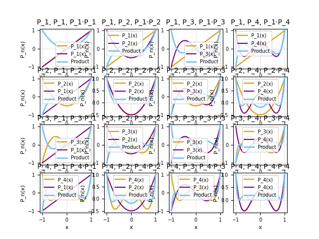

# Project 1 


## The Trapezoidal Rule

From the pervious jupyter notebooks, we know that the trapezoidal rule is a numerical method for evaluating integrals. It works by locally approximating the function as a line and thus the area underneath it as a trapezoid. An interesting thing to examine for a numerical method is the rate at which it converges to the true value. So, we want to integrate the function

```math
f(x) = \sin(\sqrt{100 x})
```

over the region [0,2] using the trapezoid rule for a sequence of different numbers of subintervals. The following function will achieve that.

```python
#The integrand
def f(x):
    return (np.sin(np.sqrt(100*x)))**2

#The function being integrated
def trapezoid(f,a,b,N):
    h = (b-a)/N #Interval size
    mysum = 0
    
    for i in range(1,N): #should go from 1 to N-1
        mysum = mysum + float(f(a+(i)*h)*h) 
    return mysum +(h/2)*(f(a) + f(b))

#This function tables values and their error
def Table(g,a,b,TrueVal, alg, points): 

    print('\n',f"{'Intervals':<12} {'Approx Value':>16} {'Error' :>25}")
    for i in points:
        val = alg(g,a,b,i)
        print(f"{i:10d} {val:19.10f} {np.abs(TrueVal - val):25.20f}")
    print()
    return
```

The first two functions are just the integrand and the trapezoid rule. The last function, called 'Table', will be used here and later in the project to output a formatted table of the the number of intervals, the approximated integral, and the error in that approximation. It is written to take the following arguments in order: the integrand, the lower and upper limit of integration, the true value, the integration algorithm, and lastly a list of subinterval totals to test.

When used with the integrand above on the interval [0.2] and having the subintervals grow expoenentially, we get the following

    Trapezoid Rule

    Intervals        Approx Value                     Error
            1        0.9999753124    0.00572723042777167901
            2        0.7959466253    0.20975591753277367246
            4        0.6983700870    0.30733245580013390796
            8        1.0349702802    0.02926773737947185872
           16        0.9467001204    0.05900242243935382991
           32        0.9784652387    0.02723730414567648861
           64        0.9979096693    0.00779287348205670583
          128        1.0036893156    0.00201322723668928560
          256        1.0051951162    0.00050742663946268252
          512        1.0055754278    0.00012711504144302666
         1024        1.0056707479    0.00003179492224458791
         2048        1.0056945931    0.00000794973995432713
         4096        1.0057005553    0.00000198749713442581
         8192        1.0057020459    0.00000049687722025737

We see that, roughly speaking, to gain an extra decimal of accuracy we have to double the number intervals each time. At some point between 4096 and 8192 we achieved 10 decimal precision. This does not take terribly long to do computationally, but there are other algorithms that can handle this problem with much fewer intervals. We will consider such an algorithm next.

## Gaussian Quadrature

### Derivation

The trapezoidal rule is based on linear approximations of function on a subinterval to compute area. Similarly, Simpson's rule instead uses quadratics which allows for a more accurate approximation and thus faster convergence. Then, we will consider a  method called Gaussian Quadrature. The tools used for the approximations in this method are the Legendre polynomials.

As a refresher, the Legendre polynomials are a set of polynomials that are orthogonal on the interval [-1,1]. The first four are plotted below, as well as their products. 



These plots visually demonstrate the orthogonality condition for the Legendre polynomials.

```math
\int_{-1}^{1} P_n(x)P_m(x) dx = \frac{2}{2n+1}\ \delta_{nm}
```

In order to take advantage of the orthogonality conditon in building our algorithm, we want to transform our integral onto the interval [-1,1], which we will do now.

```math
\text{Let } 
u = \frac{1}{b-a}\left(2x - a - b\right).
```

```math
\text{Then solving for } x:
\qquad
x = \frac{b-a}{2}\,u + \frac{a+b}{2}.
```

```math
\frac{dx}{du} = \frac{b-a}{2}
\quad \Rightarrow \quad
dx = \frac{b-a}{2}\ du.
```

```math
\boxed{
\int_a^b f(x) dx= \int_{-1}^{1} f\!\left( \frac{b-a}{2}u + \frac{a+b}{2} \right) \frac{b-a}{2} du.
}
```

Then, we can build the Gaussian Quadrature algorithm with respect to integrals on [-1,1]. The derivation presented here is taken from and derivative of the one presented by Jeremy Tatum on Libre Texts. It starts with some results needed to construct the algorithm.

We first recall polynomial division. Let P be a polynomial of degree n, and let S be a polynomial of degree 2n. Then, the polynomial division of these two has the form
```math
\frac{S(x)}{P(x)} = Q(x) + \frac{R(x)}{P(x)}
```
Where the quotient, Q, and the remainder, R, each have a degree less than n.

Then, the next result is a consequecnce of orthogonality. For the legendre polynomial of degree l and any polynomial Q of degree less than l, then
```math
\int_{-1}^{1} P_l(x)Q(x) dx
```
This happenes because the legendre polynomials of degree less than l form an orthogonal basis for the set of polynomials with degree less than l on the interval [-1,1].

Finally, we need to discuss Lagrange polynomials because they are used in the very end. If we have n known points of a function, then a polynomial approximation of degree n-1 can be constructed with the formula
```math
f(x) \approx \sum_{i=1}^{n} f(x_i)L_i(x)
```

The Li are called the lagrange polynomials. 
They can be calculated using the formula
```math
L_i(x) = \prod_{i \ne j} \frac{x-x_i}{x_i - x_j}
\\
x_i \text{ are the sampling points.}
\\
L_i(x_j) = \delta_{ij}
```
For a polynomial of degree n-1 and n sample points, this representation with lagrange polynomials is exact.

Now, we can start putting together the algorithm. We want to approximate the integral using a weighted sum of the function at n quadrature points in the interval [-1,1].
```math
\int_{-1}^{1} f(x) dx \approx \sum_{i=1}^{n} w_i f(x_i)
```
We demand that this approximation be exact for polynomials of degree less than 2n, so let S be such a polynomial. Then, the divison algorithm lets us express this in the form 
```math
S(x) = Q(x)P_n(x) + R(x)
```
Where Pn is the nth degree legendre polynomial. Therefore,
```math
\int_{-1}^{1} S(x) dx = \int_{-1}^{1} Q(x)P_n(x) dx + \int_{-1}^{1} R(x) dx
```
Orthogonality gurantees that the integral of Q(x)Pn(x) goes to 0, so we obtain
```math
\int_{-1}^{1} S(x) dx = \int_{-1}^{1} R(x) dx
```
We will set that aside for now and consider our approximation. We want our weighted sum over our n quadrature points to exaclty evalaute the integral of S.
```math
\int_{-1}^{1} S(x) dx = \sum_{i=1}^{n} w_i S(x_i) = \sum_{i=1}^{n} w_i (Q(x_i)P_n(x_i) + R(x_i))
```
Then, we choose our quadrature points to be the n distinct roots of Pn which all lie in [-1,1]. This reduces our equation to
```math
\int_{-1}^{1} S(x) dx =  \sum_{i=1}^{n} w_i  R(x_i)
```
And we now equate our two forms for the integral to yield
```math
\int_{-1}^{1} R(x) dx =  \sum_{i=1}^{n} w_i  R(x_i)
```
The important observation at this step is that we have converted the problem from inegrating a polynomial of degree up to 2n-1 with n quadrature points into an integral of an at most degree n-1 polynomial and n quadrature points. R therefore has an exact representation in terms of the lagrange polynomials with our n sample points.

By construction
```math
R(x_i) = S(x_i) 
```
Therefore
```math
R(x) = \sum_{i=1}^{n} S(x_i)L_i(x) 
```
So
```math
\int_{-1}^{1} R(x) \ dx = \int_{-1}^{1} \sum_{i=1}^{n} S(x_i)L_i(x)  \ dx = \sum_{i=1}^{n} w_i  S(x_i)
```
By mvoing an integral into the sum and equating terms, we at last determine a formula for the weights.
```math
w_i = \int_{-1}^{1} L_i(x) dx = \frac{2}{(1-x_i^2)P'_i(x_i)^2}
```
Where that last equality is determined using algebra and properties of legendre polynomials. It is omitted here becausee it does not demonstrate the important ideas of Gaussian Quadrature. It is interesting that our weights are completley independent of our integrand. They only depend on the sample points, which are determined by the order of quadrature we have chosen. This can be seen from the defintion of the lagrange polynomials and the final formula obtained.

We constrcuted this algorithm to be exact for polynomials up to degree 2n-1 for n quadrature points. Therefore, if an arbitrary function is well approximated on an interval by a polynomial of degree 2n-1 for some n, then we can be reasonably certain that guassian quadrature of order n will approximate the integral of the function on that interval. In general, reasonably well-behaved functions should then be better approximated as we make n large because they admit taylor approximations of any order.

### Implementation and Applications

Gaussian Quadrature can be implemented in just a few lines in python because Scipy contains the roots and weights for the legendre polynomials. Here is the implementation.
```Python
def GaussQuad(g,a,b,N):
    roots, weights = sp.special.roots_legendre(N)
    return np.sum([weights[i]*g(((b-a)/2)*roots[i] + (a+b)/2)*(b-a)/2 for i in range(N)])
```
The function takes in a function g to be integrated, the lower and upper limits, and the number of quadrature points. It then retireves the necessary roots and weights. The return statement calculates the sum to approximate the integral after it has been transformed to the interval [-1,1].

When tabulate the results of this for function from the trapezoidal rule for a few quadrature points, we get the following.

    Gaussian Quadrature

    Intervals        Approx Value                     Error
            1        0.5919179382    0.41378460463911692635
            2        0.0468122591    0.95889028377447971252
            3        1.0788550678    0.07315252493735124872
            4        1.4373009028    0.43159836001921014770
            5        0.5085924010    0.49711014185446389391
            6        0.9691301208    0.03657242199379018288
            7        1.2026753698    0.19697282699719309562
            8        1.0452463942    0.03954385139735516752
            9        1.0085818670    0.00287932419035552556
           10        1.0058072183    0.00010467548800452420
           11        1.0057047355    0.00000219268237677817
           12        1.0057025717    0.00000002885303884703
           13        1.0057025431    0.00000000025312063556
           14        1.0057025428    0.00000000000154765090

It is immediatley obvious that at just 14 subintervals this algorithm achieves 11 decimal places of precision. This is a signifigant improvement to the 8192 needed for the trapezoidal rule to have 6 decimal places of precision.

One thing that distinguishes Gaussian Quadrature from other integration algorithms is that it never evaluates at the limits of integration. This makes it worthwhile to experiment with a function that has a singularity at one of its limits of integration. So, consider
```math
\int_{0}^{2}\frac{y^2}{\sqrt{2-y}} \ dy
```
The integrand diverges at y=2, howevever, the integral is know to converge to 
```math
\frac{\sqrt{8192}}{15} \approx 6.03398
```
When we run it through some test values for Gaussian Quadrature, we get

    Gaussian Quadrature

    Intervals        Approx Value                     Error
            1        2.0000000000    4.03397786612520636851
            2        3.9692982723    2.06467959381430565813
            4        4.9250702034    1.10890766269902574237
            8        5.4524601041    0.58151776206370531241
           16        5.7351913886    0.29878647754265763581
           32        5.8823916391    0.15158622699414969759
           64        5.9576109220    0.07636694410004540856
          128        5.9956475710    0.03833029517007435771
          256        6.0147755808    0.01920228534661561071
          512        6.0243673843    0.00961048186697510687
         1024        6.0291702836    0.00480758256002555839
         2048        6.0315734888    0.00240437735766096949

We can still observe the algorithm converging. Unfortunatley, however, it now takes thousands of intervals to achieve just 2 decimal precision. If we try to obtain even higher precision, then the time complexity of the algortithm causes the run time to skyrocket and it takes forever to compute. For example, the number of quadrature points needed to achieve 10 decimal precision would be much larger than 100000, probably even large than 100000000. This is because Gaussian quadrature requires the existence of a good polynomial approximation on the entire interval of integration. Howevever, no polynomial can approximate a singularity. Polynomial approximations of the integrand get closer to the behavior at y = 2 as the degree increases, but there is not finite degree where that approximation becomes good for all neighborhoods about y = 2.

Thankfully, all is not lost. We can transform this integral to remove the singularity at the upper limit.

Let
```math
y = 2\sin^2 (u).
```

Then
```math
dy = 4\sin (u) \cos (u) \ du.
```

Compute each part of the integrand:

```math
y^2 = (2\sin^2 (u))^2 = 4\sin^4 (u),
```

```math
2 - y = 2 - 2\sin^2 (u) = 2(1 - \sin^2 (u)) = 2\cos^2 (u),
```

```math
\sqrt{2 - y} = \sqrt{2\cos^2 (u)} = \sqrt{2}\cos (u).
```

Change the limits

```math
y=0 \Rightarrow u=0,
\qquad
y=2 \Rightarrow u=\frac{\pi}{2}.
```

Substitute

```math
\int_{0}^{2} \frac{y^2}{\sqrt{2 - y}} \ dy
=
\int_{0}^{\pi/2}
\frac{4\sin^4 (u)}{\sqrt{2}\cos (u)}
\cdot
4\sin (u) \cos (u) \ du.
```

Simplify

```math
=
\int_{0}^{\pi/2}
\frac{16\sin^5 (u) \cos u}{\sqrt{2}\cos (u)}
\ du
=
\int_{0}^{\pi/2}
\frac{16}{\sqrt{2}}\sin^5 (u) \ du.
```

Since $\frac{16}{\sqrt{2}} = 8\sqrt{2}$,

```math
\boxed{
\int_{0}^{2} \frac{y^2}{\sqrt{2 - y}} \ dy
=
8\sqrt{2}
\int_{0}^{\pi/2} \sin^5 (u) \ du
}
```

Now, we use Gaussian Quadrature on this transformed integral

Gaussian Quadrature

    Intervals        Approx Value                     Error
            1        3.1415926536    2.89238521253541414069
            2        6.7437649140    0.70978704789109148265
            3        5.9597379152    0.07423995087555201877
            4        6.0387866085    0.00480874239395401304
            5        6.0337699892    0.00020787689198176196
            6        6.0339841203    0.00000625417495836444
            7        6.0339777294    0.00000013671461918108
            8        6.0339778684    0.00000000225831442435
            9        6.0339778661    0.00000000002912692310
           10        6.0339778661    0.00000000000030109248

This has clearly recovered the efficiency we saw before, achieving 10 decimal precision at 9 quadrature points. We can then compare this to a previous efficient algorithm called Simpson's rule. It works by apprxoimating a funciton with quadratics. Its tabulated values are 

    Simpson's Rule
    
     Intervals        Approx Value                     Error
             5        6.0339926684    0.00001480227942884937
            10        6.0339780817    0.00000021561509910839
            15        6.0339778848    0.00000001869018362299
            20        6.0339778694    0.00000000331175797896
            25        6.0339778670    0.00000000086638429764
            30        6.0339778664    0.00000000028982505285
            35        6.0339778662    0.00000000011485834506
            40        6.0339778662    0.00000000005152589466
            45        6.0339778662    0.00000000002540812005
            50        6.0339778661    0.00000000001350031198

To achieve the same precision as Gaussian Quadrature, Simpson's rule needed 35 intervals. This is still an improvement over the trapezoidal rule, but not quie as good as Gaussian Quadrature. Furthermore, this algorithm would have been compeletely unable to evaluate this integral without the subsistituion whereas Gaussian Quadrature was still able to approximate it somewhat.

## Attribution

The primary resources for this assignment were the previous jupyter notebooks for numeric integration. THey contained useful examples of looping, plotting, and other relevant syntax for python. When they did not suffice, internet resources were used. For example, if I wanted to learn how to format an axis in a plot with pylab, I would search something to the effect of "How to format axes in pylab?" and then usually the first few results would have the information I needed. Also, Cricket was helpful in formatting the legendre polynomials.

## Timekeeping

I would estimate I spent around three to 10 hours on this. About 3 for the code and 7 for the report.

## Languages, Libraries, Lessons Learned 

The only language use was python becuase thus far everything has been in python. I only know it and C++, and I did not want to use C++. The libraries were numpy, scipy, and matplotlib.pyplot. The first two were simple to use. However, I had trouple getting the plotting to work because I didn't know I had to import matplotlib.pyplot and not just matplotlib.
