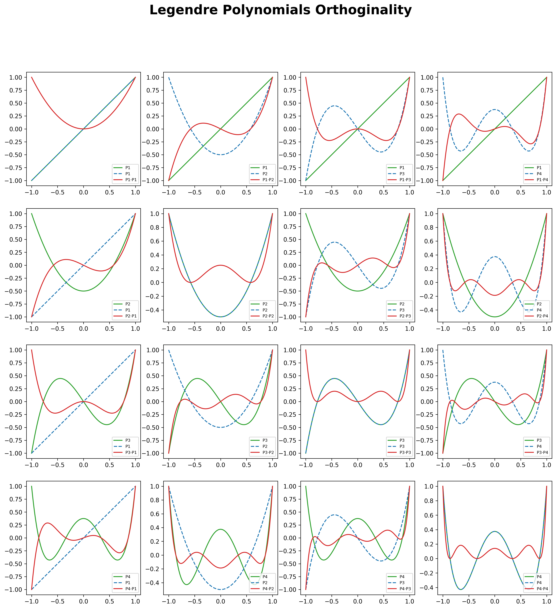

---
meta:
    Author: Alec Snodgrass
    Topic: Numeric Integration Project
    Course: TN Tech PHYS4130
    Term: Spring 2026
---
# Numeric Integration Project

## Explanation of the code

### Trapezoid approximation
The trapezoidal approximation was developed in earlier notebooks and builds off the left endpoint, right endpoint, and midpoint rules. Those three rules were studied regarding Riemann sums, a building block for integration. Using the Riemann sum method, integrals can be approximated by taking finer and finer slices of the area under the function's plot. 

Where the left endpoint, right endpoint, and midpoint rules differ from the trapezoid approximation is the form of the 'top' of the 'slice'. The trapezoid uses both the left and the right sides to approximate the same slope as the function. This method cuts out a large portion of over- or underestimations made by square rectangles. 


The code below implements the function:
```math
  I_T = \frac{h}{2}\left[ f(a) + f(b)\right] + \sum_{i=1}^{N-1} f(a+ih) h
```

```python
def traprule(f, a, b, N):                   
    dx = (b-a) / N
    l = np.linspace(a, b-dx, N)           # This calculates the left endpoint x-value
    r = np.linspace(a+dx, b, N)           # This calculates the right endpoint x-value
    return np.sum( (f(l)+f(r)) * dx ) / 2 # Averages left and right rules to form a trapezoid
```
This function divides the range into N subsections, finds the left and right endpoints for each subsection, finds the value at both endpoints for each subsection, and then calculates the area for each subsection. The area is calculated by averaging the subsection area calculated by the left and right endpoints. The N areas are added and returned as the integral.

This function was used with a *very* high **N** value to get a good approximation of the integral to compare against later. The integral was approximately:
```math
\int_0^2 \mathrm{d}x\, \sin^2\left(\sqrt{100x}\right) = 1.0057025428257
```
---
### Legendre polynomial orthogonality
Any task involving Legendre polynomials will always be made easier if the requirement to calculate them is waived. Thankfully, we were allowed to use a library that handed us the Legendre polynomials straight away.
```python
from scipy.special import legendre
```
This function streamlined the process of calculating polynomials and multiplying them together. Below is a grid of low-order Legendre polynomials. Upon careful inspection of the graphs, it is clear that $`\int_{-1}^{1} P_i\cdot P_j \mathrm{d}x=\delta_{i,j}`$. Meaning that the Legendre polynomials are, in fact, orthogonal. 

<figure>
  
  <figcaption><strong>Figure 1.</strong> 4×4 grid of Legendre polynomials and their products.</figcaption>
</figure>

---

### Gaussian quadrature
Gaussian quadrature is easiest over the bounds [-1, 1]. Therefore, a simple function conversion is required to use the algorithm. Below, I map the integrand and the bounds to an equivalent function over [-1, 1]. 
```math
u(x) = \frac{2x-a-b}{b-a}
```
Therefore, if x = a:
```math
u(a) = \frac{2a-a-b}{b-a} = -1
```
And, if x = b:
```math
u(b) = \frac{2b-b-a}{b-a} = 1
```
To calculate the integral, we need to account for our change of variables.
```math
u=\frac{2x-a-b}{b-a}
```
```math
u(b-a) = (2x-a-b)
```
```math
u(b-a)+a+b = 2x
```
```math
x = \frac{u(b-a)}{2} + \frac{a+b}{2}
```
```math
dx = du * \frac{b-a}{2}
```
For this problem, [a, b] = [0,2] and therefore 
```math
dx = du
```
```math
x = u+1
```

To approximate the integral, Gaussian quadrature is laid out in the following algorithm
```math
\int_{-1}^{1} \mathrm{d}x\, g(x) \approx \sum_{i=1}^N c_{N,i} g\left(x_{N,i}\right)
```

Where the points $`x_{N,i}`$ are the roots of the Nth order Legendre polynomial, which are found using a function discussed below. 

The weights are given by the following integral:
```math
c_{i,n}=\frac{1}{P_n^{\prime}(x_{N,i})}\int_{-1}^1\frac{P_n(x)}{x-x_{N,i}} \mathrm{d}x
```

The function f(x), which is being integrated, is:
```math
f(x) = \sin^2\left(\sqrt{100x}\right)
```
And transformed to g(u) so the algorithm can be easily applied
```math
g(u) = \sin^2\left(\sqrt{100(u+1)}\right)
```
Arguably, another function was even more useful than the Legendre polynomials library. 
```python
import scipy as sp
roots, weights = sp.special.roots_legendre(N)
```
These special roots function not only returned the roots of the Legendre polynomial of order N, but also returned the weighting coefficient. Both of which are needed in the summation. All that is left to do is multiply and add. 
```python
def algorithm(N):
    roots, weights = sp.special.roots_legendre(N)
    return np.sum(weights * g(roots))
```
Using this algorithm, the integral is approximated to an accuracy of $\epsilon=10^{-14}$ with N = 16. The efficiency is remarkable compared to the trapezoidal approximation, which required tens of millions of sub-intervals to get an accuracy of even $10^{-12}$.

## Extension 1

### Performing the change of variables
The integral given for the challenge is:
```math
\int_0^2 \frac{y^2}{\sqrt{2-y}} \, dy
```

The substitution to be applied is: 
```math
y = 2\sin^2\theta
```
```math
dy = 4\sin\theta\cos\theta d\theta
```

Next, I need to transform the integrand:

#### Numerator:
```math
y^2 = (2\sin^2\theta)^2 = 4\sin^4\theta

```
#### Denominator: 
```math
2 - y = 2 - 2\sin^2\theta = 2\cos^2\theta
```
```math
\sqrt{2-y} = \sqrt{2}\cos\theta
```

#### Changing the limits

When y = 0:
```math
0 = 2\sin^2\theta
```
```math
\theta = 0
```
When y = 2:
```math
2 = 2\sin^2\theta
```
```math
\theta = \frac{\pi}{2}
```
So the new limits are
```math
\theta \in [0, \tfrac{\pi}{2}]
```

#### Substituting everything
The integral becomes
```math
\int_0^{\pi/2}\, \frac{4\sin^4\theta}{\sqrt{2}\cos\theta}\, 4\sin\theta\cos\theta\, d\theta
```
Which simplifies to:
```math
\boxed{
8\sqrt{2}\, \int_0^{\pi/2}  \sin^5\theta\, d\theta
}
```

---

### Applying Simpson's Rule
After the change of variables is made, only a short section of code in necessary to compute Simpson's rule for approximating integrals.
```python
def Simpson(integrand, a, b, N):            # Integral on the bounds [a, b]
    I_m = midpoint(integrand, a, b, N)      # Midpoint-rule approx
    I_t = traprule(integrand, a, b, N)      # Trapezoid-rule approx
    return (2*I_m + I_t) / 3 
```
With **N** equal to 25, the approximation is accurate out to 10 significant figures

---

### Gaussian Quadrature
The first step in Gaussian quadrature is to map the function onto [-1, 1]. This will need to be done for both the original integral and the change-of-variables integral. The general change of variables is:

```math
x = \frac{b-a}{2}u + \frac{a+b}{2}
```
```math
dx = \frac{b-a}{2} du
```

Therefore, the before-and-after relationship is:
```math
\int_a^b f(x)\,dx = \frac{b-a}{2}\, \int_{-1}^{1}\, f\!\left(\frac{b-a}{2}u + \frac{a+b}{2}\right) du
```

---

#### Original Integral
```math
\int_0^2 \frac{y^2}{\sqrt{2-y}} \, dy
```
Since the original range is [0, 2], the function is just offset by 1 from our needed range. Therefore, the scaling is a factor of 1. 

```math
y = u + 1
```
```math
dy = dt
```
```math
\frac{b-a}{2} = 1, \quad \frac{a+b}{2} = 1
```

Therefore,
```math
\int_0^2 f(y)\,dy  =  \int_{-1}^{1} f(u+1)\,du
```
Which is:
```math
\int_0^2 \frac{y^2}{\sqrt{2-y}}\,dy  = 
\int_{-1}^{1}\, \frac{(u+1)^2}{\sqrt{1-u}}\,du
```

---

#### Transformed Integral

After substitution, we obtained

```math
8\sqrt{2}\, \int_0^{\pi/2}\, \sin^5\theta \, d\theta
```
With these bounds, the relation becomes

```math
\theta = \frac{\pi}{4}(u+1)
```
```math
d\theta = \frac{\pi}{4} du
```
since
```math
\frac{b-a}{2} = \frac{\pi}{4},\,\ \frac{a+b}{2} = \frac{\pi}{4}
```

Therefore,

```math
\int_0^{\pi/2} g(\theta)\,d\theta  =  
\frac{\pi}{4}\, \int_{-1}^{1}\, g\!\left(\frac{\pi}{4}(u+1)\right) du
```
Which is
```math
8\sqrt{2}\int_0^{\pi/2} \sin^5\theta\,d\theta  =
2\pi\sqrt{2}\, \int_{-1}^{1}\, \sin^5\!\left(\frac{\pi}{4}(u+1)\right) du
```

---

#### N, Runtime, and Accuracy
The Gaussian quadrature for the original integral was poor. The algorithm took a very long time (almost four minutes) to run with N = 100,000, and the result was only accurate out to four decimal places! Terribly inefficient. 

The Gaussian quadrature for the change of variables integral was **much** better. The result compiled in 0 seconds and only required N = 9 for an accuracy of 10 significant figures. This beat the Simpson's rule for the changed variable integral, which required N = 25 for the same accuracy. 

## Attribution

- People
  - Dr. Reid answered several clarifying questions throughout the project. Mostly, questions about his intent for our work and the form of our submissions. 
- Websites
  - A few different websites were referenced for coding syntax and function definitions
- Books
  - Who has books anymore?!
- AI
  - Much more modern approach. I asked ChatGPT on several occasions to suggest Python functions and to explain their results, such as condensing plots, formatting graphs, and loop syntax...

## Timekeeping

After the full write-up and extensions are finished, the total time spent will be close to two full day's work. The extension added a full day basically. The amount of writing, typing, and formatting it took was painstaking. 

## Languages, Libraries, Lessons Learned

### Languages
- English mainly, but also Python. I would use C++ or C, but I don't have much experience with Python, and I think it would be good to get some exposure to it. At some point, though, I would like to do it in C++ to refine my proficiency
- I started with Python and never thought about switching.

### Libraries
- I used the standard libraries for math-type coding: 
  - NumPy 
  - SciPy
- I also had to use:
  - matplotlib.pyplot
  - SciPy. Special for the Legendre functions
- There was a REMARKABLE library. I pointed this out in the code as well, but the sp.specail.roots_legendre(N) function was AWESOME! It practically completed the most intense part of the algorithm for me. 
- The pyplot library was difficult to use because I have not had much experience with it, and I don't know the syntax. Typically, that is not a big deal, but for a plotting function, there are a lot of steps and customizations that go into it. 

### Lessons learned
- I got more familiar with the syntax of Python, the libraries and their uses, and some functions for math, plotting, etc. 
- Obviously, I learned about Gaussian quadrature and what a wonderful method of integration it is!
- More interestingly than the program-specific topics, I had to practice program management, timekeeping, version control software, git-specific nuances, and more. I think that this project was a great learning curve for the rest of the course. 

