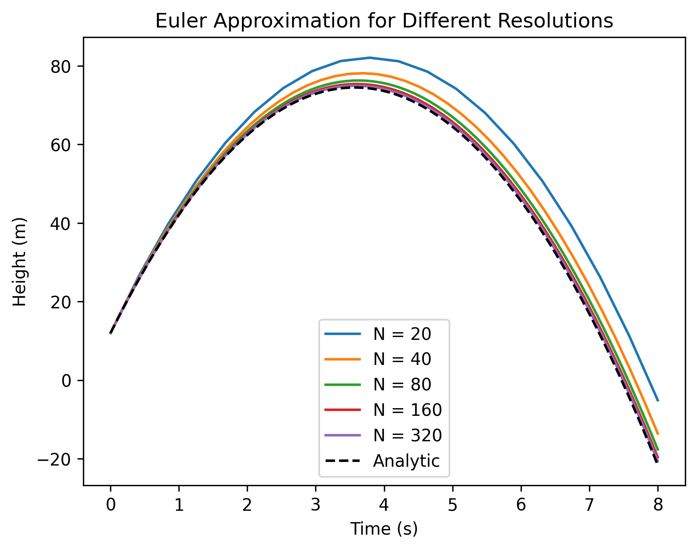
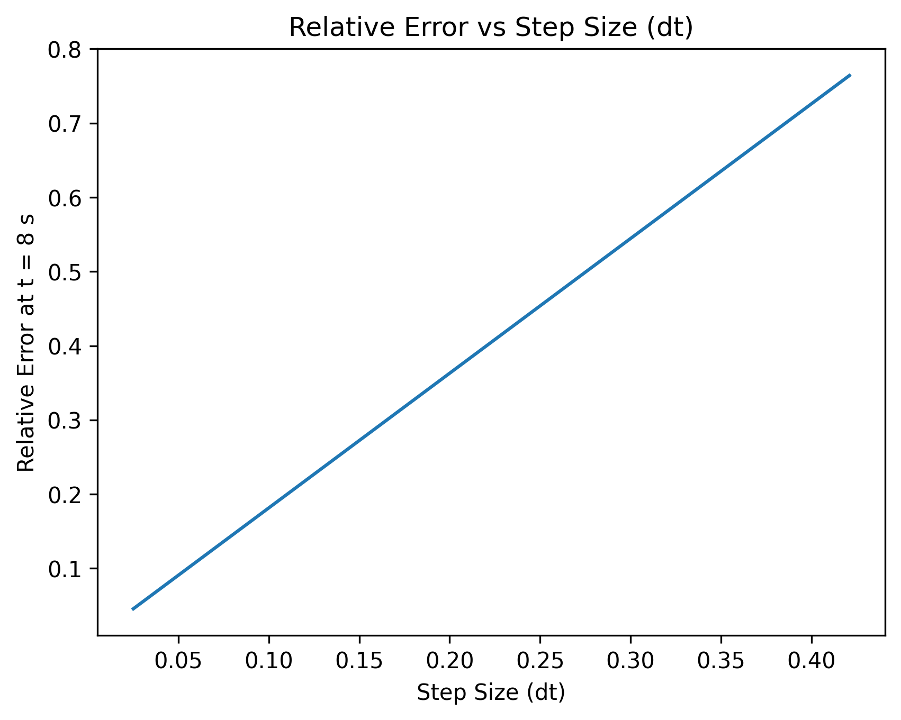
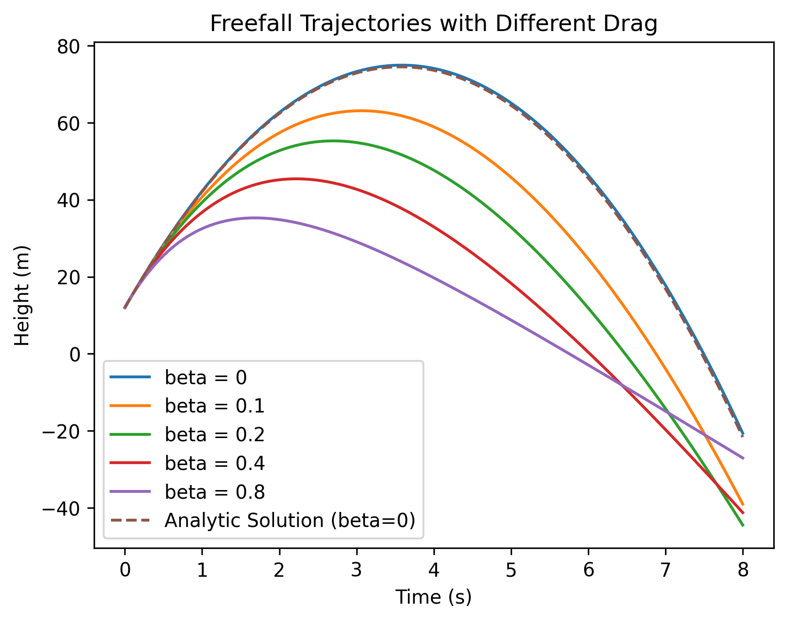
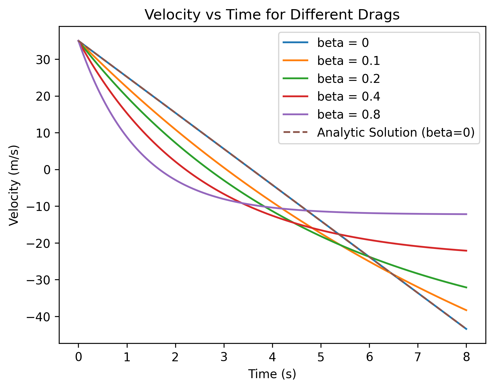

# Notebook 3.1: ODE - Euler Writeup

## b) Euler’s Method: Discretizing Equations of Motion 
### Equations of Motion
The equations that describe the verticle position and velocity are
```math
\frac{dy}{dt} = v \\
\frac{dv}{dt} = -g - \beta v
```
where
```math
\begin{aligned}
    y(t) &= \mathrm{position} \\
    v(t) &= \mathrm{velocity} \\
    g    &= \mathrm{gravitational\; acceleration} \\
    \beta&= \mathrm{drag coefficient} \\
\end{aligned}
```


### Time Intervals
Define discrete time steps
```math
t_i = t_0 + i \Delta t
```
where $ \Delta t $ is the timestep size.


### Euler Approximation
Euler’s method works by slightly adjusting values using their forward differences at each time interval based on the values from the previous time interval. First, replace the continuous derivatives in the equation by approximations over a small time step.
```math
\frac{dy}{dt} \approx \frac{y_{i+1} - y_i}{\Delta t} \\
```
```math
\frac{dv}{dt} \approx \frac{v_{i+1} - v_i}{\Delta t}
```


#### Position Update
```math
\frac{y_{i+1} - y_i}{\Delta t} = v_i   \\
y_{i+1} = y_i + v_i \Delta t
```

#### Velocity Update
```math
\frac{v_{i+1} - v_i}{\Delta t} = a = -g - \beta v_i   \\
v_{i+1}  = v_i + a \Delta t = v_i + (-g - \beta v_i)\Delta t
```


#### Final Euler System

```math
\boxed{
\begin{aligned}
    y_{i+1} &= y_i + v_i \Delta t \\
    v_{i+1} &= v_i + (-g - \beta v_i)\Delta t
\end{aligned}
}
```


These two equations are implemented to update the values at every time step.

This strategy is limited by the error which is introduced by the time step. For more accurate approximations, smaller time steps must be used. As seen in the image below, the number of time steps (or equiventally, the value of dt) impacts the accuracy of the appoximation greatly. 

## c) Plot of $y(t)$ for Dfferent Resolutions
<figure>
  
  <figcaption><strong>Figure 1.</strong> Freefall Trajectories for Different Resolutions.</figcaption>
</figure>


## d) Plot of the Error at $t_{max}$ vs $\Delta t$
<figure>
  
  <figcaption><strong>Figure 2.</strong> Relative Error for Different Resolutions.</figcaption>
</figure>


## e) Plots of the $y(t)$ and $v(t)$ with Drag
<figure>
  
  <figcaption><strong>Figure 3.</strong> Vertical Trajectories with Different Drag Values.</figcaption>
</figure>


<figure>
  
  <figcaption><strong>Figure 4.</strong> Vertical Velocities with Different Drag Values.</figcaption>
</figure>


## f) Intution for Plots with Drag
### Velocity
Starting with the graphs of velocity will make explaining the position graphs easier.

As the drag coefficient is increased, the force acting in the opposite direction of velocity increases. This means the object will slow down faster with higher drag coefficients. On the other hand, acceleration due to gravity will eventually balance with the drag force, and the velocity will level off. Meaning that with higher drag coefficients, the final downward velocity will be of less magnitude. This behavior is modeled in Figure 4 above. The lines cooresponding to the higher drag coefficents decrease quickest, but also level off quickest. 

### Position
The position graphs are sensible for two primary reasons. 1) The high-drag lines don't get as high as the other lines because of the higher resistance. 2) As the drag increases, the height of the object at $t = 8s$ tends upward. This makes sense considering the high-drag coefficient prevents the downward velocity from becoming large.  

## g) Some indication of which resolution you chose for #6, and why it's acceptable
I started the resolutions at about 20 partitions. This gave ~2.5 time-steps per second. Then increased to 40 (~5 steps per second), then 80 (~10 steps per second), and so on. As seen in Figure 1, the approximation got very close to the exact solution. At 320 partitions, the approximation was visually identical to the exact plot. Also, I compared the results with 320 steps to the results with 10,000 steps and could not tell the difference. So I went with 320. 