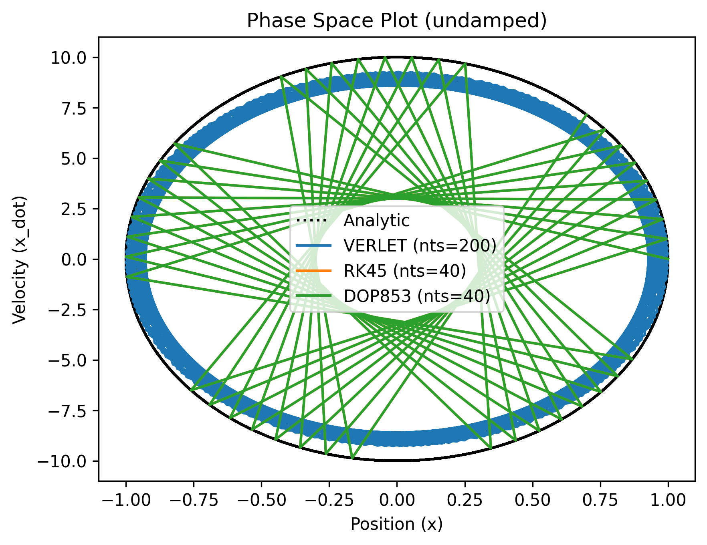
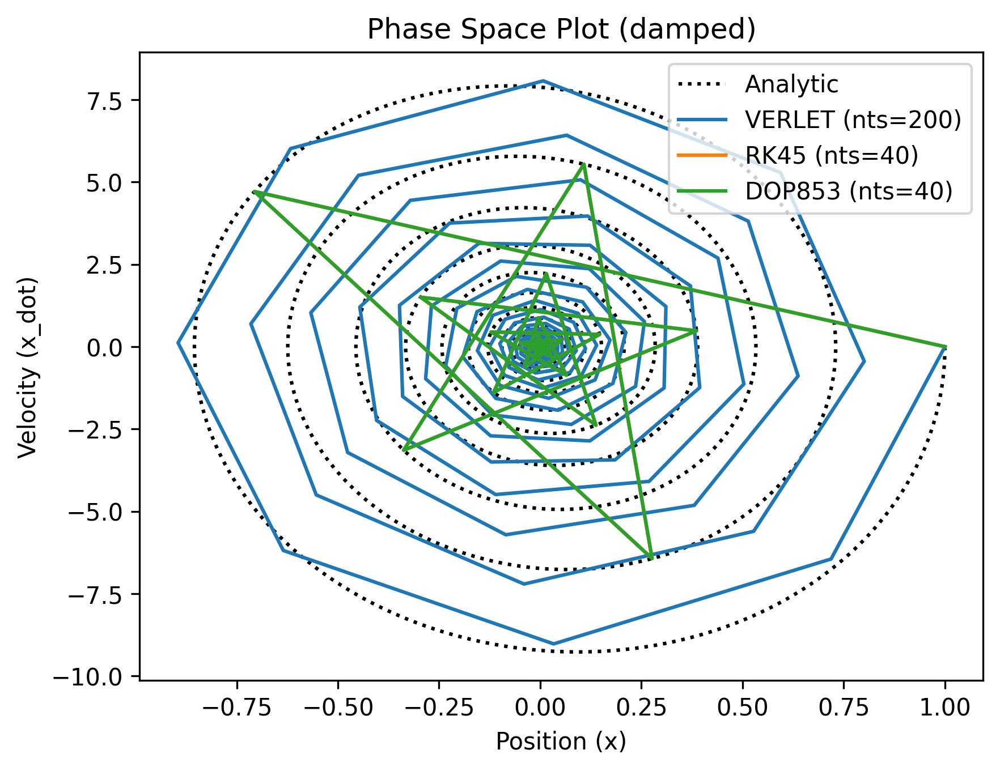
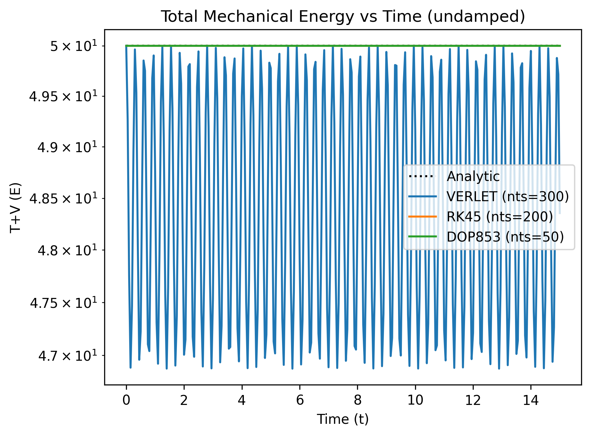
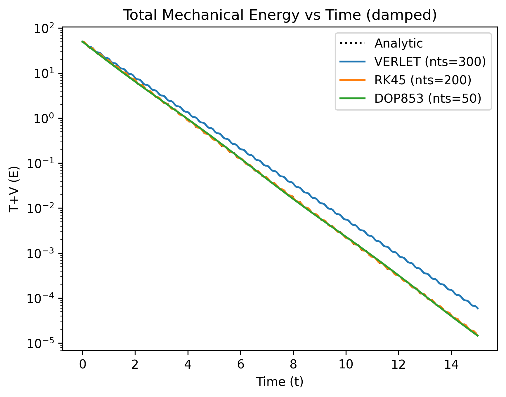
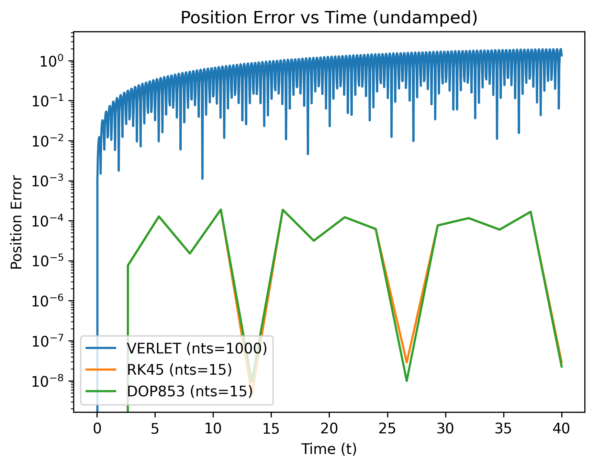
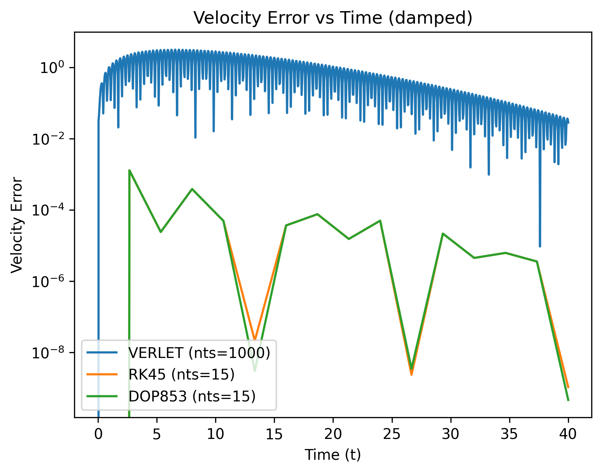
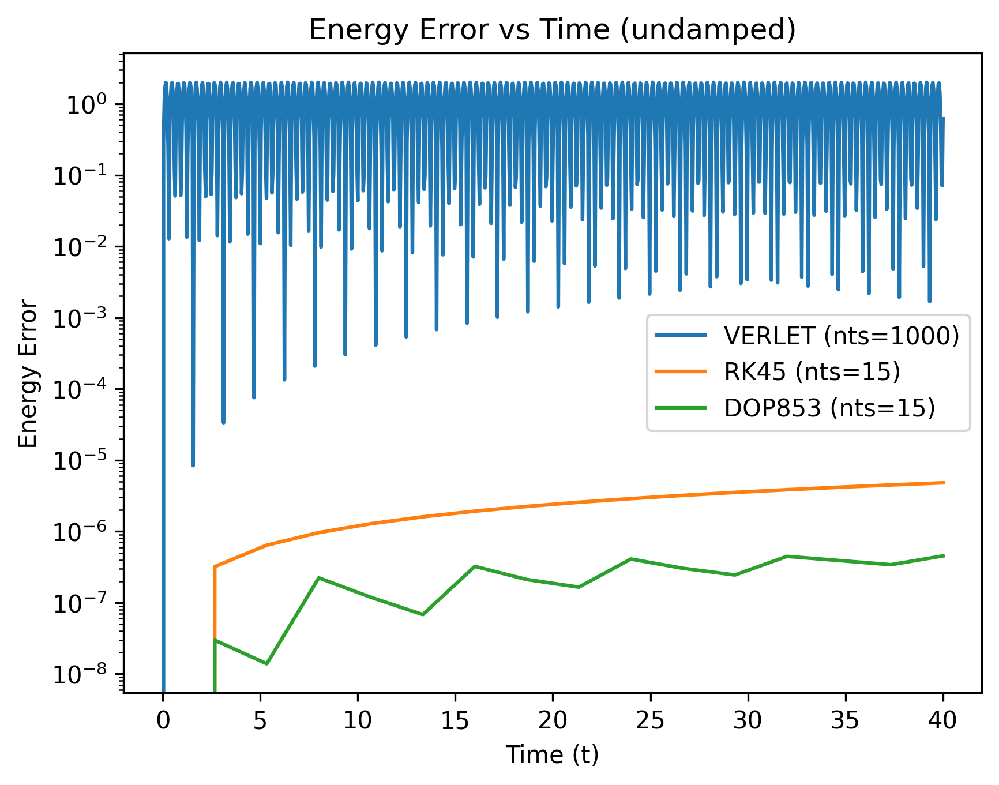
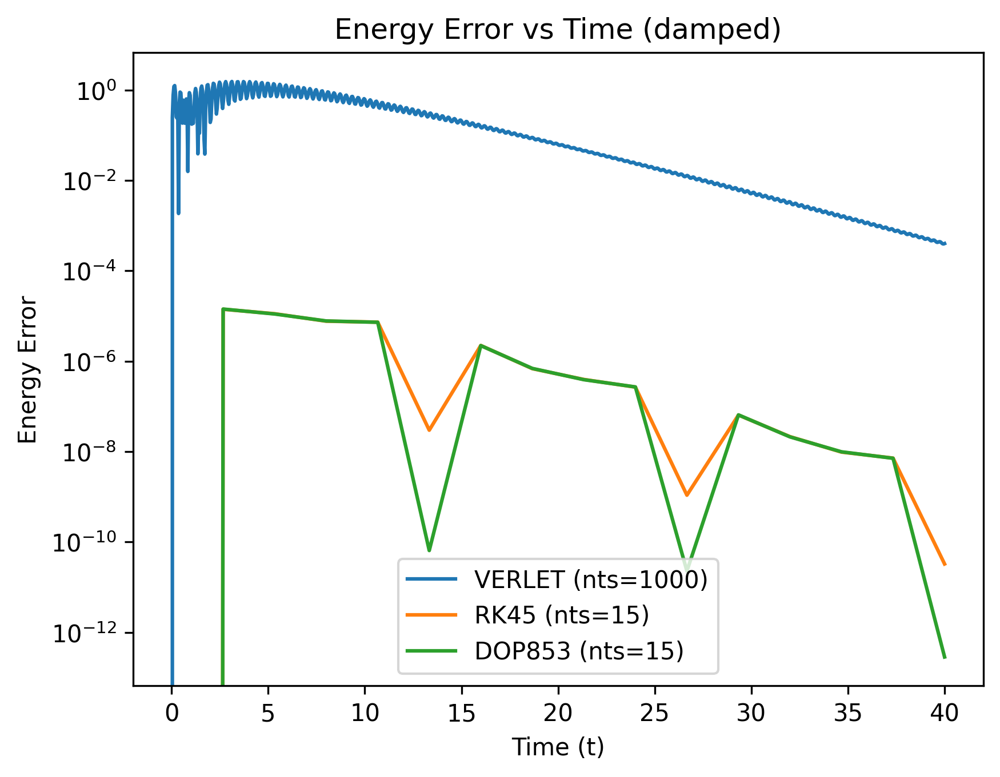

---
meta:
    author: Alec Snodgrass
    topic:  ODE Project
    course: TN Tech PHYS 4130
    term:   Spring 2026
---
# ODE Solver Project Writeup

## Introduction
The physical world is described by differential equations. Examples include laws of motion (Newton's Laws), electrodynamics (including electric/magnetic circuits), heat transfer, wave motion, etc. Dynamical systems are described by these mathematical equations. These equations are rarely analytically tractable. In most cases, there are non-linear forces, damping, or coupled systems, which make numerical approximations the most feasible solution method. 

Computational physics uses numerical methods to approximate, to varying degrees of accuracy, the behavior of these physical systems. By discretizing time or space, algorithms are developed to step through the evolution of these systems. This is done by approximating the continuous derivative with finite difference approximations. The order of approximation and correction terms determines the accuracy and effectiveness of the solver. 

There are many different algorithms for solving ODEs numerically. Different methods are characterized by the accuracy they achieve given a finite time step, which is usually the variable changed in any given algorithm. Given a small time step *h*, the integration is accurate through order $h^n$ where n is the **order** of the method used. There is an inverse relationship between the simplicity of the algorithm and the accuracy of the solution. For example, the Euler method is easy to implement but is not very accurate and can diverge for certain systems. In contrast, higher-order methods like Runge-Kutta are much more accurate but require more computational time and effort. A symplectic integrator like the Verlet method has the advantage of conserving properties of conservative systems. The parameters of a given problem, such as time scale, stiffness, and required accuracy, factor into which solver is most appropriate.

In this project, multiple numeric differential equation solvers were implemented on a simple harmonic oscillator (SHO) system (undamped and damped). This is a simple system whose behavior is well known, making it easy to compare the numerical results to the expected results. The different algorithms were compared to evaluate their performance and accuracy. Each solver's performance can be seen in the plots of position, velocity, phase space, and energy evolution. The equation of motion for the SHO is as follows:
```math
\ddot{x} + \gamma \dot{x} + \omega^2 x = 0
```
Where the gamma, the damping coefficient, is zero for the undamped case. This equation is analytically solvable, physically ubiquitous, and is sensitive to errors in approximation. 

##  Solver Algorithms
In this section, the underlying equations that motivate the algorithms are examined and related to their corresponding implementations. Three different solvers are explored: a symplectic integrator and two different predictor-corrector methods. The explanation does not include a derivation, but it does explain how each of these solvers works in terms of the algorithm and the underlying equations. 

### Symplectic Integrator: Verlet
Verlet integration is a numerical method most commonly used to solve Newton's equations of motion for different systems. It works well for most mechanical systems, which can be described by a second-order ODE such as 
```math
\ddot{x} = f(x, \dot{x}, t)
```
The algorithm updates the position first by averaging the Taylor expansion of the position at the two neighboring time intervals. 
```math
\mathrm{Taylor\; Expand:}\; x(t + \Delta t) \\
\mathrm{Taylor\; Expand:}\; x(t - \Delta t) \\
\mathrm{Add\; them:}\; x(t + \Delta t) = 2x(t) - x(t - \Delta t) + \ddot{x}(t) \Delta t^2 + O(\Delta t^4)
```
Then, the velocity is updated using the average of the acceleration at the current and next time step.  
```math
\dot{x}(t + \Delta t) = \dot{x}(t) + \frac{\ddot{x}(t + \Delta t) - \ddot{x}(t - \Delta t)}{2} \Delta t
```

The code below shows the implementation of the equations above. 
```python
for it in range(1, nts): 
    x[it+1] = 2*x[it] - x[it-1] + (a[it] * dt**2)
    a[it+1] = deriv([x[it+1], v[it]], t[it+1])[1]       # Use the derivative function to get the acceleration
    v[it+1] = v[it] + (dt / 2)*(a[it] + a[it+1])
```
A careful observer will notice that the loop does not start at zero. This is because the algorithm requires the position at the previous time step. Therefore, the first iteration is done manually, given the initial conditions, in a manner similar to the Euler method.
```python
def Verlet_solver(coord_init, tmin, tmax, nts, deriv):
# coord_init is a list of the initial position and velocity, [x0, v0]
...
    x[0] = coord_init[0]
    v[0] = coord_init[1]
    a[0] = deriv(coord_init, tmin)[1] 

    x[1] = x[0] + (v[0]*dt) + (0.5*a[0] * dt**2)       
    a[1] = deriv([x[1], v[0]], t[1])[1]
    v[1] = v[0] + (0.5 * (a[0] + a[1]) * dt)
...
```

### SciPy Integrator: Runge-Kutta 4(5)
Runge-Kutta (RK) is a famous family of methods used to solve ODEs. The 4(5) indicates that it is a fourth-order method with a fifth-order error estimate. This is a prime example of a predictor-corrector method. The algorithm works by calculating slopes at different points within a time step and then taking the weighted average of those slopes to update the function values. What makes RK45 unique is that it is an *adaptive* method, meaning that the algorithm adjusts the time step size based on the estimated error. The complexities of the implementation of this method are overlooked for the purposes of this report, but the underlying equations are as follows:

Intermediate slopes:
```math
k_i = h * f(t_n + c_i h,\; y_n + \sum_{j=1}^{i-1} a_{ij} k_j)
```
Where h is the adjustable time step, and where the coefficients c_i and a_ij are determined by the specific RK method. For RK45, the coefficients are as follows:
```math 
\begin{aligned}
k_1 &= hf(t_n, y_n) \\
k_2 &= hf(t_n + \frac{1}{4}h, y_n + \frac{1}{4}k_1) \\
k_3 &= hf(t_n + \frac{3}{8}h, y_n + \frac{3}{32}k_1 + \frac{9}{32}k_2) \\
k_4 &= hf(t_n + \frac{12}{13}h, y_n + \frac{1932}{2197}k_1 - \frac{7200}{2197}k_2 + \frac{7296}{2197}k_3) \\
k_5 &= hf(t_n + h, y_n + \frac{439}{216}k_1 - 8k_2 + \frac{3680}{513}k_3 - \frac{845}{4104}k_4) \\
k_6 &= hf(t_n + \frac{1}{2}h, y_n - \frac{8}{27}k_1 + 2k_2 - \frac{3544}{2565}k_3 + \frac{1859}{4104}k_4 - \frac{11}{40}k_5) \\
\end{aligned}
```

Fourth-order approximation:
```math
y_{n+1} = y_n + \frac{25}{216} k_1 + \frac{1408}{2565} k_3 + \frac{2197}{4104} k_4 - \frac{1}{5} k_5 \\
```
Fifth-order approximation:
```math
z_{n+1} = y_n + \frac{16}{135} k_1 + \frac{6656}{12825} k_3 + \frac{28561}{56430} k_4 - \frac{9}{50} k_5 + \frac{2}{55} k_6
```
Update and error estimate:
```math
\mathrm{Error\; Estimate}\; = |z_{n+1} - y_{n+1}|
``` 
The RK4(5) solver was not manually implemented in the code; instead, SciPy's optimized implementation was used. There are some subtleties to passing parameters to and extracting data from the pre-made function, all of which are explained in the code. Otherwise, the solver is easy to use: just call the **solve_ivp** function with the appropriate arguments from the SciPy library.
```python
def RK45_solver(coord_init, tmin, tmax, nts, deriv):
...
    solution = solve_ivp(swapped_deriv, (tmin, tmax), coord_init, t_eval=t, method='RK45', rtol=1e-9, atol=1e-12)
    # Where 'swapped_deriv' is a modified function for the differential equation that is compatible with solve_ivp.
    # And where 'solution' is an object that contains the time points and corresponding solutions. 
...
```
> [!NOTE]
> The rtol and atol parameters adjust the relative and absolute error tolerances, respectively. Adjusting these parameters allows for a clearer comparison between the RK45 and DOP853 solvers, which is important for this project.

### SciPy Integrator: DOP853
The naming convention for this method is annoyingly cryptic, but it stands for **Do**rmand-**P**rince **8**(**5**, **3**): DOP853. Following the Runge-Kutta convention, this means that the DOP853 method is an eighth-order method with a fifth-order and third-order error estimate. This method is a member of the same family as the RK4(5) method, only more computationally intensive and more accurate. The SciPy library explains it as an eighth-order Runge-Kutta method originally from the *Fortran* library; it is particularly good for solving non-stiff ODEs with high precision. 

All the development for RK4(5) applies directly to the DOP853 method -- just more. DOP853 follows the same logic: calculate intermediate slopes, take a weighted average of slopes, update the function values, then adjust the time step using the error estimate. It is also an adaptive method, meaning the time step is adjusted based on an estimated error, which in this case is calculated using the low-order (fifth and third) approximations. Another interesting feature of this method addressed an issue caused by the adjustable time stepping. The feature is referred to as a "dense output formula," and it allows the end user to find the solution at any arbitrary point in time (even those in between the exact time steps). A seventh-order interpolation is used to construct a polynomial that can be evaluated for any time point. A very pleasant feature. 

The implementation, once again, was not done manually. A simple call to the **solve_ivp** function with the appropriate arguments and method name was all that was needed - except for some similar subtleties similar to the RK4(5) method.
```python
def DOP853_solver(coord_init, tmin, tmax, nts, deriv):
...
    sol = solve_ivp(swapped_deriv, (tmin, tmax), coord_init, t_eval=t, method='DOP853', rtol=1e-9, atol=1e-12)
...
```

## Phase Space Trajectory and Energy Evolution of a Simple Harmonic Oscillator
The phase space trajectory and energy evolution of the SHO system were plotted for both cases (undamped and damped) for all three solvers. The different trajectories and energy calculations can be compared to investigate the difference in performance and accuracy of the solvers. 
### Phase Space Undamped SHM
<figure>
  
  <figcaption><strong>Figure 1.</strong> Undamped SHO Phase Space Trajectories.</figcaption>
</figure>

### Phase Space Damped SHM
<figure>
  
  <figcaption><strong>Figure 2.</strong> Damped SHO Phase Space Trajectories.</figcaption>
</figure>

### Energy Evolution Undamped SHM
<figure>
  
  <figcaption><strong>Figure 3.</strong> Energy Evolution of Undamped SHO.</figcaption>
</figure>

### Energy Evolution Damped SHM
<figure>
  
  <figcaption><strong>Figure 4.</strong> Energy Evolution of Damped SHO.</figcaption>
</figure>

The similarities and accuracy of the RK45 and DOP853 solvers are on full display in the plots above. They nearly perfectly overlap and will only produce a visible difference if the number of time steps is different between the two. (The plots produced by varying the number of time steps between the solvers are much more geometrically aesthetic.) The point of the plots above is to emphasize that the RK45 and DOP853 methods are extremely accurate, producing results that are visually indistinguishable from the analytic solution (at the points of evaluation). The Verlet method, however, is not as accurate but still quite close to the expected result and may be preferred in specific situations over the more computationally intensive methods.

## Strengths and Weaknesses of Each Solver
This section will more clearly examine the differences in performance and accuracy of the three solvers. Because the error is much smaller than the scale of the system, observing the differences in trajectories and energy is difficult in the plots above. Therefore, the error between the numerical and analytic solutions is calculated and plotted on a semilog plot to help visualize the differences. This is especially helpful when comparing the RK45 and the DOP853 methods, which are both very accurate and very similar. 

To actually get a difference in performance between RK45 and DOP853, the error tolerances were adjusted, the number of time steps was reduced, the time scale was increased, and the frequency was increased. There are multiple error plots created in the code, but only a few are included here to demonstrate the general trends. 

### Position Error - Undamped SHM
<figure>
  
  <figcaption><strong>Figure 5.</strong> Undamped SHO Position Error.</figcaption>
</figure>

### Velocity Error - Damped SHM
<figure>
  
  <figcaption><strong>Figure 6.</strong> Damped SHO Velocity Error.</figcaption>
</figure>

### Energy Error - Undamped SHM
<figure>
  
  <figcaption><strong>Figure 7.</strong> Energy Error of Undamped SHO.</figcaption>
</figure>

### Energy Error - Damped SHM
<figure>
  
  <figcaption><strong>Figure 8.</strong> Energy Error of Damped SHO.</figcaption>
</figure>

### Timing
The *magic command* **%timeit** was used to calculate the time taken for each solver to run with the same parameters (100 seconds, 1,000 time steps, and the same initial conditions) for both the undamped and damped cases. The results show the average time for 7 runs and are as follows:
| Solver  | Undamped Time (ms) | Damped Time (ms) |
|---------|--------------------|------------------|
| Verlet  | 1.20               | 1.27             |
| RK45    | 495                | 132              |
| DOP853  | 123                | 56.1             |

Unsurprisingly, the Verlet method is **way** faster than the other two methods. The Verlet method is neither complex nor computationally intensive, but it is also not as accurate. Surprisingly, the DOP853 method is **faster** than the RK45 method. This is not very intuitive because the DOP853 method is a much higher order and thus more computationally expensive. Why would the RK45 method take more time to do fewer steps? The answer is that although the RK45 method is less intensive per step, it requires more internal steps (not time steps) to achieve the same level of error as the DOP853 method. Remember, the internal, local error (absolute and relative) tolerances were adjusted to be the same for both methods. In an oversimplification, the DOP853 method hits the taget, first try, each step, while the RK45 method takes a few more shots to hit the same target. If the parameters of the RK45 and DOP853 function calls were NOT adjusted to be the same error bounds, then RK45 would be faster than DOP853, but the results would not be as accurate. The error tolerances were adjusted to be the same, so that a difference in performance could be observed in terms of timeing. 

This interesting result stems from the specific system the solvers were applied to: the simple harmonic oscillator. The SHO is a well-behaved system with a *smooth* solution. DOP853, according to SciPy documentation, is particularly well adapted for **non-stiff** ODEs with high precision - which is exactly what this comparison is. The RK45 method is a more *general-purpose* method. It works very well for a variety of systems and lacks the optimization and specialization that other solvers may have. That being said, the RK45 method still returned very good results, very quickly, and is a very good choice for many systems. The Verlet method also returned good results very quickly, but lacks the robustness and accuracy of the other systems. There are many practical applications for a method that is less accurate - but fast. 

# Extension: Symplectics Deep Dive: Calculation

## Forest-Ruth 4th Order Symplectic Integrator
Etienne Forest and Ronald D. Ruth published a paper in 1990 on "Fourth-Order Symplectic Integration." Their work describes a method for constructing higher-order symplectic integrators. The Forest-Ruth method expands on the Stormer-Verlet method (a second-order method) to form a fourth-order method. Simply, a higher-order method is constructed by combining multiple steps from the lower-order symplectic method.

## Brief Motivation
They specifically studied systems in which the differential equations to be solved were taken from the Hamiltonian. There is more buildup to be had, but to focus on the method itself, the general Hamiltonian is as follows:
```math
H(p, q) = T(p) + V(q)
```
> [!NOTE] 
> This Hamiltonian is NOT a function of time, which is important for energy conservation and will be addressed later.

Where T is the kinetic energy, and V is the potential energy. The equations of motion are as follows:
```math
\dot{q} = \frac{\partial H}{\partial p} = \frac{\partial T}{\partial p} \quad \mathrm{and} \quad
\dot{p} = -\frac{\partial H}{\partial q} = -\frac{\partial V}{\partial q}
```
Typically, in mechanics, the formulas are
```math
\dot{q} = \frac{p}{m} \quad \mathrm{and} \quad
\dot{p} = F(q)
```
Where ***F*** is the force, which is the negative gradient of the potential energy or, in general, some function of the position. The velocity Verlet method used earlier (see the section above or the code directly) can be expressed in terms of the Hamiltonian:
```math
\begin{aligned}
  p_{n+\frac{1}{2}} &= p_n - \frac{h}{2} F(q_n) \\
  q_{n+1}           &= q_n + h \frac{p_{n+\frac{1}{2}}}{m} \\
  p_{n+1}           &= p_{n+\frac{1}{2}} - \frac{h}{2} F(q_{n+1})
\end{aligned}
```
Remember that *h* is the small time step. These equations are often referred to as "kick-drift-kick" steps because first the momentum is updated (kick), then the position is updated (drift), and then the momentum is updated again (kick). 

## Forest-Ruth Algorithm
The Forest-Ruth method is a composition of three steps of the second-order method, which can be expressed as follows:
```math
\Phi_4(h) = \Phi_2(\xi h) \circ \Phi_2(\lambda h) \circ \Phi_2(\xi h)
```
Where:
```math
  \xi = \frac{1}{2 - 2^{1/3}}, \quad
  \lambda = 1 - 2\xi = \frac{-2^{1/3}}{2 - 2^{1/3}}
```
And where $\Phi_2$ is the second-order symplectic method (the Stormer-Verlet method). Therefore, the Verlet equations are adjusted as follows:
#### Step 1:
```math
\begin{aligned}
  p_{n+\frac{1}{2}} &= p_n - \frac{\xi h}{2} F(q_n) \\
  q_{n+1}           &= q_n + \xi h \frac{p_{n+\frac{1}{2}}}{m} \\
  p_{n+1}           &= p_{n+\frac{1}{2}} - \frac{\xi h}{2} F(q_{n+1})
\end{aligned}
```
#### Step 2:
```math
\begin{aligned}
  p_{n+\frac{1}{2}} &= p_n - \frac{\lambda h}{2} F(q_n) \\
  q_{n+1}           &= q_n + \lambda h \frac{p_{n+\frac{1}{2}}}{m} \\
  p_{n+1}           &= p_{n+\frac{1}{2}} - \frac{\lambda h}{2} F(q_{n+1})
\end{aligned}
```
#### Step 3:
```math
\begin{aligned}
  p_{n+\frac{1}{2}} &= p_n - \frac{\xi h}{2} F(q_n) \\
  q_{n+1}           &= q_n + \xi h \frac{p_{n+\frac{1}{2}}}{m} \\
  p_{n+1}           &= p_{n+\frac{1}{2}} - \frac{\xi h}{2} F(q_{n+1})
\end{aligned}
```

This "kick-drift-kick" sequence is implemented in code, in a manner similar to updating the position and momentum in the Verlet method. Although the rigorous mathematical proof is beyond the scope of this report, the idea is that the errors produced by the second-order method can be canceled out by using the right coefficients. The method is fourth-order because the error terms are of order $h^4$ or lower. The method is explicit because the next position and momentum can be calculated directly from the current position and momentum without needing to solve any implicit equations. The focus of the following sections is to show that this method does indeed conserve energy by proving that phase space volume is conserved.

## Phase Space Volume Conservation

### Liouville's Theorem and Noether's Theorem
Briefly, Liouville's theorem states that, in a Hamiltonian system, the phase space distribution function (volume) is conserved under time evolution. This is a fundamental property of Hamiltonian systems and is closely related to the conservation of energy.

Again, briefly, Noether's theorem states that every differentiable symmetry of a physical system corresponds to a conservation law. In the context of Hamiltonian mechanics, if the Hamiltonian does not explicitly depend on time, then energy is conserved. Using Noether's theorem, this is because the Hamiltonian is invariant under a time translation.

### Phase Space
The phase space volume conservation is a key property of symplectic integrators. It means that the algorithm preserves the structure of the phase space, which is important when simulating Hamiltonian systems. The mathematical proof of this property involves showing that the Jacobian determinant of the transformation from one time step to the next is equal to one. This can be shown by calculating the Jacobian matrix of the transformation and then taking its determinant. The calculation is lengthy, but the end result is that the determinant is indeed equal to one, confirming that the phase space volume is conserved. 

First, the transformation from one time step to the next, in a numerical integrator, can be expressed as:
```math
(q_n, p_n) \rightarrow (q_{n+1}, p_{n+1})
```
For compactness, this mapping, as in the literature, will be denoted as 
```math
\Phi: (q, p) \mapsto (Q, P)
```
If the transformation satisfies 
```math
dq\, dp = dQ\, dP
```
Then the phase space volume is conserved. This can be shown by calculating the Jacobian determinant of the transformation and showing that it is equal to unity. 
```math
\boxed{
  J = \begin{bmatrix}
    \frac{\partial Q}{\partial q} & \frac{\partial Q}{\partial p} \\
    \frac{\partial P}{\partial q} & \frac{\partial P}{\partial p}
  \end{bmatrix}
}
```
---
Since the Forest-Ruth method is a composition of three steps, the Jacobian determinant is the product of each step's Jacobian determinant. Each of those three steps can be further broken down into the "kick-drift-kick" sequence. Since the three steps that compose the Forest-Ruth method are essentially identical (ignoring the constant coefficients that scale the time step), the Jacobian for each step is the same. Therefore, the Jacobian determinant for each of the three steps is equal to the product of the Jacobians for the "kick-drift-kick" sequence. To help clarify:
```math
\begin{aligned}
  \mathrm{det}(J_{Forest-Ruth}) &= \mathrm{det}(J_{Step1}) \cdot \mathrm{det}(J_{Step2}) \cdot \mathrm{det}(J_{Step3}) \\
  = \mathrm{det}(J_{Verlet}) ^3 &= (\mathrm{det}(J_{Kick1}) \cdot \mathrm{det}(J_{Drift}) \cdot \mathrm{det}(J_{Kick2})) ^3 
\end{aligned}
```

The first calculation is the Jacobians for the "kick-drift-kick" sequence.
#### <u> Kick 1 Jacobian: </u>
Recall the equations for kick 1:
```math
\begin{aligned}
  q' &= q \\
  p' &= p - \frac{h}{2} F(q)
\end{aligned}
```
Therefore, the Jacobian matrix is 
```math
  J_{Kick1} = 
  \begin{bmatrix}
    1 & 0 \\
    -\frac{h}{2} F'(q) & 1
  \end{bmatrix}
```
And, the determinant is 
```math
\det(J_{Kick1}) = 1
```

#### <u> Drift Jacobian: </u>
Recall the equations for drift:
```math
\begin{aligned}
  q' &= q + h \frac{p}{m}\\
  p' &= p
\end{aligned}
```
Therefore, the Jacobian matrix is 
```math
  J_{Drift} = 
  \begin{bmatrix}
    1 & \frac{h}{m} \\
    0 & 1
  \end{bmatrix}
```
And, the determinant is 
```math
\det(J_{Drift}) = 1
```

#### <u> Kick 2 Jacobian: </u>
Recall the equations for kick 2:
```math
\begin{aligned}
  q' &= q \\
  p' &= p - \frac{h}{2} F(q)
\end{aligned}
```
Therefore, the Jacobian matrix is 
```math
  J_{Kick2} = 
  \begin{bmatrix}
    1 & 0 \\
    -\frac{h}{2} F'(q) & 1
  \end{bmatrix}
```
And, the determinant is 
```math
\det(J_{Kick2}) = 1
```

Since the determinant of each "kick" and "drift" step is equal to one, then the determinant of each step is also one. Since the determinant of each step is one, the determinant of the entire Forest-Ruth method is one. In an expression:
```math
\boxed{
  \begin{aligned}
    \mathrm{det}(J_{\mathrm{Forest-Ruth}}) &= \mathrm{det}(J_{\mathrm{Step1}}) \cdot \mathrm{det}(J_{\mathrm{Step2}}) \cdot \mathrm{det}(J_{\mathrm{Step3}}) = \mathrm{det}(J_{\mathrm{Verlet}}) ^3 \\
    &= (\mathrm{det}(J_{\mathrm{Kick1}}) \cdot \mathrm{det}(J_{\mathrm{Drift}}) \cdot \mathrm{det}(J_{\mathrm{Kick2}})) ^3 \\
    &= (1 \cdot 1 \cdot 1) ^3 \\
    &= 1
  \end{aligned}
}
```
---
### Summary
From **linear algebra**, a transform ***T*** is symplectic if the volume is preserved. From **classical mechanics**, since the equations of motion were derived from a time-invariant Hamiltonian, the phase space volume is conserved, and thus energy is conserved. From **numerical analysis**, the Jacobian determinant of the transformation from one time step to the next was calculated and shown to be equal to one, confirming that the phase space volume is conserved. Sparing the mathematical details, the combination of these facts means that the Forest-Ruth method conserves energy, which is a key property of symplectic integrators.

##  Addressing Questions
### Attribution
I primarily used Wikipedia and SciPy documentation to become familiar with the algorithms and how to implement them. 

The extension was based on the method presented briefly in a [Wikipedia article on Symplectic Integrators](https://en.wikipedia.org/wiki/Symplectic_integrator). The Forest-Ruth method was more explicitly described in their paper, "Fourth-Order Symplectic Integration" (1990). The paper is available on [ScienceDirect](https://www.sciencedirect.com/science/article/abs/pii/016727899090019L).

The method for proving phase space volume conservation was based on the method laid out in [LibreTexts](https://math.libretexts.org/Bookshelves/Differential_Equations/Numerically_Solving_Ordinary_Differential_Equations_(Brorson)/07%3A_Symplectic_integrators/7.04%3A_Conservative_systems_phase_space_and_Liouvilles_theorem).

### Timekeeping
I spent several full days of work on this project. I started by comparing the Euler method, RK2, and the ODEINT solvers using the SHO system. I then use the format of those comparisons to implement and compare the Verlet, RK4(5), and DOP853 methods. I spent the first couple of days writing the code for the initial assignment and quickly setting up a rough draft of the outline. Then I spent a full day's worth of time looking into and explaining the algorithms for the three more advanced solvers. I spent the next couple of days implementing the extensions and explaining that work in my report write-up. 

### Languages, Libraries, Lessons Learned
I started with Python and stayed with Python. I considered using C++ for this project to brush up on that language, but I thought that the plotting required would be too difficult. If I can learn how to make a specific function in C++ and then use Python for simpler tasks, I would do that in the future. 

I used the following libraries in this project:
1. Numpy as np
    - Used for the usual reasons: array handling, vector operations, math functions, etc. This is pretty standard for any sciencey project.
2. Matplotlib.pyplot as plt
    - Used for plotting results and comparisons. Quite necessary for a project involving graphs. 
3. Scipy.integrate.solve_ivp
    - Finally, the most interesting library for this project was the one I used for integrators. This package offers a variety of differential equation solvers. I chose to use the RK4(5) and DOP853 methods. 

I did learn some more Python-specific syntax that will be helpful moving forward. For example, the *column_stack* function was useful for handling the 2D arrays for position and velocity. 