# Introduction
Numerical methods can be implemented to approximate solutions for ordinary differential equations (ODEs) that would otherwise be an algebraically labor-some task. This package was developed to demonstrate the capabilities of several approximation techniques which include Euler's method, the Runge-Kutta technique, Verlet integration, and Scipy's ODEINT. We provide an explanation of how each method works. Then, we showcase phase-space and Energy vs Time plots to illustrate the capabilities of each approximation technique and ability to conserve energy. By the same token, we analyze the error of these numerical methods in various manners.        

 We found that the while one method might be the most optimal for one situation, another method might be optimal for a different situation. The pros and cons of each method depending on the situation are further discussed in the conclusion.
## Background Theory

Euler's method is typically what one would start out with when exploring ODE approximation methods. It approximates the solution of an ODE at a point, B, by starting from an initial value, point A, and taking the next point B on the tangent line to the solution at point A. Then, it repeats the process for the subsequent points as depicted in Fig. 1. The number of these sub-intervals taken over time is typically referred to as the number of time steps (nts). And, the error of Euler's method reduces proportionally as the number of time steps increases, so we call it a first order method or a first order approximation. 

<p align="center">
  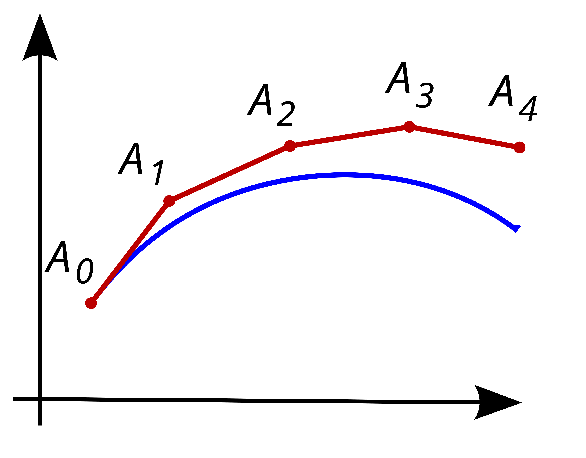
</p>

<p align="center">
  Figure 1: Illustration of Euler's method. The red line is the numerical approximation, and the blue line is the analytic solution. Reproduced from [Wikipedia](https://en.wikipedia.org/wiki/Euler_method).
</p>


The Runge-Kutta method is similar to Euler's method in the sense that it is an iterative technique; however, it incorporates additional points within the interval which generally makes it much more accurate then Euler's method. For example, RK2 uses the slope at A to approximate the solution at the midpoint of A and B, then uses the slope at the midpoint to approximate the solution at B. Furthermore, RK4 utilizes a weighted average of the slope at A, the slope at B, and the slope at the midpoint using two different estimates. As a result, it turns out that RK2 is a second order method whereas RK4 is a fourth order method.

Verlet integration can be implemented for second order ODE's of the form $\ddot{x}(t) = A(x(t))$ such as for a harmonic oscillator. The algorithm is derived from the Taylor expansion for $x(t+\Delta t)$ and $x(t-\Delta t)$ as follows,

$$
x(t+\Delta t)=x(t)+\dot{x}(t)\Delta t+\frac{1}{2}\ddot{x}(t)\Delta t^2+\frac{1}{6}x^{(3)}(t)\Delta t^3+\cdots
$$

$$
x(t-\Delta t)=x(t)-\dot{x}(t)\Delta t+\frac{1}{2}\ddot{x}(t)\Delta t^2-\frac{1}{6}x^{(3)}(t)\Delta t^3+\cdots
$$

where adding these yields

$$
x(t+\Delta t)=2x(t)-x(t-\Delta t)+\ddot{x}(t)\Delta t^2+\mathcal{O}(\Delta t^4)
$$

Scipy's ODEINT adaptively chooses the step size which is effectively like choosing the number of time steps but with the catch that the step size is not constant. In other words, it optimizes the step size in different regions where the slope is more sporadic for lack of better terms. Additionally, it uses a combination of numerical methods which are split into two categories of stiff and non-stiff depending on the step size required for a reasonable approximate.

# Procedure
To demonstrate the use of each method, we approximate x(t) and v(t) for a harmonic oscillator with and without a linear dampening term. We illustrate these solutions by plotting the phase-space diagrams for each method. In addition, we provide Energy vs. Time plots to show whether or not a specific method conserves energy. To compare between the different methods, our tool offers several means of error analysis where the error is computed from the analytic solution. The first is a straightforward output of the error at some user-selected time. This option is most reliable as it is compatible with Scipy functions that adaptively select the number of time steps, yet it offers the least insight. The next option is to output the number of time steps required to achieve a user-defined target error. Although, this option is not compatible with Scipy's RK4 and ODEINT, it can provide more useful information with the other methods. Lastly, our tool offers Number of Time Steps vs Error loglog plots which also is not compatible with RK4 and ODEINT since Scipy adaptively chooses the number of timesteps. Initially, we attempted to work around Scipy's adaptive selection of nts by passing specific time points in an array, t_eval, "linspaced" into time points based on the number of time steps. However, Scipy just returns the solutions at those time points based on its own number of time steps. 

 
## Function Code
Below are some highlight-worthy segments of code and algorithms written in plain text. For RK4 we used Scipy's RK4(5), and we of course used Scipy for ODEINT.
### Euler_Solver

```python
def SHO_solver_Euler(x0, v0, tmin, tmax, nts, SHO_deriv):
    x_array = np.zeros(nts)                           
    v_array = np.zeros(nts)                           
    t_array = np.linspace(tmin, tmax, nts, endpoint=False)
    dt = t_array[1] - t_array[0]                        
    x_array[0] = x0                                     
    v_array[0] = v0                                     
    
    for it in range(0, nts-1):
        x_array[it+1] = x_array[it] + dt * SHO_deriv([x_array[it], v_array[it]], t_array[it])[0]
        v_array[it+1] = v_array[it] + dt * SHO_deriv([x_array[it], v_array[it]], t_array[it])[1]
    
    return t_array, x_array, v_array
```
The recursive algorithm we use for Euler's method shown above is: 

$$
x_0 = x_0
$$

$$
v_0 = v_0
$$

$$
x_{n+1} = x_n + \Delta t x_n
$$

$$
v_{n+1} = v_n + \Delta t v_n
$$

### RK2_Solver
```python
def SHO_solver_RK2(x0, v0, tmin, tmax, nts, SHO_deriv):
    x_array = np.zeros(nts)                                                     # array to hold position
    v_array = np.zeros(nts)                                                     # array to hold velocity
    t_array = np.linspace(tmin, tmax, nts, endpoint=False)                      # array holds the time points 
    dt = t_array[1] - t_array[0]                                                # dt = time step length  
    x_array[0] = x0                                                             # Initial position
    v_array[0] = v0                                                             # Initial velocity
    for it in range(0, len(t_array)-1 ):                                        # loop over time steps
        t  = t_array[it]                                                        
        x_h = x_array[it] + (dt/2 * SHO_deriv([x_array[it], v_array[it]], t)[0])                # sub-step 1 for RK2
        v_h = v_array[it] + (dt/2 * SHO_deriv([x_array[it], v_array[it]], t)[1])                # sub-step 1 for RK2
        x_array[it+1] = x_array[it] + (dt * SHO_deriv([x_h, v_h], t + dt/2)[0])         # sub-step 2 for RK2
        v_array[it+1] = v_array[it] + (dt * SHO_deriv([x_h, v_h], t + dt/2)[1])         # sub-step 2 for RK2
    return t_array, x_array, v_array
```
The recursively defined algorithm for RK2_solver is:

   $$
   x_{n+\frac{1}{2}} = x_n + \frac{\Delta t}{2}v_n
   $$

   $$
   v_{n+\frac{1}{2}} = v_n + \frac{\Delta t}{2}A(x_n,v_n)
   $$

   
   $$
   x_{n+1} = x_n + \Delta t v_{n+\frac{1}{2}}
   $$

   $$
   v_{n+1} = v_n + \Delta t A\left(x_{n+\frac{1}{2}}, v_{n+\frac{1}{2}}\right)
   $$

   where A is the acceleration.
### Verlet_Solver

```python
def verlet_solver(x0, v0, tmin, tmax, nts, deriv):
    x_array = np.zeros(nts)                                                     # array to hold position
    v_array = np.zeros(nts)                                                     # array to hold velocity                                               
    t_array = np.linspace(tmin, tmax, nts, endpoint=False)                      # array holds the time points 
    dt = t_array[1] - t_array[0]                                                # dt = time step length  
    x_array[0] = x0                                                             # Initial position
    v_array[0] = v0                                                             # Initial velocity
    for it in range(0, len(t_array)-1 ):                                        # loop over time steps
        # Algorithm for Verlet method 
        x1 = x_array[it] + v_array[it]*dt + 0.5 * deriv(x_array[it], v_array[it]) * dt**2
        v1 = v_array[it] + 0.5 * (deriv(x_array[it], v_array[it]) + deriv(x1, v_array[it])) * dt
        x_array[it+1] = x1
        v_array[it+1] = v1


    return t_array, x_array, v_array
```
The verlet algorithm above is recursively defined as:


   $$
   x_0 = x_0
   $$

   $$
   v_0 = v_0
   $$

   $$
   x_{n+1} = x_n + v_n\Delta t + \frac{1}{2}A(x_n,v_n)\Delta t^2
   $$

   $$
   v_{n+1} = v_n + \frac{1}{2}\left[A(x_n,v_n) + A(x_{n+1},v_n)\right]\Delta t
   $$

where A is acceleration.


## Instructions
To run the tool use this command from the terminal that includes P3_code.py and Functions.py.

```bash
conda activate [environment]
python P3_Code.py
```


# Analysis
This tool can be used to analyze phase space plots, Energy vs Time plots, and error. For the following demonstration in this Analysis section we use the same parameters: $x_0 = 5$ m, $v_0 = 2$ m/s, $t_f = 20$ s, and 64 time steps. Additionally, for dampening we used m = 1.0 kg, k = 1.0 and b = 0.2.

## Phase Space 
The first step of analysis should be to check that the phase space plots look reasonable. For a simple harmonic oscillator with no dampening, these plots should appear as ovals as depicted in Fig. 2. The ovals should appear smoother or less rigid for higher amounts of time steps.

### Simple Harmonic Oscillator


<p align="center">
  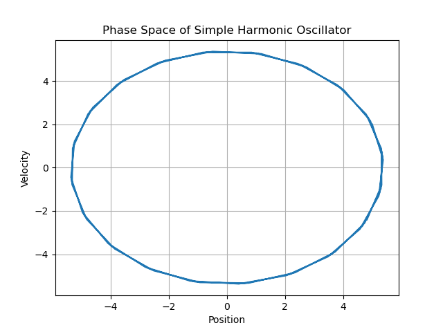
  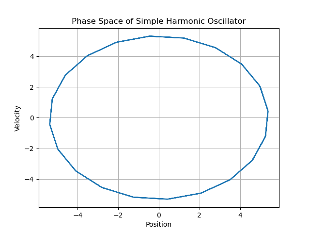
  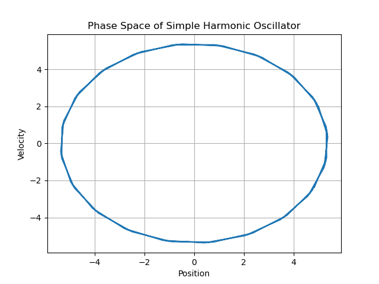
</p>

<p align="center">
  <b>Figure 2:</b> Phase space plots for the simple harmonic oscillator using RK4, Verlet, and ODEINT (left to right). The plots appear as ovals as expected for a simple harmonic oscillator.
</p>


### Harmonic Oscillator with Linear Dampening

For a linearly damped harmonic oscillator, the phase space plot should spiral outwards because of the dampening term as shown in Fig. 3.

<p align="center">
  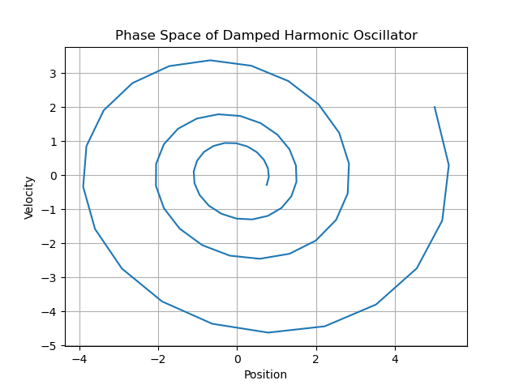
  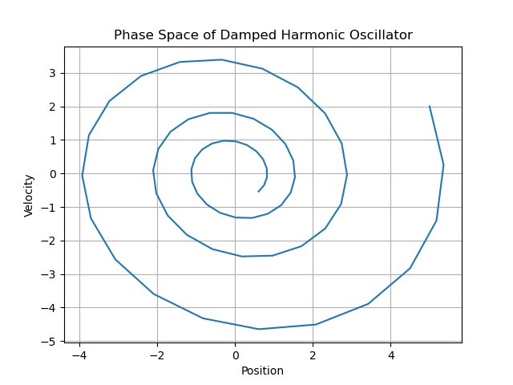
  
</p>

<p align="center">
  <b>Figure 3:</b> Phase space plots for the simple harmonic oscillator using RK4, Verlet, and ODEINT (left to right). The plots appear as spirals as expected for a damped harmonic oscillator.
</p>

## Energy vs. Time 
Some applications might require the conservation of energy. For example, a simulation of neutron production in a neutron source would require energy conservation so that it doesn't overestimate the number of neutrons. Whence, Energy vs. Time plots can be observed to deduct whether a particular method conserves energy or not. The Verlet method does a great job of conserving energy in comparison to other methods such as RK2 as shown in Fig. 4.


<p align="center">
  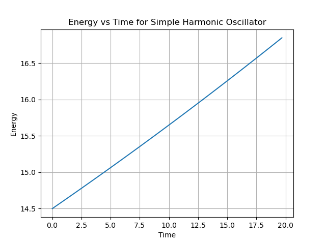
  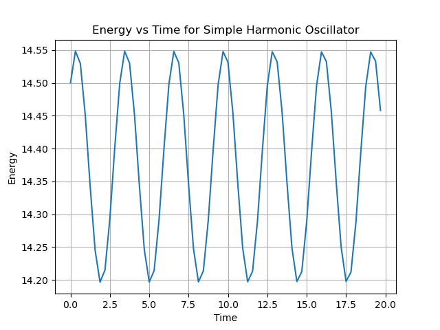
</p>

<p align="center">
  <b>Figure 4:</b> RK2 (left) does not appear to conserve energy. We observe that energy increases linearly or drifts over time. Meanwhile, Verlet (right) does appear to conserve energy as it does not drift over time.
</p>


## Error 
We demonstrate three strategies to analyze error below. The first is calculating at the error at a chosen time. Next, is computing the number of time steps required to reach a certain target error. Last, is analyzing the slope of a loglog plot of Error vs. Number of Time Steps. 
### Error Output at Selected Time
The time we chose to demonstrate is 4 seconds. The reason for this is because x(t) is not at the boundaries or origin here which might cause weird spikes in the error. Anyways, Table 1 illustrates the resulting errors for each method at t=4.0 s with and without dampening. ODEINT has the lowest error for both systems by a substantial margin ($10^{-9}$ and $10^{-8}$ order). The second lowest error for both systems is RK4(5) on the order of $10^{-4}$. Verlet and RK2 are around the same error on the order of $10^{-2}$ and $10^{-3}$. Euler's method is on the order of $10^{-1}$.

| System | Requested Time | Evaluated Time | Verlet Relative Error | RK4(5) Relative Error | RK2 Relative Error | ODEINT Relative Error | Euler Relative Error |
|---|---:|---:|---:|---:|---:|---:|---:|
| SHO | 4.0 | 4.062500 | 5.8e-03 | 4.4e-04 | 2.6e-02 | 4.8e-09 | 9.6e-01 |
| DHO | 4.0 | 4.062500 | 4.5e-02 | 7.1e-04 | 3.8e-02 | 2.7e-08 | 8.8e-01 |
### Number of Time Steps Required for a Chosen Target Error

The number of time steps required to reach a certain error threshold is important to consider when choosing a method because it allows one to weigh the accuracy of higher order methods against low computational cost of lower order methods. Table 1 shows the number of time steps required to reach a target error of 0.01 and 0.05 of x(t) for a damped and undamped harmonic oscillator using Euler's method, RK2, and Verlet integration. We can observe that the Verlet method reaches the target error in the fewest nts without linear dampening; however, when linear dampening is involved RK2 reaches the target error in the fewest nts.

| System | Target Relative Error | Verlet nts | RK2 nts | Euler nts |
|---|---:|---:|---:|---:|
| SHO | 0.01 | 256 | 512 | 32768 |
| SHO | 0.05 | 64 | 256 | 8192 |
| DHO | 0.01 | 2048 | 512 | 32768 |
| DHO | 0.05 | 512 | 256 | 4096 |

Table 2: Number of time steps to reach a target error of x(t) for a harmonic oscillator with and without dampening using Euler's method, RK2 and Verlet.

### Loglog Plot of Error vs. Number of Time Steps
A linear slope of a loglog plot of Error vs. Number of Time Steps illustrates the order of an approximation. For example, if the slope is -4, then the approximation is fourth order. Thus, we can compute the slope to verify the order of each method. Fig. 5 shows the loglog plots for RK2 and Verlet approximations of x(t) for a simple harmonic oscillator which yield a slope of -2.04 and -1.85 respectively. These values support roughly a second order relationship between the error and number of timesteps. Meanwhile, for a damped harmonic oscillator RK2 has a slope of -2.20 whereas Verlet has a slope of -1.05. This signifies that the Verlet method becomes first order when a linear dampening term is introduced. 

<p align="center">
  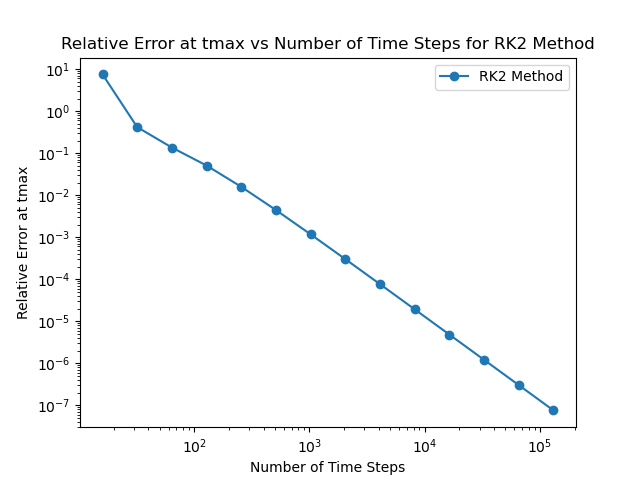
  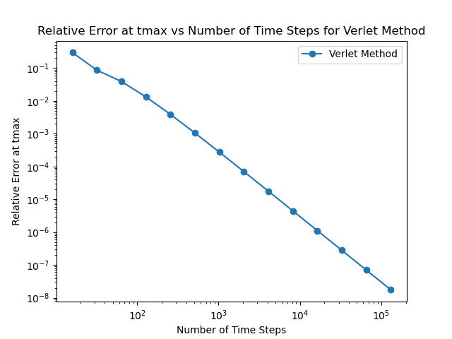
</p>

<p align="center">
  <b>Figure 5:</b> RK2 (left) has a slope of -2.04 which is reasonable since it is a second order method. Meanwhile, Verlet (right) has a slope of -1.85 which is still reasonable for a second order method.
</p>


<p align="center">
  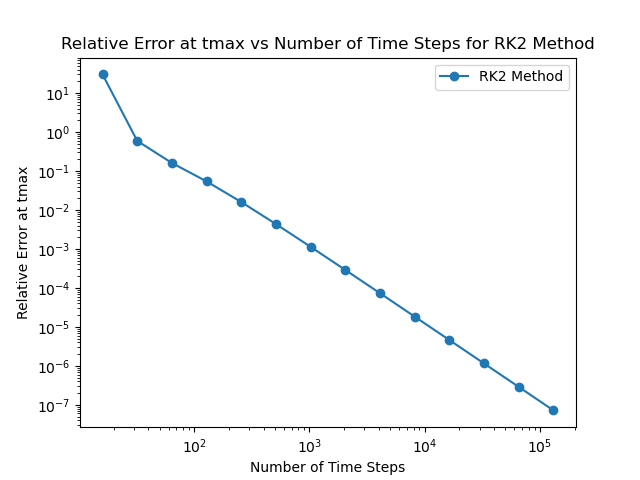
  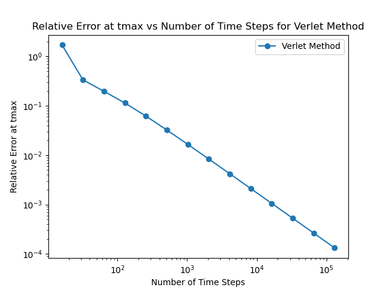
</p>

<p align="center">
  <b>Figure 6:</b> RK2 (left) has a slope of -2.20 which is reasonable since it is a second order method. Meanwhile, Verlet (right) has a slope of -1.05 which supports that it loses its second order characteristic with dampening.
</p>


# Conclusions
While there is no clear "best" method for all scenarios, each method can be considered optimal for specific scenarios. To start, the Verlet method is the only technique here that conserves energy. So, if a specific application requires energy conservation, the Verlet method would be the way to go. On the contrary, the Verlet method decreases in order when a linear dampening term is introduced. The Runge-Kutta method does not seem to care whether there is a dampening term or not, making it more versatile. In addition, Scipy's ODEINT is the highest order method, making it the most accurate in general. However, there is a degree to which one must consider how much accuracy is really needed depending on what might be considered a good enough approximation. 

# Extensions

## Symplectics Deep Dive: Programming

I used the triangle method that you described the day we were in Advanced Lab. 

```python
def triangle(x0, p0, dx, dp): # x0, p0 is one corner
    return np.array([[x0, p0], [x0 + dx, p0], [x0, p0 + dp]])


def triangle_area(x1, p1, x2, p2, x3, p3):
    return 0.5 * np.abs(x1*(p2 - p3) + x2*(p3 - p1) + x3*(p1 - p2))    # determinant formula for area of triangle

def phase_space_area(x0, p0, dx, dp, tmin, tmax, nts, deriv, solver):
    corners = triangle(x0, p0, dx, dp)      # initialize points

    # let each point evolce in phase space
    t_array, x1, p1 = solver(corners[0,0], corners[0,1], tmin, tmax, nts, deriv)
    t_array, x2, p2 = solver(corners[1,0], corners[1,1], tmin, tmax, nts, deriv)
    t_array, x3, p3 = solver(corners[2,0], corners[2,1], tmin, tmax, nts, deriv)

    # find the new areas at each time step
    area_array = np.zeros(len(t_array))
    for i in range(len(t_array)):
        area_array[i] = triangle_area(x1[i], p1[i], x2[i], p2[i], x3[i], p3[i])

    return t_array, area_array
```


 1. How does phase space area (Total Mechanical Energy) evolve in the damped and undamped SHM scenerios?

In the undamped cases, phase space area seemed relatively conserved for Verlet method and it drifts positively and linearly for RK2 and Euler's method. Broadly, it is either conserved or growing for the undamped case. Meanwhile, it decays for Verlet, RK2, and Euler's method in the damped case.

<p align="center">
  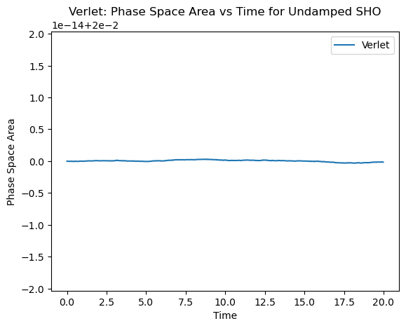
  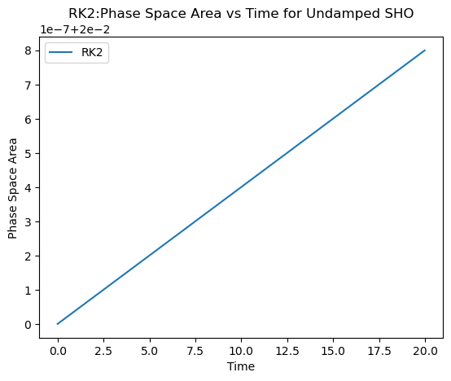
  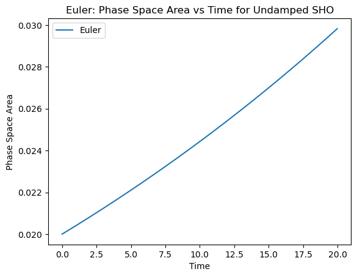
</p>

<p align="center">
  <b>Figure 7:</b> Undamped cases for Verlet, RK2, and Euler (left to right). It looks like phase space area is conserved for Verlet integration. It looks to grow or drift linearly for RK2 and Euler's method.
</p>

<p align="center">
  
  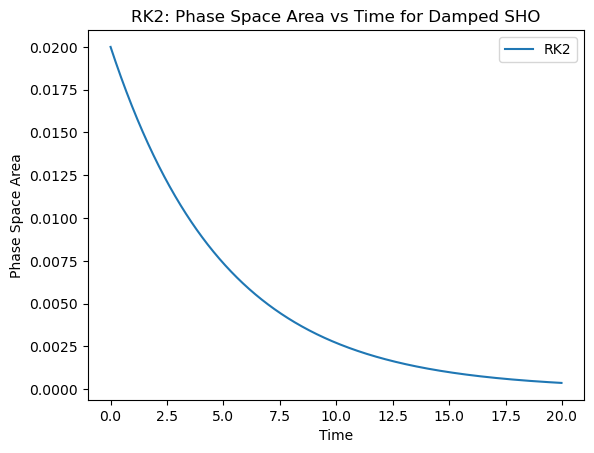
  
</p>

<p align="center">
  <b>Figure 8:</b> Damped cases for Verlet, RK2, and Euler (left to right). Phase space area seems to decay for Verlet integration, RK2, and Euler's method.
</p>


 2. How do different integrators affect this variation in area?

All of the integrators seem to have a similar effect in the damped case in which the phase space area decays. However, in the undamped case Verlet integration stands out as it conserves phase space area whereas RK2 and Euler's method do not.


# Questions

## Attribution 
I used Wikipedia for the recursive definitions of the algorithms, mainly Verlet but I had to refresh myself on RK2. I also used Scipy's documentation on ODEINT, solveivp, and LSODA to learn about how ODEINT works.

## Timekeeping

Week before spring break: 
1 hour: Tuesday in class

1 hour: Tuesday after class or Wednesday (I forgot which day)

1? hour: Thursday

1 hour: Friday

After spring break: 
3 hours: Tuesday 3/24

2 hours: Thursday or Friday (I forgot)

Week of 4/1

5 hours: Tuesday

3 hours: Wednesday

Main thing I got caught up on for a few hours yesterday was when I realized Scipy's RK4 was doing its own thing with the time steps.

## Languages, Libraries, Lessons Learned
I used Scipy, Numpy and matplotlib. I thought Scipy's RK4(5) was frustrating for what I wanted to do because it wouldn't let me tell it how many time steps to use. I feel like you have less freedom when using something from a library sometimes.