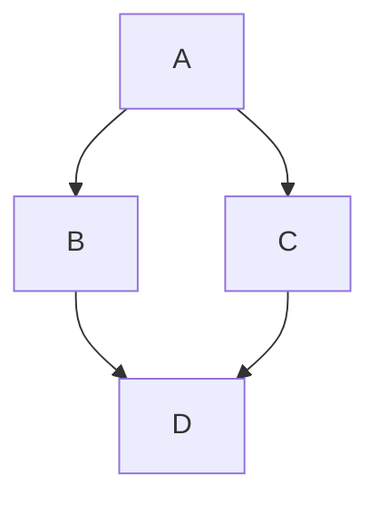

# Writeup quality of life tips

## GitHub Flavored Markdown (GFM) supports syntax highlighting and code blocks

```python
print("Hello, world!")
```

## GFM supports Mermaid block diagrams
Use this for flowcharts to document your program logic and/or your program structure!



# DLA algorithm tips

 - What data structure are you using to represent the aggregate?
 - How are you rendering that structure?
 - Computers are fast, but they could be faster. Are there redundant operations in your algorithm?

> [!NOTE]
> Matplotlib's matshow (or imshow) is one good option for raster graphics!

## Display particles by generation/age
It can be nice to see which particles accumulate where.
You can do this quickly by setting the pixel to a value [0,1] proportional to n/N, and applying a colormap to the resulting figure.
The colormap can be continuous, or discrete.
Discrete would let you see where generations of particles wound up.

## Figure tips: trim to DLA, control figure size

You can make your "grid" aka "crystal" numpy array oversized, and then trim to the aggregate's max/min x/y borders.

```python
# Make a simple DLA
particles = 1000
crystal = grow_crystal(N = particles)

# sum columns and rows, identify which elements are not zero
xslice = np.where(np.sum(crystal,axis=0))[0]
yslice = np.where(np.sum(crystal,axis=1))[0]

# calculate the size of the cropped aggregate
whitespace = 2  # don't crop exactly to the edges of the DLA
ypixels = yslice[-1]-yslice[0]+2*whitespace
xpixels = xslice[-1]-xslice[0]+2*whitespace

# approximate the size of the generated figure. This is more than good enough almost always.
figure_ppi = 15  # ppi = pixels per inch
figw = xpixels/figure_ppi
figh = ypixels/figure_ppi+0.375  # add extra space for the figure title

# Create a figure/axis object (this makes systematic figure generation much easier)
# NB you should specify the length and width of the figure (in inches) here.
fig, ax = plt.subplots(figsize=(figw, figh))

# slice the "crystal" object on the edges identified with the "where" command.
# NB: you can break a python function call over multiple lines to make it easier to read
_ = ax.imshow(crystal[yslice[0]-whitespace:yslice[-1]+whitespace+1,
                      xslice[0]-whitespace:xslice[-1]+whitespace+1],
               origin='upper',
               interpolation='nearest',
               aspect='equal')

# these optional parameters (origin, interpolation, aspect) are automatically set by matshow,
# but matshow also moves the axes to the top of the 
_ = ax.axis('off')
_ = ax.set_title(f'N={particles}', fontsize=12)  # note the use of an f-string in this command
fig.savefig(f'demo_figure_N{particles}.png',bbox_inches='tight',dpi=150)

# If you *only* want to save the array, and you want to add the title and all figure details separately
# you can call imsave instead:
plt.imsave(f'demo_figure_N{particles}_direct.png',
           crystal[yslice[0]-whitespace:yslice[-1]+whitespace+1,
                   xslice[0]-whitespace:xslice[-1]+whitespace+1],
           )
# This shifts the overhead, and now you'll have to figure out how to scale the resulting png so the figure
# is exactly as large as you want. It's not easier per se, but it's predictable and good to know for LaTeX
# manuscripts especially.
```

# Python Optimization Tips

 - [The Optimization Ladder (Python)](<https://cemrehancavdar.com/2026/03/10/optimization-ladder/>)
 - [Why is Python so Slow?](https://tonybaloney.github.io/posts/why-is-python-so-slow.html)
 - [Slow and Fast Random Integers in Python](https://eli.thegreenplace.net/2018/slow-and-fast-methods-for-generating-random-integers-in-python/)

# Random Number Generation with Python Iterators

NumPy is generally overkill for the RNG work this project requires. If you *want* to use NumPy, you follow the best practices laid out in this [Scientific Python blog](https://blog.scientific-python.org/numpy/numpy-rng/), which has you create a python generator first, and then call that generator to create random numbers.

```python
import numpy as np

rng = np.random.default_rng()
rng.random()  # generate a floating point number between 0 and 1
int(4*rng.random())  # generate a random integer between 0 and 3
```
You can specify a **seed**, and you can specify the distribution you want the RNG to sample when you create it. NumPy has excellent documentation for this. It's probably faster to simply use python's random library:

```python
import random

random.random()
```

This problem is much better defined! When you step the particle, you are stepping it in either 4 or 8 directions, so you can (and should) use *getrandbits* instead. This is 3-20x faster than the earlier methods.
```python
import random

random.getrandbits(2)
```
