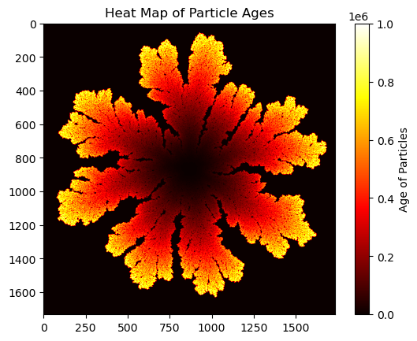
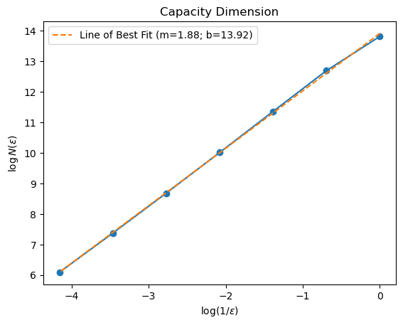
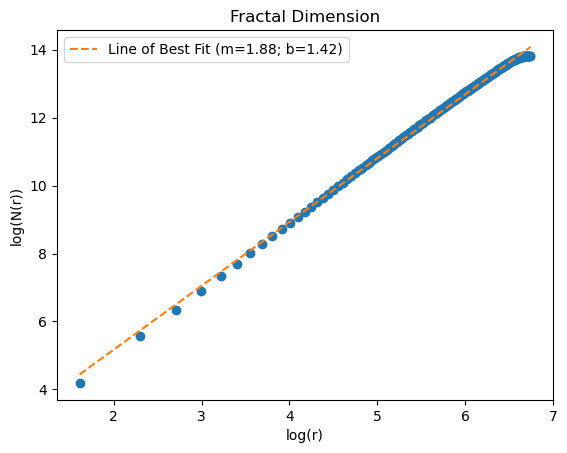
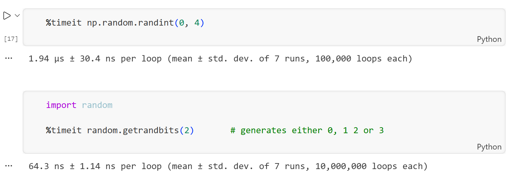

# Extension 3
A one million particle DLA simulation is a difficult computation task where every coding detail matters. By using %timeit we were able to profile our code to see which methods resulted in quicker runtimes. For example, using random.getrandbit() is faster than np.random.randint() as shown in Fig. 4. Additionally, using a 4-directional random walk and a 4-neighbor check is surprisingly faster than including corners. These coding details play an important role, however, after a certain point we turn to optimize the physical details of the system.

We first hypothesized that the radius, r, of a fractal grows as a function of number of particles, N, and this rate is related to the aggregate's density or fractal dimension. Furthermore, we can observe in Fig. 3 (of ReadMe.md in the WriteUp directory) that the log-log plots of $S$ vs $D_{C}$ and $S$ vs $D_{r}$ demonstrate an exponential relationship. Building on this information, we hypothesized that as $S$ approaches 0, the aggregate should converge to a disk with a fractal dimension equal to 2. In this extreme case, $r$ increases like $\Delta r$ = $\frac{1}{2\pi r} \Delta N$. In other words, as $N$ increases to add another layer of circumference, $r$ increases by 1. Meanwhile, this rate must increase as the fractal dimension decreases, since the number of particles do not have to fill the entire circumference. Therefore, the rate that $r$ increases as a function of $N$ increases as $S$ increases from its limit of 0. 

Thus, for our one million particle simulation we knew we wanted to use a low value of $S$. But of course, if we chose $S$ to be too low, then the particles would almost never stick. So although we would be optimizing the rate at which $r$ increases as a function of $N$, the simulation would still take forever to run. We further hypothesized (based on testing) that as $N$ increases and the optimal value of $S$ decreases, then the rate that the optimal value of $S$ decreases, decreases itself for larger $N$. Therefore, we performed a few test runs for a range of $N$ = 5,000 to $N$ = 50,000. The data is commented in the first cell of Extension3.ipynb. Using this data, we guessed $S$ = 0.005 is in the ballpark of optimal values for $N$ = $10^{6}$.
 

A one million particle DLA process was simulated for $S$ = 0.005, and the heat map is provided in Fig. 1. We estimated its fractal dimension to equal 1.88 using both the box-counting and mass-radius methods as illustrated in Fig. 2 and Fig. 3 respectively. 

  

  Figure 1: <em>Heat map of a million particle with S=0.005. It yields an estimated fractal dimension of 1.88 using the box-counting and mass-radius methods.</em>

----

  

  Figure 2: <em>Box-counting fractal dimension estimation where m = 1.88 describes the capacity dimension.</em>

---

  

  Figure 3: <em>Mass-radius fractal dimension estimation where m = 1.88 describes the fractal dimension.</em>

---

  

  Figure 4: <em>Using %timeit, we can profile parts of our code to see which methods yield faster runtimes .</em>

